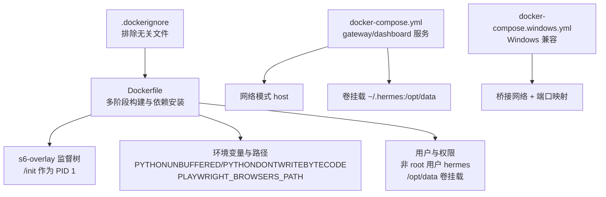
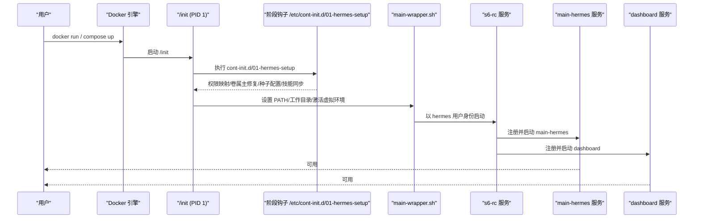
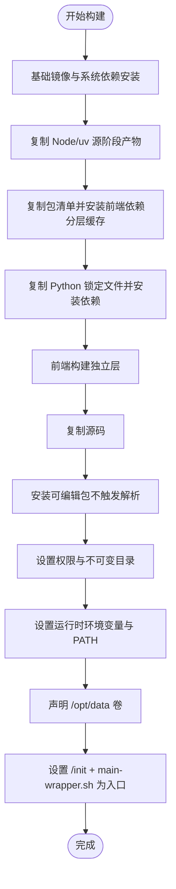
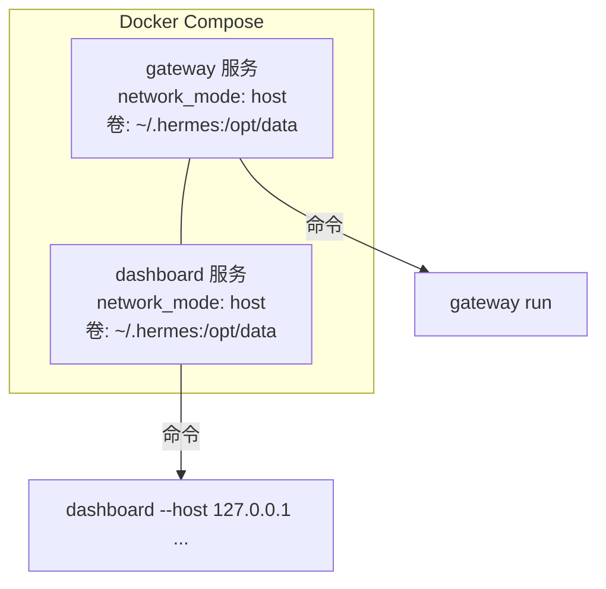
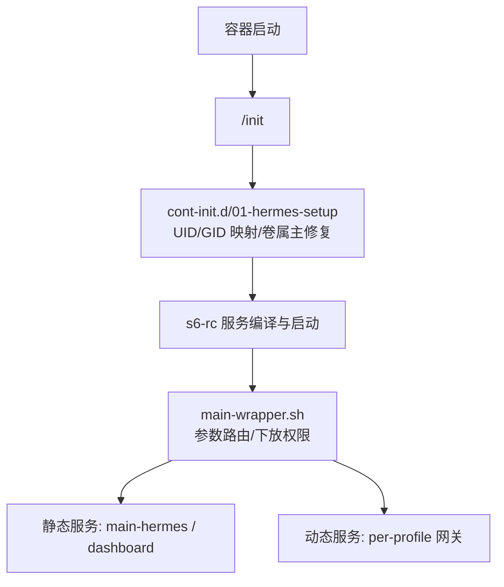
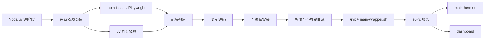

# 容器化配置

<cite>
**本文档引用的文件**
- [Dockerfile](file://Dockerfile)
- [docker-compose.yml](file://docker-compose.yml)
- [.dockerignore](file://.dockerignore)
- [docker-compose.windows.yml](file://docker-compose.windows.yml)
- [docker/entrypoint.sh](file://docker/entrypoint.sh)
- [docker/hermes-exec-shim.sh](file://docker/hermes-exec-shim.sh)
- [docker/main-wrapper.sh](file://docker/main-wrapper.sh)
- [docker/stage2-hook.sh](file://docker/stage2-hook.sh)
- [docker/cont-init.d/015-supervise-perms](file://docker/cont-init.d/015-supervise-perms)
- [SECURITY.md](file://SECURITY.md)
- [docs/security/network-egress-isolation.md](file://docs/security/network-egress-isolation.md)
- [docs/observability/README.md](file://docs/observability/README.md)
- [docker/SOUL.md](file://docker/SOUL.md)
</cite>

## 目录
1. [简介](#简介)
2. [项目结构](#项目结构)
3. [核心组件](#核心组件)
4. [架构总览](#架构总览)
5. [详细组件分析](#详细组件分析)
6. [依赖关系分析](#依赖关系分析)
7. [性能考虑](#性能考虑)
8. [故障排查指南](#故障排查指南)
9. [结论](#结论)
10. [附录](#附录)

## 简介
本指南围绕该代码库中的容器化配置进行系统性说明，覆盖以下主题：
- Dockerfile 多阶段构建与依赖管理、环境变量配置
- docker-compose.yml 的服务定义、网络与卷配置、环境变量注入
- 容器运行时的安全与权限控制（非 root 用户、文件系统权限、进程管理）
- 镜像优化策略（层缓存、依赖精简、启动时间优化）
- 运维实践（健康检查、资源限制、日志与可观测性）
- 安全加固（最小权限、镜像扫描、运行时保护）

## 项目结构
与容器化直接相关的文件主要集中在根目录与 docker/ 目录中：
- 根级 Dockerfile：定义多阶段构建、系统依赖安装、Python/Node 依赖安装、Playwright 浏览器预装、s6-overlay 监督体系、入口点与命令路由
- 根级 docker-compose.yml：默认使用 host 网络模式，定义 gateway 与 dashboard 两个服务，绑定 ~/.hermes 到 /opt/data
- 根级 .dockerignore：排除大量开发与构建产物，避免污染镜像上下文
- 根级 docker-compose.windows.yml：Windows Docker Desktop 兼容版本，使用桥接网络与端口映射
- docker/ 目录：包含入口脚本、主包装器、阶段钩子与监督权限修复脚本
- 文档：安全策略、网络出站隔离、可观测性接口

图表来源
- [Dockerfile:1-338](file://Dockerfile#L1-L338)
- [docker-compose.yml:1-77](file://docker-compose.yml#L1-L77)
- [.dockerignore:1-108](file://.dockerignore#L1-L108)
- [docker-compose.windows.yml:1-39](file://docker-compose.windows.yml#L1-L39)

章节来源
- [Dockerfile:1-338](file://Dockerfile#L1-L338)
- [docker-compose.yml:1-77](file://docker-compose.yml#L1-L77)
- [.dockerignore:1-108](file://.dockerignore#L1-L108)
- [docker-compose.windows.yml:1-39](file://docker-compose.windows.yml#L1-L39)

## 核心组件
- 多阶段构建与依赖管理
  - 使用上游镜像作为源阶段，确保 Node LTS 与 Python 版本稳定
  - 分层缓存策略：先复制包清单，再执行 npm/uv 安装，最后复制源码
  - Playwright 浏览器预装于独立目录，避免与宿主机冲突
- s6-overlay 监督体系
  - /init 作为 PID 1，负责 cont-init.d 脚本与 s6-rc 服务编排
  - 静态服务（main-hermes、dashboard）在构建期声明，动态网关服务在运行期注册
- 运行时与权限
  - 默认以非 root 用户运行，通过 s6-setuidgid 下放权限
  - 提供特权降级 shim，防止 docker exec 以 root 写入数据卷导致权限错配
- 环境变量与路径
  - 关键环境变量用于日志缓冲、字节码生成、浏览器缓存位置
  - 启动参数路由与工作目录恢复，保证交互式 TUI 正常工作

章节来源
- [Dockerfile:1-338](file://Dockerfile#L1-L338)
- [docker/main-wrapper.sh:1-83](file://docker/main-wrapper.sh#L1-L83)
- [docker/hermes-exec-shim.sh:1-88](file://docker/hermes-exec-shim.sh#L1-L88)
- [docker/stage2-hook.sh:1-434](file://docker/stage2-hook.sh#L1-L434)

## 架构总览
下图展示容器启动到服务可用的关键流程：s6-overlay 初始化、阶段钩子执行、服务注册与启动。

图表来源
- [Dockerfile:314-338](file://Dockerfile#L314-L338)
- [docker/stage2-hook.sh:1-434](file://docker/stage2-hook.sh#L1-L434)
- [docker/main-wrapper.sh:1-83](file://docker/main-wrapper.sh#L1-L83)

章节来源
- [Dockerfile:314-338](file://Dockerfile#L314-L338)
- [docker/stage2-hook.sh:1-434](file://docker/stage2-hook.sh#L1-L434)
- [docker/main-wrapper.sh:1-83](file://docker/main-wrapper.sh#L1-L83)

## 详细组件分析

### Dockerfile 多阶段构建与依赖管理
- 源阶段
  - 使用上游镜像作为 Node 与 uv 的来源，确保 LTS 版本与可复现性
  - 系统依赖通过单层安装并清理缓存，减少镜像体积
- s6-overlay 安装
  - 支持多架构自动选择 tarball，并进行 SHA256 校验
  - 提供向后兼容的 tini 符号链接，避免旧版编排失败
- 用户与权限
  - 创建非 root 用户 hermes，UID 可通过运行时变量覆盖
  - /opt/hermes 在运行时保持不可变，仅 /opt/data 可写
- 前端与源码
  - 前端构建独立分层，Python 依赖与源码分离，最大化缓存命中
- 运行时环境
  - 设置 PATH 将 /opt/hermes/bin 放在首位，优先使用特权降级 shim
  - 通过环境变量固定 TUI/WEB 构建产物路径，避免运行时 npm install

图表来源
- [Dockerfile:10-338](file://Dockerfile#L10-L338)

章节来源
- [Dockerfile:10-338](file://Dockerfile#L10-L338)

### docker-compose.yml 服务定义与网络配置
- 服务
  - gateway：默认使用 host 网络，便于直接监听平台端口；支持通过环境变量启用 API 服务器
  - dashboard：默认仅监听本地回环，支持通过命令行参数调整主机与端口
- 卷挂载
  - 统一挂载 ~/.hermes 到 /opt/data，确保数据持久化与权限一致性
- 环境变量
  - HERMES_UID/HERMES_GID 或 PUID/PGID：将容器内 hermes 用户映射到宿主机 UID/GID
  - 平台密钥与服务账号路径：通过环境变量或卷挂载注入敏感信息

图表来源
- [docker-compose.yml:29-77](file://docker-compose.yml#L29-L77)

章节来源
- [docker-compose.yml:1-77](file://docker-compose.yml#L1-L77)

### Windows Docker Desktop 兼容配置
- 移除 host 网络模式，改用桥接网络与显式端口映射
- 使用 Windows 用户目录占位符，适配不同平台路径
- dashboard 通过端口映射暴露本地服务

章节来源
- [docker-compose.windows.yml:1-39](file://docker-compose.windows.yml#L1-L39)

### 运行时与权限控制（s6-overlay 与特权降级）
- s6-overlay
  - /init 作为 PID 1，执行 cont-init.d 脚本与 s6-rc 服务
  - 静态服务在构建期声明，动态网关在运行期注册
- 阶段钩子（stage2-hook.sh）
  - UID/GID 映射与组成员修复（支持 docker.sock）
  - 数据卷属主修复与目标化权限修正
  - 首次引导配置种子与技能同步
  - 发现 Playwright 浏览器二进制并通过环境传播
- 主包装器（main-wrapper.sh）
  - 参数路由：无参执行 hermes、直接执行可执行文件、转交子命令
  - 以 hermes 用户身份下放权限，设置 HOME 与工作目录
- 特权降级 shim（hermes-exec-shim.sh）
  - 防止 docker exec 以 root 写入 /opt/data 导致权限错配
  - 通过绝对路径调用真实 venv 可执行文件，避免递归与 PATH 操控风险

图表来源
- [docker/stage2-hook.sh:1-434](file://docker/stage2-hook.sh#L1-L434)
- [docker/main-wrapper.sh:1-83](file://docker/main-wrapper.sh#L1-L83)
- [docker/cont-init.d/015-supervise-perms:1-91](file://docker/cont-init.d/015-supervise-perms#L1-L91)

章节来源
- [docker/stage2-hook.sh:1-434](file://docker/stage2-hook.sh#L1-L434)
- [docker/main-wrapper.sh:1-83](file://docker/main-wrapper.sh#L1-L83)
- [docker/cont-init.d/015-supervise-perms:1-91](file://docker/cont-init.d/015-supervise-perms#L1-L91)
- [docker/hermes-exec-shim.sh:1-88](file://docker/hermes-exec-shim.sh#L1-L88)

### 环境变量与路径配置
- 关键环境变量
  - PYTHONUNBUFFERED=1、PYTHONDONTWRITEBYTECODE=1：提升日志实时性与避免字节码生成
  - PLAYWRIGHT_BROWSERS_PATH：指定浏览器缓存目录，避免与宿主机冲突
  - HERMES_*：指向 /opt/data 下的各子目录，统一数据与配置位置
  - HERMES_TUI_DIR/HERMES_WEB_DIST：指向预构建的前端产物，避免运行时 npm install
- PATH 顺序
  - 将 /opt/hermes/bin 放在最前，确保特权降级 shim 被优先解析

章节来源
- [Dockerfile:12-286](file://Dockerfile#L12-L286)

### 镜像优化策略
- 层缓存
  - 仅复制包清单后执行安装，前端与 Python 依赖分别缓存
  - 前端构建独立层，Python 仅在源码变更时重建
- 依赖精简
  - 排除 node_modules/.venv/.pip-cache 等临时目录
  - 仅安装生产所需 extras，避免开发与测试依赖进入镜像
- 启动时间优化
  - 预构建前端产物，避免运行时 npm install
  - 固定浏览器缓存路径，减少启动时发现与准备时间

章节来源
- [.dockerignore:1-108](file://.dockerignore#L1-L108)
- [Dockerfile:110-189](file://Dockerfile#L110-L189)

### 容器监控与日志收集
- 观测性接口
  - 提供 observer hooks，支持 LLM 请求、工具调用、审批与子代理生命周期事件
  - 插件可基于会话/回合/请求/工具 ID 进行关联与导出
- 日志与健康检查
  - 建议结合外部日志系统（如集中式日志采集）与健康检查端点
  - dashboard 与 gateway 均可暴露健康检查路径，便于编排器探活

章节来源
- [docs/observability/README.md:1-317](file://docs/observability/README.md#L1-L317)

### 安全加固最佳实践
- 最小权限
  - 默认非 root 用户运行，通过 s6-setuidgid 下放权限
  - 数据卷仅授予 hermes 用户读写，安装目录保持不可变
- 运行时保护
  - 特权降级 shim 防止 docker exec 以 root 写入数据卷
  - stage2-hook 对 docker.sock 进行组成员修复，避免权限不足
- 网络隔离
  - 默认 host 网络可能带来风险，建议使用隔离网络与出站代理
  - 通过 docker-compose.override.yml 定义内部网络与 egress 网络，并配合代理允许列表

章节来源
- [SECURITY.md:297-332](file://SECURITY.md#L297-L332)
- [docs/security/network-egress-isolation.md:1-196](file://docs/security/network-egress-isolation.md#L1-L196)
- [docker/stage2-hook.sh:118-172](file://docker/stage2-hook.sh#L118-L172)
- [docker/hermes-exec-shim.sh:1-88](file://docker/hermes-exec-shim.sh#L1-L88)

## 依赖关系分析
- 构建期依赖
  - Node/uv 源阶段 → 系统依赖安装 → npm/uv 安装 → 前端构建 → 源码复制 → 可编辑安装
- 运行期依赖
  - s6-overlay → cont-init.d 钩子 → s6-rc 服务 → main-hermes/dashboard
  - hermes-exec-shim 与 main-wrapper 保障权限与 PATH 正确性

图表来源
- [Dockerfile:10-338](file://Dockerfile#L10-L338)

章节来源
- [Dockerfile:10-338](file://Dockerfile#L10-L338)

## 性能考虑
- 构建性能
  - 分层缓存策略显著降低重复安装成本
  - 前端与 Python 依赖分离，减少不必要的重建
- 运行性能
  - 预构建前端产物与浏览器缓存，缩短启动时间
  - 非 root 用户与最小权限模型减少上下文切换与权限检查开销

## 故障排查指南
- 权限问题
  - docker exec 以 root 写入 /opt/data 导致权限错配：使用特权降级 shim 或以 --user hermes 运行
  - 数据卷属主异常：检查 stage2-hook 的 chown 逻辑与 hermes-owned 子目录
- 网络问题
  - host 网络模式下访问受限：改为隔离网络并通过代理允许列表放行
  - docker.sock 权限不足：确认 stage2-hook 已为 hermes 添加正确的组成员
- 启动失败
  - 首次启动缺少配置：确认 stage2-hook 是否正确种子 .env/config.yaml/SOUL.md
  - Playwright 浏览器未被识别：确认 stage2-hook 是否已导出 AGENT_BROWSER_EXECUTABLE_PATH

章节来源
- [docker/hermes-exec-shim.sh:1-88](file://docker/hermes-exec-shim.sh#L1-L88)
- [docker/stage2-hook.sh:174-271](file://docker/stage2-hook.sh#L174-L271)
- [docker/stage2-hook.sh:385-431](file://docker/stage2-hook.sh#L385-L431)
- [docs/security/network-egress-isolation.md:62-196](file://docs/security/network-egress-isolation.md#L62-L196)

## 结论
该容器化配置通过多阶段构建、s6-overlay 监督体系与严格的权限控制，实现了可复现、安全且高性能的运行时环境。结合网络隔离与可观测性接口，可在生产环境中实现更强的边界保护与运维可见性。建议在生产部署中采用隔离网络与代理、最小权限模型与定期镜像扫描，持续强化安全基线。

## 附录
- 个性化人格
  - 可通过 docker/SOUL.md 自定义 agent 个性，每次消息加载时生效
- 常用环境变量参考
  - HERMES_UID/HERMES_GID 或 PUID/PGID：映射容器内用户到宿主机
  - PLAYWRIGHT_BROWSERS_PATH：浏览器缓存目录
  - HERMES_TUI_DIR/HERMES_WEB_DIST：预构建前端产物路径
  - HERMES_DOCKER_EXEC_AS_ROOT：可选禁用特权降级（调试用途）

章节来源
- [docker/SOUL.md:1-15](file://docker/SOUL.md#L1-L15)
- [Dockerfile:12-286](file://Dockerfile#L12-L286)