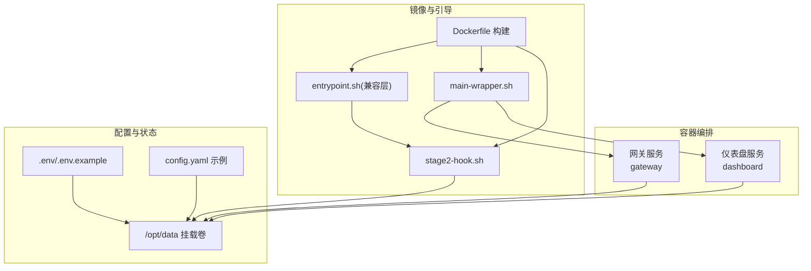
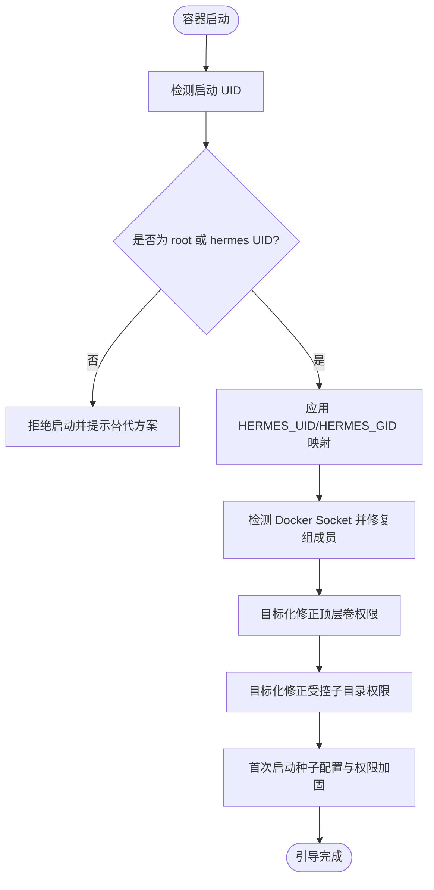
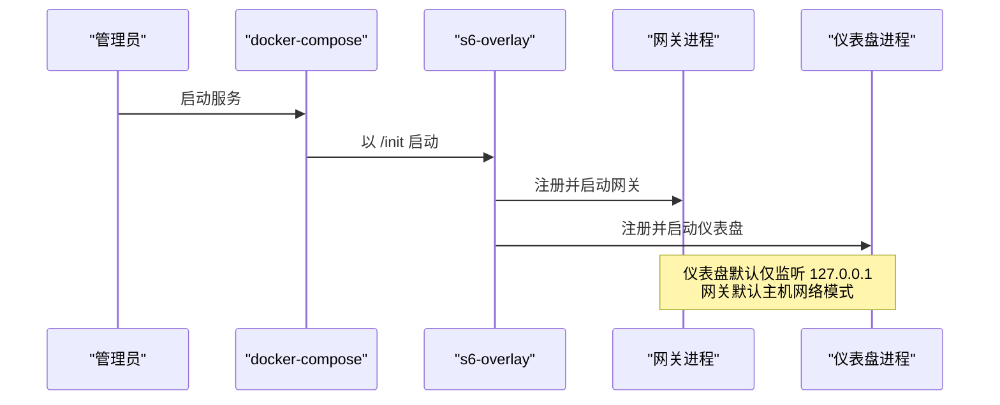
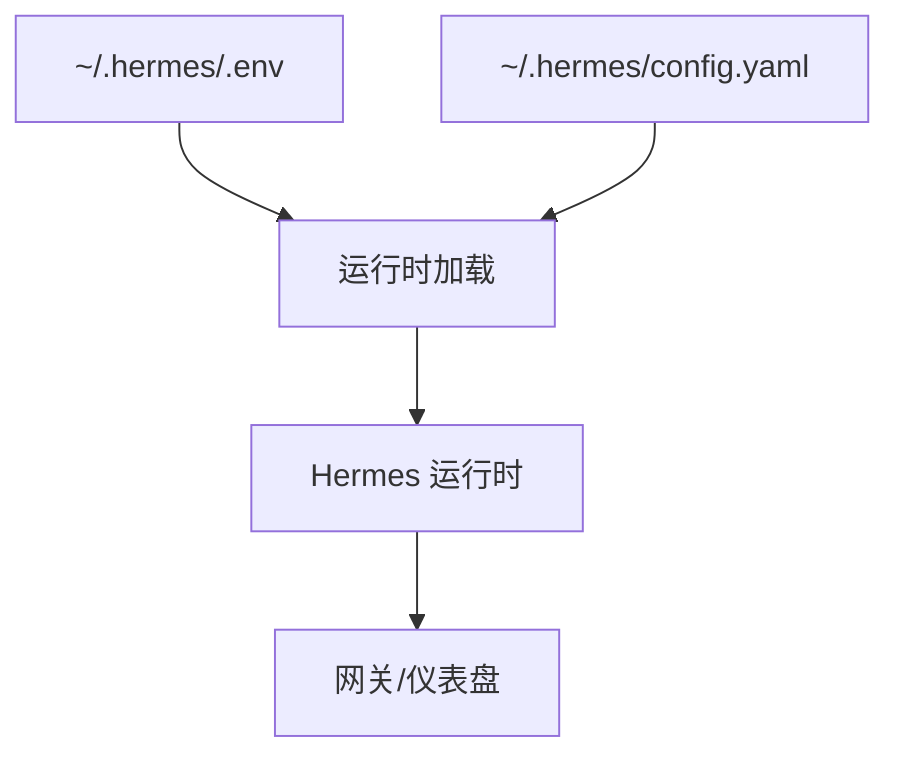
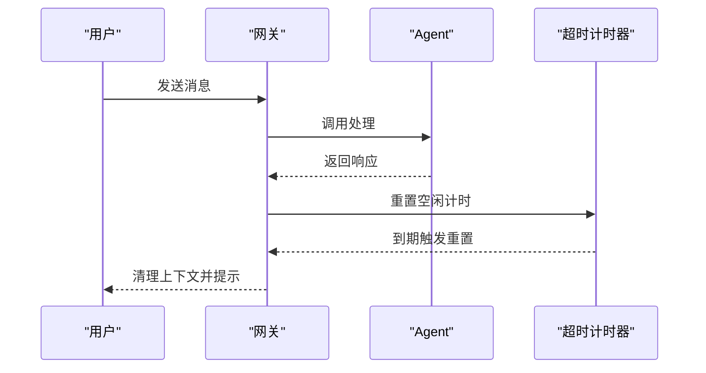
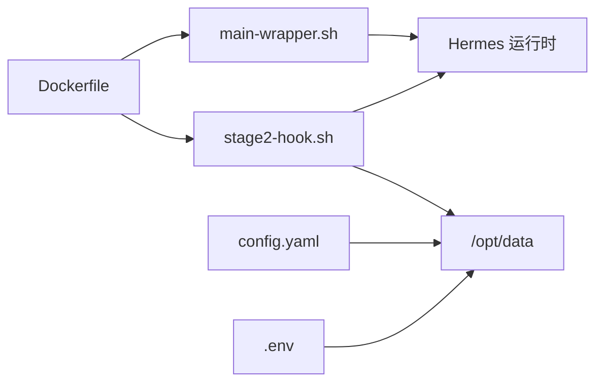

# 生产环境配置

<cite>
**本文档引用的文件**
- [docker-compose.yml](file://docker-compose.yml)
- [Dockerfile](file://Dockerfile)
- [cli-config.yaml.example](file://cli-config.yaml.example)
- [hermes_constants.py](file://hermes_constants.py)
- [docker/entrypoint.sh](file://docker/entrypoint.sh)
- [docker/main-wrapper.sh](file://docker/main-wrapper.sh)
- [docker/stage2-hook.sh](file://docker/stage2-hook.sh)
- [website/docs/user-guide/security.md](file://website/docs/user-guide/security.md)
- [gateway/run.py](file://gateway/run.py)
- [tests/agent/test_curator_backup.py](file://tests/agent/test_curator_backup.py)
</cite>

## 目录
1. [简介](#简介)
2. [项目结构](#项目结构)
3. [核心组件](#核心组件)
4. [架构总览](#架构总览)
5. [详细组件分析](#详细组件分析)
6. [依赖关系分析](#依赖关系分析)
7. [性能考虑](#性能考虑)
8. [故障排除指南](#故障排除指南)
9. [结论](#结论)
10. [附录](#附录)

## 简介
本指南面向在生产环境中部署与运维 Hermes Agent 的工程团队，围绕系统资源规划、服务配置管理、性能调优策略、负载均衡与扩展、数据库与存储最佳实践以及安全配置等方面，提供可操作的建议与参考路径。内容基于仓库中的容器编排、镜像构建、运行时引导脚本、配置示例与安全文档进行提炼与整合。

## 项目结构
Hermes Agent 的生产部署以容器为核心，采用 s6-overlay 进程监督模型，通过 Docker Compose 编排网关与仪表盘服务，并由 stage2 引导脚本完成用户映射、权限修正、配置种子与技能同步等初始化工作。CLI 配置示例文件提供了模型选择、终端后端、工具集、会话重置策略等关键参数的配置入口。



**图表来源**
- [docker-compose.yml:29-77](file://docker-compose.yml#L29-L77)
- [Dockerfile:331-338](file://Dockerfile#L331-L338)
- [docker/entrypoint.sh:1-28](file://docker/entrypoint.sh#L1-L28)
- [docker/main-wrapper.sh:1-83](file://docker/main-wrapper.sh#L1-L83)
- [docker/stage2-hook.sh:1-434](file://docker/stage2-hook.sh#L1-L434)

**章节来源**
- [docker-compose.yml:1-77](file://docker-compose.yml#L1-L77)
- [Dockerfile:1-338](file://Dockerfile#L1-L338)

## 核心组件
- 容器镜像与运行时
  - 使用 s6-overlay 作为 PID 1，负责监督主进程、仪表盘与按配置动态注册的网关实例。
  - 主程序包装器负责参数路由、权限降级与工作目录恢复。
  - stage2 引导脚本执行 UID/GID 映射、卷所有权修正、配置种子、技能同步与浏览器二进制发现。
- 服务编排
  - 网关服务默认使用主机网络模式，支持通过环境变量启用开放 API 服务器（需配合鉴权）。
  - 仪表盘服务默认仅绑定本地回环地址，远程访问需通过 SSH 隧道或反向代理。
- 配置体系
  - CLI 配置示例覆盖模型提供商、请求超时、终端后端、工具集与会话重置策略等。
  - 运行时常量模块统一解析 HERMES_HOME、平台默认路径与网络偏好等。

**章节来源**
- [Dockerfile:314-338](file://Dockerfile#L314-L338)
- [docker/main-wrapper.sh:14-83](file://docker/main-wrapper.sh#L14-L83)
- [docker/stage2-hook.sh:18-75](file://docker/stage2-hook.sh#L18-L75)
- [docker-compose.yml:29-77](file://docker-compose.yml#L29-L77)
- [cli-config.yaml.example:1-1241](file://cli-config.yaml.example#L1-L1241)
- [hermes_constants.py:520-595](file://hermes_constants.py#L520-L595)

## 架构总览
下图展示了生产环境的典型部署拓扑：容器内通过 s6-overlay 监督网关与仪表盘；网关通过消息平台适配器接入外部平台；配置与状态挂载到宿主机卷；必要时通过反向代理或隧道暴露 API。

```mermaid
graph TB
subgraph "宿主机"
VOL["~/.hermes 挂载卷"]
LB["反向代理/负载均衡"]
end
subgraph "容器"
S6["s6-overlay(PID 1)"]
GW["网关进程"]
DB["仪表盘进程"]
ENV[".env/.env.example"]
CFG["config.yaml 示例"]
end
subgraph "外部平台"
TG["Telegram"]
DC["Discord"]
SL["Slack"]
end
VOL <- --> GW
VOL <- --> DB
ENV --> GW
ENV --> DB
CFG --> GW
CFG --> DB
S6 --> GW
S6 --> DB
GW --> TG
GW --> DC
GW --> SL
LB --> GW
```

**图表来源**
- [docker-compose.yml:29-77](file://docker-compose.yml#L29-L77)
- [Dockerfile:314-338](file://Dockerfile#L314-L338)
- [docker/stage2-hook.sh:302-341](file://docker/stage2-hook.sh#L302-L341)

## 详细组件分析

### 组件A：容器引导与权限管理
- 目标
  - 在不破坏监督树的前提下，实现宿主机用户与容器内 hermes 用户的 UID/GID 映射。
  - 保证挂载卷中受控子目录的正确归属，避免权限问题导致的启动循环。
- 关键流程
  - stage2 引导脚本检测当前容器启动 UID，拒绝任意非 root 且非 hermes UID 的启动方式。
  - 支持 HERMES_UID/HERMES_GID 或 PUID/PGID 别名进行映射。
  - 对 Docker Socket 所属 GID 进行组成员修复，确保 hermes 用户具备 docker 后端所需权限。
  - 针对顶层卷与受控子目录分别执行目标化 chown，避免误伤宿主机其他文件。
  - 种子配置文件与权限加固，确保 .env 文件严格私有。



**图表来源**
- [docker/stage2-hook.sh:26-74](file://docker/stage2-hook.sh#L26-L74)
- [docker/stage2-hook.sh:107-172](file://docker/stage2-hook.sh#L107-L172)
- [docker/stage2-hook.sh:174-262](file://docker/stage2-hook.sh#L174-L262)
- [docker/stage2-hook.sh:302-341](file://docker/stage2-hook.sh#L302-L341)

**章节来源**
- [docker/stage2-hook.sh:18-434](file://docker/stage2-hook.sh#L18-L434)
- [docker/main-wrapper.sh:24-50](file://docker/main-wrapper.sh#L24-L50)

### 组件B：服务编排与网络暴露
- 目标
  - 提供安全可控的服务暴露策略，避免将敏感服务直接暴露于公网。
- 关键点
  - 网关服务默认使用主机网络模式，可通过注释掉 API 服务器相关环境变量来禁用对外暴露。
  - 仪表盘服务默认仅监听 127.0.0.1，如需远程访问，推荐使用 SSH 隧道或反向代理。
  - 建议在生产中通过反向代理统一接入，实现 TLS 终止、速率限制与访问控制。



**图表来源**
- [docker-compose.yml:29-77](file://docker-compose.yml#L29-L77)
- [Dockerfile:331-338](file://Dockerfile#L331-L338)

**章节来源**
- [docker-compose.yml:13-27](file://docker-compose.yml#L13-L27)
- [docker-compose.yml:63-77](file://docker-compose.yml#L63-L77)

### 组件C：配置管理与密钥安全
- 目标
  - 通过 .env 与 config.yaml 实现环境变量与配置分离，确保密钥与敏感参数的安全。
- 关键点
  - .env 文件应严格私有（600），存放 API Key 与认证凭据。
  - config.yaml 示例提供模型提供商、终端后端、工具集与会话策略等生产可用的默认项。
  - 运行时常量模块统一解析 HERMES_HOME 与平台默认路径，避免硬编码带来的跨平台问题。



**图表来源**
- [docker/stage2-hook.sh:314-320](file://docker/stage2-hook.sh#L314-L320)
- [cli-config.yaml.example:1-1241](file://cli-config.yaml.example#L1-L1241)
- [hermes_constants.py:520-540](file://hermes_constants.py#L520-L540)

**章节来源**
- [docker/stage2-hook.sh:302-341](file://docker/stage2-hook.sh#L302-L341)
- [cli-config.yaml.example:1-1241](file://cli-config.yaml.example#L1-L1241)
- [hermes_constants.py:520-595](file://hermes_constants.py#L520-L595)

### 组件D：会话超时与活动监控
- 目标
  - 在长连接或低频交互场景中，通过超时与活动追踪避免资源占用与成本上升。
- 关键点
  - 网关侧提供会话空闲超时与定时重置策略，结合仪表盘与日志进行诊断。
  - 可结合外部监控系统采集会话活动摘要，辅助容量规划与告警。



**图表来源**
- [gateway/run.py:15841-15863](file://gateway/run.py#L15841-L15863)

**章节来源**
- [gateway/run.py:15841-15863](file://gateway/run.py#L15841-L15863)

## 依赖关系分析
- 容器镜像构建阶段
  - 分层缓存策略优先安装前端与 Python 依赖，减少重复构建时间。
  - Playwright 浏览器安装与缓存独立于源码复制，提升前端构建效率。
- 运行时依赖
  - s6-overlay 作为 PID 1，负责监督与重启策略。
  - main-wrapper.sh 与 stage2-hook.sh 协同完成参数路由与引导任务。
- 配置与状态
  - HERMES_HOME 下的 config.yaml 与 .env 决定运行行为与安全边界。
  - hermes_constants.py 提供路径解析与网络偏好等基础能力。



**图表来源**
- [Dockerfile:110-198](file://Dockerfile#L110-L198)
- [docker/main-wrapper.sh:14-83](file://docker/main-wrapper.sh#L14-L83)
- [docker/stage2-hook.sh:302-341](file://docker/stage2-hook.sh#L302-L341)

**章节来源**
- [Dockerfile:110-216](file://Dockerfile#L110-L216)
- [docker/main-wrapper.sh:14-83](file://docker/main-wrapper.sh#L14-L83)
- [docker/stage2-hook.sh:302-341](file://docker/stage2-hook.sh#L302-L341)

## 性能考虑
- 启动优化
  - 使用分层缓存安装前端与 Python 依赖，避免每次源码变更导致全量重装。
  - 通过 Playwright 预装 Chromium，减少运行时冷启动开销。
- 内存管理
  - 运行时禁用 Python 字节码写入与延迟安装，降低磁盘 IO 与启动时间。
  - 建议在容器资源限制中为 Python 进程预留足够堆空间，避免频繁 GC 抖动。
- 并发处理
  - 网关侧提供会话并发上限与超时策略，防止突发流量导致资源耗尽。
  - 终端后端（如 Docker）建议设置合理的 CPU、内存与磁盘限额，避免单个会话影响整体稳定性。
- 缓存策略
  - CLI 配置示例提供 OpenRouter 响应缓存与 Anthropic Prompt 缓存 TTL 设置，减少重复请求。
  - 建议结合平台提供的缓存机制（如 CDN、边缘缓存）进一步降低延迟。

**章节来源**
- [Dockerfile:135-137](file://Dockerfile#L135-L137)
- [cli-config.yaml.example:146-157](file://cli-config.yaml.example#L146-L157)
- [cli-config.yaml.example:416-418](file://cli-config.yaml.example#L416-L418)

## 故障排除指南
- 权限与所有权问题
  - 若容器启动后出现无法读取或写入状态文件，检查 stage2 引导脚本对顶层卷与受控子目录的 chown 行为。
  - 确保 .env 文件权限为 600，避免被非所有者读取。
- 网络与暴露问题
  - 如需远程访问仪表盘，请使用 SSH 隧道或反向代理，避免直接暴露至公网。
  - 网关 API 服务器需同时设置鉴权密钥与监听地址，否则不会对外开启。
- 会话与超时异常
  - 结合网关侧的空闲超时与定时重置策略，查看日志定位长时间无响应的会话。
  - 对于需要长时间推理的任务，适当提高请求超时与非流式调用的“陈旧调用”检测阈值。

**章节来源**
- [docker/stage2-hook.sh:174-262](file://docker/stage2-hook.sh#L174-L262)
- [docker-compose.yml:13-27](file://docker-compose.yml#L13-L27)
- [gateway/run.py:15841-15863](file://gateway/run.py#L15841-L15863)

## 结论
通过 s6-overlay 的稳定监督、严格的引导与权限管理、清晰的配置与密钥分离，以及可扩展的会话与超时策略，Hermes Agent 能够在生产环境中实现安全、可靠与高性能的运行。建议在部署时遵循最小暴露原则、定期更新与审计配置，并结合监控与备份策略完善运维闭环。

## 附录

### 系统资源规划建议（CPU/内存/存储/网络）
- CPU
  - 网关与仪表盘：根据并发会话数与平台消息吞吐量估算，建议至少 2 核起步，高峰期按 2-3x 预留。
  - 终端后端（容器沙箱）：为每个沙箱分配 1 CPU 核心，避免多沙箱争抢导致抖动。
- 内存
  - Python 进程建议最小 2GB，结合模型推理需求与并发峰值评估总内存。
  - 为 Playwright 浏览器进程预留额外内存，避免 OOM 导致的页面失败。
- 存储
  - /opt/data 挂载卷建议使用 SSD，具备足够的 IOPS 以支撑日志与状态文件的频繁写入。
  - 备份策略：定期快照或归档 ~/.hermes 中的关键文件（见“备份与恢复”）。
- 网络
  - 默认主机网络模式，确保网关可访问各平台 API。
  - 如需对外暴露 API，务必通过反向代理统一接入并启用 TLS。

### 服务配置管理最佳实践
- 环境变量
  - 将敏感信息放入 ~/.hermes/.env，保持 600 权限。
  - 使用 HERMES_UID/HERMES_GID 或 PUID/PGID 实现宿主机用户映射，避免 --user 自定义 UID。
- 配置文件
  - 使用 cli-config.yaml.example 作为模板，结合实际提供商与工具集进行定制。
  - 通过 HERMES_HOME 控制配置与状态根目录，避免硬编码路径。
- 密钥管理
  - 通过 .env 管理 API Key，避免提交至版本控制。
  - 定期轮换密钥并在 stage2 引导阶段安全注入。

**章节来源**
- [docker-compose.yml:38-61](file://docker-compose.yml#L38-L61)
- [docker/stage2-hook.sh:314-320](file://docker/stage2-hook.sh#L314-L320)
- [cli-config.yaml.example:1-1241](file://cli-config.yaml.example#L1-L1241)

### 负载均衡与扩展
- 水平扩展
  - 通过反向代理（如 Nginx）对多个网关实例进行轮询或最少连接调度。
  - 为长连接与慢推理场景设置较长的代理读取超时。
- 垂直扩展
  - 根据并发与内存占用逐步增加 CPU 与内存配额，观察 GC 与 I/O 指标。
- 自动伸缩
  - 结合平台指标（如活跃请求数、队列长度）配置 HPA，动态调整副本数。
  - 对于推理类服务，可参考 vLLM/TensorRT-LLM 的多实例与 NGINX 负载均衡示例进行部署。

**章节来源**
- [website/docs/user-guide/security.md:580-594](file://website/docs/user-guide/security.md#L580-L594)

### 数据库与存储配置
- 数据持久化
  - 使用 /opt/data 挂载卷保存 config.yaml、.env、日志、会话与记忆等状态文件。
  - 对关键文件（如 state.db、response_store.db）进行周期性备份。
- 备份策略
  - 快照：在停机窗口或只读状态下进行数据库快照。
  - 归档：定期将 ~/.hermes 中的状态文件打包归档，保留最近 N 份。
- 灾难恢复
  - 准备回滚清单：明确回滚到上一个稳定版本所需的文件与步骤。
  - 验证恢复：在隔离环境中验证备份文件的完整性与可恢复性。

**章节来源**
- [docker/stage2-hook.sh:322-331](file://docker/stage2-hook.sh#L322-L331)
- [tests/agent/test_curator_backup.py:134-568](file://tests/agent/test_curator_backup.py#L134-L568)

### 安全配置
- 网络安全
  - 仪表盘默认仅监听 127.0.0.1，远程访问需通过 SSH 隧道或反向代理。
  - 网关 API 服务器需启用鉴权密钥与受控监听地址。
- 访问控制
  - 平台侧设置显式允许列表，避免使用全局放通。
  - 使用配对码而非硬编码用户 ID，降低泄露风险。
- 数据加密
  - .env 文件权限严格私有；传输通道使用 TLS。
- 审计日志
  - 定期检查 ~/.hermes/logs 中的异常访问与错误记录，建立告警机制。

**章节来源**
- [docker-compose.yml:13-27](file://docker-compose.yml#L13-L27)
- [website/docs/user-guide/security.md:580-603](file://website/docs/user-guide/security.md#L580-L603)