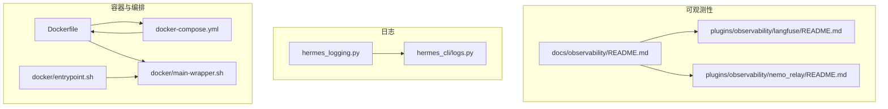
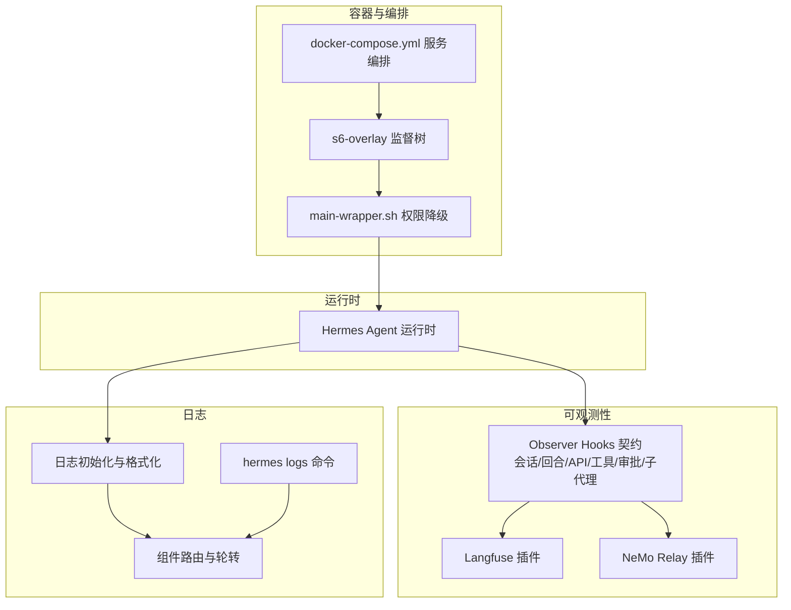
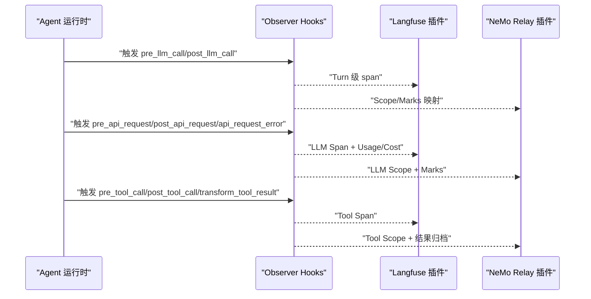
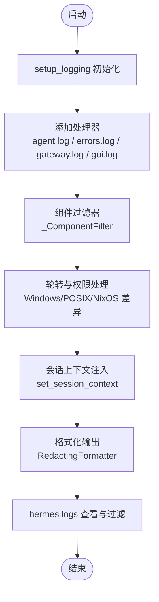
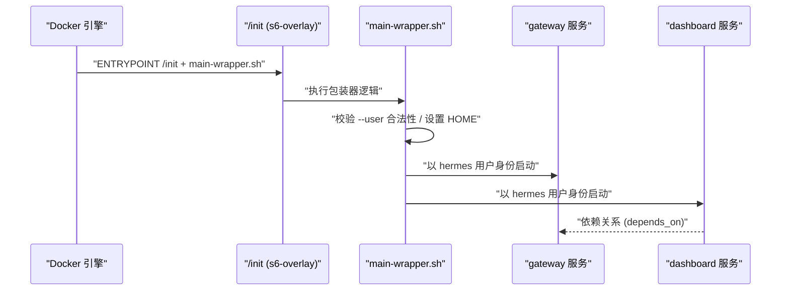
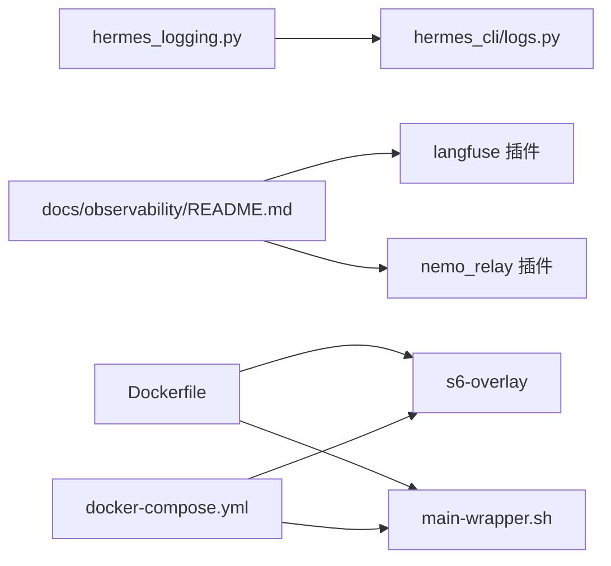

# 监控与运维

<cite>
**本文引用的文件**
- [docs/observability/README.md](file://docs/observability/README.md)
- [hermes_logging.py](file://hermes_logging.py)
- [hermes_cli/logs.py](file://hermes_cli/logs.py)
- [plugins/observability/langfuse/README.md](file://plugins/observability/langfuse/README.md)
- [plugins/observability/nemo_relay/README.md](file://plugins/observability/nemo_relay/README.md)
- [docker-compose.yml](file://docker-compose.yml)
- [Dockerfile](file://Dockerfile)
- [docker/entrypoint.sh](file://docker/entrypoint.sh)
- [docker/main-wrapper.sh](file://docker/main-wrapper.sh)
</cite>

## 目录
1. [引言](#引言)
2. [项目结构](#项目结构)
3. [核心组件](#核心组件)
4. [架构总览](#架构总览)
5. [详细组件分析](#详细组件分析)
6. [依赖分析](#依赖分析)
7. [性能考量](#性能考量)
8. [故障排查指南](#故障排查指南)
9. [结论](#结论)
10. [附录](#附录)

## 引言
本指南面向监控与运维团队，系统化梳理本项目的监控与可观测性能力、日志管理策略、容器化与服务编排、可观测插件集成（Langfuse、NeMo Relay）、以及可落地的运维流程与最佳实践。内容覆盖基础设施监控、应用性能监控、业务指标监控、日志采集与聚合、自动化运维（CI/CD、自动化部署、配置管理）与故障排查方法，并补充团队组织与安全合规建议。

## 项目结构
围绕监控与运维的关键目录与文件如下：
- 可观测性契约与插件：docs/observability/README.md、plugins/observability/langfuse/README.md、plugins/observability/nemo_relay/README.md
- 日志子系统：hermes_logging.py、hermes_cli/logs.py
- 容器与编排：Dockerfile、docker-compose.yml、docker/entrypoint.sh、docker/main-wrapper.sh

图表来源
- [docs/observability/README.md](file://docs/observability/README.md)
- [plugins/observability/langfuse/README.md](file://plugins/observability/langfuse/README.md)
- [plugins/observability/nemo_relay/README.md](file://plugins/observability/nemo_relay/README.md)
- [hermes_logging.py](file://hermes_logging.py)
- [hermes_cli/logs.py](file://hermes_cli/logs.py)
- [Dockerfile](file://Dockerfile)
- [docker-compose.yml](file://docker-compose.yml)
- [docker/entrypoint.sh](file://docker/entrypoint.sh)
- [docker/main-wrapper.sh](file://docker/main-wrapper.sh)

章节来源
- [docs/observability/README.md](file://docs/observability/README.md)
- [hermes_logging.py](file://hermes_logging.py)
- [hermes_cli/logs.py](file://hermes_cli/logs.py)
- [docker-compose.yml](file://docker-compose.yml)
- [Dockerfile](file://Dockerfile)
- [docker/entrypoint.sh](file://docker/entrypoint.sh)
- [docker/main-wrapper.sh](file://docker/main-wrapper.sh)

## 核心组件
- 观测钩子契约：提供会话、回合、API请求、工具调用、审批、子代理等生命周期事件的标准化输出，支持导出到 Langfuse、OpenTelemetry、NeMo Relay 等生态。
- 日志子系统：集中式日志初始化、按组件路由、轮转与脱敏、会话上下文注入、命令行查看与过滤。
- 容器与编排：基于 s6-overlay 的进程监督、用户映射、特权降级、服务编排与网络模式选择。
- 可观测插件：Langfuse 插件（可选启用，需凭据），NeMo Relay 插件（可导出 ATOF/ATIF 轨迹，支持中间件观察或托管执行）。

章节来源
- [docs/observability/README.md](file://docs/observability/README.md)
- [hermes_logging.py](file://hermes_logging.py)
- [hermes_cli/logs.py](file://hermes_cli/logs.py)
- [plugins/observability/langfuse/README.md](file://plugins/observability/langfuse/README.md)
- [plugins/observability/nemo_relay/README.md](file://plugins/observability/nemo_relay/README.md)
- [docker-compose.yml](file://docker-compose.yml)
- [Dockerfile](file://Dockerfile)

## 架构总览
下图展示从运行时到可观测插件与日志系统的整体交互路径，以及容器层的服务编排与权限控制。

图表来源
- [docs/observability/README.md](file://docs/observability/README.md)
- [hermes_logging.py](file://hermes_logging.py)
- [hermes_cli/logs.py](file://hermes_cli/logs.py)
- [plugins/observability/langfuse/README.md](file://plugins/observability/langfuse/README.md)
- [plugins/observability/nemo_relay/README.md](file://plugins/observability/nemo_relay/README.md)
- [docker-compose.yml](file://docker-compose.yml)
- [docker/main-wrapper.sh](file://docker/main-wrapper.sh)

## 详细组件分析

### 观测钩子契约与导出
- 钩子类型：会话生命周期、回合级 LLM、请求级 API、工具生命周期、审批、子代理。
- 关联 ID：会话、任务、回合、API 请求、工具调用、父子会话与子代理等稳定标识，便于跨事件关联。
- 输出字段：时间戳、状态、错误、用量、结果等；请求/响应/错误采用“净化”后的 JSON 兼容结构，避免敏感信息泄露。
- 性能原则：默认未挂载插件时不产生昂贵的 payload 构造；插件仅在注册相应钩子时才构建净化后的请求/响应载荷。

图表来源
- [docs/observability/README.md](file://docs/observability/README.md)
- [plugins/observability/langfuse/README.md](file://plugins/observability/langfuse/README.md)
- [plugins/observability/nemo_relay/README.md](file://plugins/observability/nemo_relay/README.md)

章节来源
- [docs/observability/README.md](file://docs/observability/README.md)

### 日志子系统
- 统一入口：setup_logging 提供集中式日志初始化，支持多处理器（agent.log、errors.log、gateway.log、gui.log），并为每个处理器设置合适的最小级别与轮转策略。
- 组件路由：通过 _ComponentFilter 将不同组件（gateway、gui、cli、agent、tools、cron）的日志定向到对应文件，便于分层排查。
- 会话上下文：set_session_context/clear_session_context 注入会话标签，便于按会话聚合与过滤。
- 脱敏与安全：使用 RedactingFormatter 对敏感字段进行脱敏，避免明文写盘。
- 平台差异：Windows 使用并发安全的 RotatingFileHandler，POSIX 使用标准轮转；NixOS 环境下提供 ManagedRotatingFileHandler 以维持组可读权限与外部轮转兼容。
- 命令行查看：hermes logs 支持尾随、实时跟随、级别过滤、会话过滤、组件过滤、相对时间范围等，满足快速排障需求。

图表来源
- [hermes_logging.py](file://hermes_logging.py)
- [hermes_cli/logs.py](file://hermes_cli/logs.py)

章节来源
- [hermes_logging.py](file://hermes_logging.py)
- [hermes_cli/logs.py](file://hermes_cli/logs.py)

### 容器与编排
- s6-overlay：作为 PID 1 的监督树，负责容器内主进程、仪表板与按配置生成的网关服务的生命周期管理与僵尸回收。
- 用户映射与权限降级：通过 HERMES_UID/HERMES_GID 在启动阶段将镜像内的 hermes 用户映射到宿主机用户，随后在 main-wrapper.sh 中通过 s6-setuidgid 将非 root 进程降权运行，降低容器内写盘风险。
- 网络模式：默认 host 模式，便于直接暴露网关与仪表板；仪表板默认绑定到 127.0.0.1，不建议公网暴露，如需远程访问请通过反向代理或 SSH 隧道。
- 服务编排：docker-compose.yml 定义 gateway 与 dashboard 两个服务，gateway 依赖 dashboard，二者共享 /opt/data 卷用于持久化配置、日志与技能等。

图表来源
- [Dockerfile](file://Dockerfile)
- [docker-compose.yml](file://docker-compose.yml)
- [docker/main-wrapper.sh](file://docker/main-wrapper.sh)
- [docker/entrypoint.sh](file://docker/entrypoint.sh)

章节来源
- [Dockerfile](file://Dockerfile)
- [docker-compose.yml](file://docker-compose.yml)
- [docker/entrypoint.sh](file://docker/entrypoint.sh)
- [docker/main-wrapper.sh](file://docker/main-wrapper.sh)

### 可观测插件：Langfuse
- 启用方式：交互式或手动安装 SDK 并启用插件。
- 凭证与环境变量：公钥、私钥、基础地址；可选环境、版本、采样率、字段最大长度、调试开关。
- 行为：未安装 SDK 或缺少凭证时静默失败开放（fail-open），不影响运行。

章节来源
- [plugins/observability/langfuse/README.md](file://plugins/observability/langfuse/README.md)

### 可观测插件：NeMo Relay
- 功能：将 Hermes 观测钩子映射为 NeMo Relay 的 Scope/Marks/ATOFS/ATIF，支持导出轨迹用于离线分析与重放。
- 启用与配置：先启用插件，再通过环境变量或 plugins.toml 配置导出路径与模式；支持自适应中间件观察或托管执行。
- 示例：提供了委托子代理与并行工具调用的本地示例与预期输出形态，便于验证与回归测试。

章节来源
- [plugins/observability/nemo_relay/README.md](file://plugins/observability/nemo_relay/README.md)

## 依赖分析
- 组件耦合
  - hermes_logging 与 hermes_cli/logs 通过统一的会话上下文与组件前缀实现日志分流与过滤。
  - 观测钩子契约被 Langfuse 与 NeMo Relay 插件消费，形成后端中立的可观测性扩展点。
  - 容器层通过 s6-overlay 与 main-wrapper.sh 解耦运行时与权限控制，降低耦合度。
- 外部依赖
  - Langfuse：Python SDK（可选）。
  - NeMo Relay：运行时与组件配置（可选）。
  - Docker 生态：s6-overlay、Entrypoint/Wrapper、Compose 编排。

图表来源
- [hermes_logging.py](file://hermes_logging.py)
- [hermes_cli/logs.py](file://hermes_cli/logs.py)
- [docs/observability/README.md](file://docs/observability/README.md)
- [plugins/observability/langfuse/README.md](file://plugins/observability/langfuse/README.md)
- [plugins/observability/nemo_relay/README.md](file://plugins/observability/nemo_relay/README.md)
- [Dockerfile](file://Dockerfile)
- [docker-compose.yml](file://docker-compose.yml)
- [docker/main-wrapper.sh](file://docker/main-wrapper.sh)

章节来源
- [hermes_logging.py](file://hermes_logging.py)
- [hermes_cli/logs.py](file://hermes_cli/logs.py)
- [docs/observability/README.md](file://docs/observability/README.md)
- [plugins/observability/langfuse/README.md](file://plugins/observability/langfuse/README.md)
- [plugins/observability/nemo_relay/README.md](file://plugins/observability/nemo_relay/README.md)
- [docker-compose.yml](file://docker-compose.yml)
- [Dockerfile](file://Dockerfile)
- [docker/main-wrapper.sh](file://docker/main-wrapper.sh)

## 性能考量
- 观测钩子成本控制：仅在至少有一个插件注册了相应钩子时才构造净化后的请求/响应载荷，避免默认路径产生额外开销。
- 日志性能：Windows 使用并发安全轮转处理器；POSIX 下保持标准轮转行为；NixOS 下确保组可读与外部轮转兼容。
- 容器性能：Python 标准输出缓冲关闭（PYTHONUNBUFFERED=1）以减少延迟；Playwright 浏览器缓存在镜像层预装，避免运行时下载。

章节来源
- [docs/observability/README.md](file://docs/observability/README.md)
- [hermes_logging.py](file://hermes_logging.py)
- [Dockerfile](file://Dockerfile)

## 故障排查指南
- 快速定位
  - 使用 hermes logs 查看最近日志，结合级别、组件、会话 ID、相对时间范围进行过滤。
  - 利用会话上下文注入，将同一对话中的所有日志串联起来，提升关联分析效率。
- 常见问题
  - 日志文件缺失：首次运行前不会生成日志，先执行 hermes chat 再查看。
  - 权限问题：容器内以 root 启动时写入 $HERMES_HOME 的文件可能不可读，使用特权降级或通过 docker exec 的 hermes 执行器。
  - Windows 轮转失败：确认使用并发安全的 RotatingFileHandler，避免其他进程占用导致重命名冲突。
- 可观测性验证
  - Langfuse：启用后发起一次对话，在 Langfuse 控制台检查是否存在“Hermes turn”轨迹。
  - NeMo Relay：启用后导出 ATOF/ATIF 文件，核对事件与轨迹结构是否符合预期。

章节来源
- [hermes_cli/logs.py](file://hermes_cli/logs.py)
- [hermes_logging.py](file://hermes_logging.py)
- [plugins/observability/langfuse/README.md](file://plugins/observability/langfuse/README.md)
- [plugins/observability/nemo_relay/README.md](file://plugins/observability/nemo_relay/README.md)

## 结论
本项目提供了完善的可观测性契约与日志基础设施，配合可选的 Langfuse 与 NeMo Relay 插件，能够覆盖从基础设施到应用性能再到业务指标的多层级监控。容器层通过 s6-overlay 与权限降级保障运行时稳定性与安全性。建议在生产环境中启用组件化日志、开启必要的可观测插件，并建立基于会话与轨迹的故障排查流程。

## 附录
- 自动化运维建议（概念性）
  - CI/CD：在流水线中集成日志与可观测性检查步骤，确保每次发布前验证关键路径的日志与轨迹输出。
  - 自动化部署：使用 docker-compose 或容器编排平台管理服务生命周期，结合 s6-overlay 的监督能力保证高可用。
  - 配置管理：通过 HERMES_HOME 持久化配置与日志，避免在镜像层写入状态数据。
  - 变更管理：对可观测插件启用/禁用与导出配置进行版本化管理，确保可追溯与回滚。
- 团队组织与管理（概念性）
  - 角色分工：运维工程师负责基础设施与容器编排，SRE 负责可观测性与告警，开发负责插件与钩子扩展。
  - 工作流程：建立变更评审、发布验证、故障复盘与知识沉淀机制。
  - 技能培训：定期开展可观测性与容器化专题培训，提升团队整体能力。
- 安全与合规（概念性）
  - 访问控制：限制对仪表板与网关的访问，必要时通过反向代理或隧道接入。
  - 操作审计：记录关键运维操作与插件启用/禁用动作，保留审计日志。
  - 数据保护：对日志与导出文件进行脱敏与加密存储，遵守数据最小化与保留期限要求。
  - 法规遵循：根据所在地区与行业要求，制定数据分类分级与跨境传输策略。