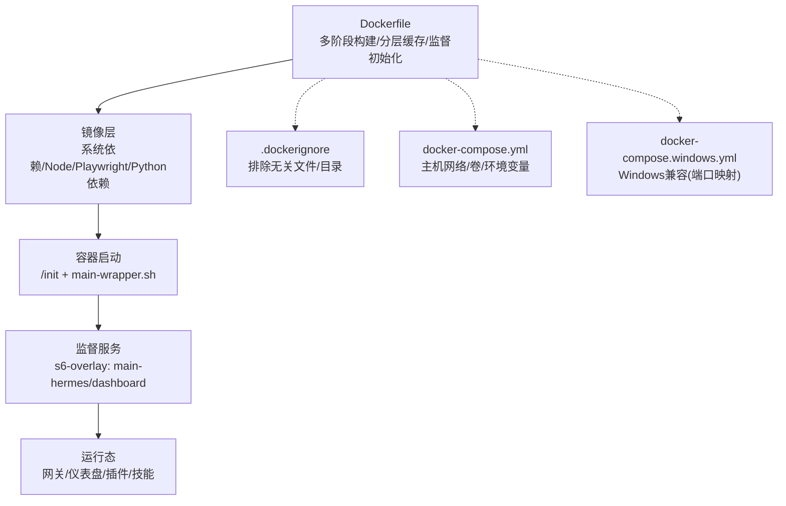
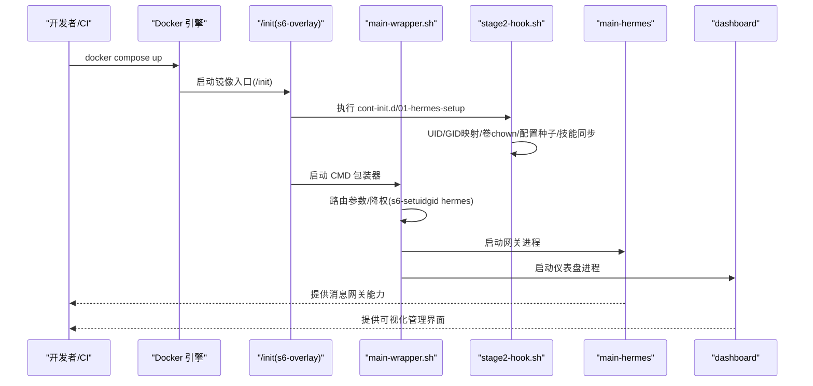
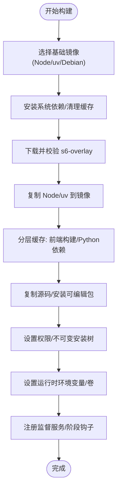
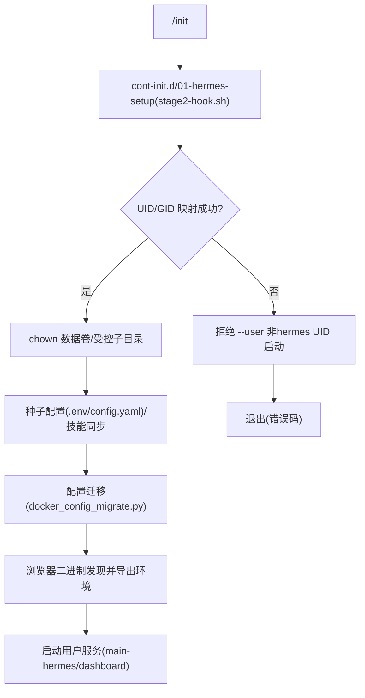
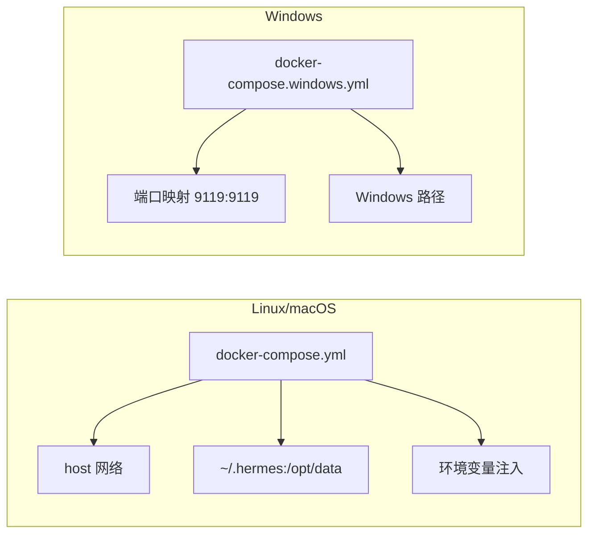
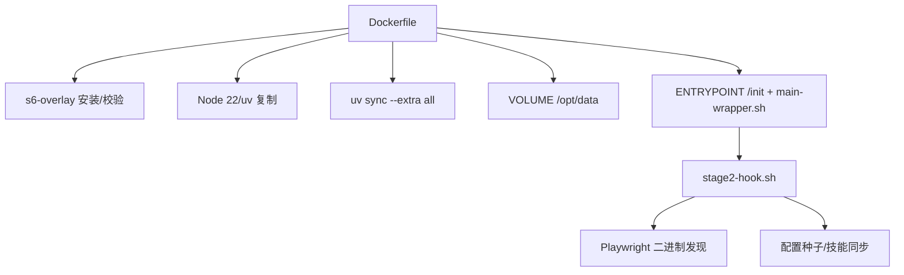

# 部署与生产

<cite>
**本文引用的文件**
- [Dockerfile](file://Dockerfile)
- [docker-compose.yml](file://docker-compose.yml)
- [docker-compose.windows.yml](file://docker-compose.windows.yml)
- [.dockerignore](file://.dockerignore)
- [docker/main-wrapper.sh](file://docker/main-wrapper.sh)
- [docker/stage2-hook.sh](file://docker/stage2-hook.sh)
- [docker/hermes-exec-shim.sh](file://docker/hermes-exec-shim.sh)
- [docker/entrypoint.sh](file://docker/entrypoint.sh)
- [docker/SOUL.md](file://docker/SOUL.md)
- [cli-config.yaml.example](file://cli-config.yaml.example)
- [setup-hermes.sh](file://setup-hermes.sh)
- [scripts/install.sh](file://scripts/install.sh)
</cite>

## 目录
1. [简介](#简介)
2. [项目结构](#项目结构)
3. [核心组件](#核心组件)
4. [架构总览](#架构总览)
5. [详细组件分析](#详细组件分析)
6. [依赖关系分析](#依赖关系分析)
7. [性能考虑](#性能考虑)
8. [故障排查指南](#故障排查指南)
9. [结论](#结论)
10. [附录](#附录)

## 简介
本指南面向运维与开发团队，提供从本地到容器化再到云平台的全链路部署与生产实践。内容覆盖：
- 多种部署方式：本地安装、容器编排（Docker）、跨平台兼容性（Windows Docker Desktop）
- 容器镜像构建与配置：分层缓存、运行时权限、卷挂载、环境变量、入口点与监督机制
- 生产环境性能调优与资源规划：CPU、内存、存储、网络
- 高可用与容灾：负载均衡、故障转移、数据备份与恢复
- 监控与运维最佳实践：日志聚合、性能监控、告警配置
- 安全加固：网络安全、访问控制、数据保护
- 自动化与脚本：安装脚本、升级流程、配置迁移

## 项目结构
围绕部署与生产的关键目录与文件如下：
- 容器与编排：Dockerfile、docker-compose.yml、docker-compose.windows.yml、.dockerignore 及 docker/ 下的启动与监督脚本
- 配置模板：cli-config.yaml.example 提供模型、终端后端、浏览器工具、会话重置等生产级配置参考
- 安装与升级：setup-hermes.sh 与 scripts/install.sh 提供本地与远程一键安装、虚拟环境与依赖管理
- 运行时引导：docker/main-wrapper.sh、docker/stage2-hook.sh、docker/hermes-exec-shim.sh 实现 s6-overlay 监督树、UID/GID 映射、权限降级与特权命令执行

图表来源
- [Dockerfile:1-338](file://Dockerfile#L1-L338)
- [docker-compose.yml:1-77](file://docker-compose.yml#L1-L77)
- [docker-compose.windows.yml:1-39](file://docker-compose.windows.yml#L1-L39)
- [.dockerignore:1-108](file://.dockerignore#L1-L108)

章节来源
- [Dockerfile:1-338](file://Dockerfile#L1-L338)
- [docker-compose.yml:1-77](file://docker-compose.yml#L1-L77)
- [docker-compose.windows.yml:1-39](file://docker-compose.windows.yml#L1-L39)
- [.dockerignore:1-108](file://.dockerignore#L1-L108)

## 核心组件
- 容器镜像与监督体系
  - 使用 s6-overlay 替代 tini，PID 1 为 /init，负责 cont-init.d 初始化与监督树启动
  - 分层缓存策略：前端构建、Python 依赖、源码复制顺序优化
  - 权限与安全：非 root 用户运行，特权命令通过 hermes-exec-shim.sh 降权执行
- 编排与运行参数
  - docker-compose.yml 支持主机网络模式、卷挂载 ~/.hermes 到 /opt/data、环境变量注入
  - Windows 兼容版使用端口映射替代 host 网络
- 配置与迁移
  - cli-config.yaml.example 提供模型、终端后端、浏览器工具、会话重置等生产配置
  - stage2-hook.sh 在首次启动或重启时进行目录结构、权限、配置种子与迁移

章节来源
- [Dockerfile:241-338](file://Dockerfile#L241-L338)
- [docker/main-wrapper.sh:1-83](file://docker/main-wrapper.sh#L1-L83)
- [docker/stage2-hook.sh:1-434](file://docker/stage2-hook.sh#L1-L434)
- [docker/hermes-exec-shim.sh:1-88](file://docker/hermes-exec-shim.sh#L1-L88)
- [docker-compose.yml:29-77](file://docker-compose.yml#L29-L77)
- [docker-compose.windows.yml:12-39](file://docker-compose.windows.yml#L12-L39)
- [cli-config.yaml.example:1-800](file://cli-config.yaml.example#L1-L800)

## 架构总览
下图展示容器启动到服务运行的端到端流程，以及关键配置与卷挂载位置。

图表来源
- [docker-compose.yml:29-77](file://docker-compose.yml#L29-L77)
- [docker/main-wrapper.sh:14-83](file://docker/main-wrapper.sh#L14-L83)
- [docker/stage2-hook.sh:1-434](file://docker/stage2-hook.sh#L1-L434)

## 详细组件分析

### 组件A：容器镜像与分层构建
- 关键特性
  - 多阶段构建：Node 22 基础镜像、uv 基础镜像、Debian 运行时
  - 分层缓存：前端构建独立于 Python 源；Playwright 浏览器预装在可复用路径
  - 运行时环境：禁用 Python 缓冲、禁止生成 .pyc、设置 Playwright 浏览器缓存路径
  - 监督初始化：s6-overlay 安装与校验、PID 1 为 /init、静态服务声明
  - 权限与安全：非 root 用户 hermes、特权命令降权 shim、PATH 优先级保证
- 卷与环境
  - 卷挂载 /opt/data，环境变量 HERMES_HOME、HERMES_WRITE_SAFE_ROOT、HERMES_DISABLE_LAZY_INSTALLS
  - 环境变量示例：HERMES_UID/HERMES_GID、API_SERVER_HOST/API_SERVER_KEY、平台密钥等

图表来源
- [Dockerfile:10-338](file://Dockerfile#L10-L338)

章节来源
- [Dockerfile:10-338](file://Dockerfile#L10-L338)

### 组件B：启动包装器与监督钩子
- main-wrapper.sh
  - 参数路由：无参执行 hermes、直接执行可执行程序、作为 hermes 子命令转发
  - 权限降级：仅当当前用户为 root 时通过 s6-setuidgid hermes 降权
  - 工作目录处理：保存原始工作目录并在启动前切换至 /opt/data
- stage2-hook.sh（cont-init.d）
  - UID/GID 映射：支持 HERMES_UID/HERMES_GID 或 PUID/PGID，避免 --user 固定 UID 的限制
  - 数据卷修复：针对顶层目录与受控子目录进行目标化 chown，避免破坏宿主文件
  - 配置种子：首次启动复制 .env 与 config.yaml 示例，并设置权限
  - 技能同步：从镜像内置 skills 同步到 /opt/data
  - 配置迁移：运行 docker_config_migrate.py 保持 schema 最新
  - 浏览器二进制发现：自动定位 Playwright Chromium 并导出 AGENT_BROWSER_EXECUTABLE_PATH
- hermes-exec-shim.sh
  - 防止 docker exec 以 root 写入 /opt/data 导致权限不一致的问题
  - 仅在 root 且未显式允许时才降权执行，否则直接透传

图表来源
- [docker/stage2-hook.sh:1-434](file://docker/stage2-hook.sh#L1-L434)
- [docker/main-wrapper.sh:14-83](file://docker/main-wrapper.sh#L14-L83)
- [docker/hermes-exec-shim.sh:1-88](file://docker/hermes-exec-shim.sh#L1-L88)

章节来源
- [docker/main-wrapper.sh:1-83](file://docker/main-wrapper.sh#L1-L83)
- [docker/stage2-hook.sh:1-434](file://docker/stage2-hook.sh#L1-L434)
- [docker/hermes-exec-shim.sh:1-88](file://docker/hermes-exec-shim.sh#L1-L88)

### 组件C：编排与跨平台兼容
- docker-compose.yml
  - 主机网络模式、卷挂载 ~/.hermes:/opt/data、环境变量 HERMES_UID/HERMES_GID
  - 网关与仪表盘服务分离，仪表盘默认仅监听 127.0.0.1，远程访问需隧道或反向代理
  - 可选启用 OpenAI 兼容 API 服务器（需设置 API_SERVER_KEY）
- docker-compose.windows.yml
  - 移除 host 网络，使用端口映射 9119:9119，Windows 路径兼容
  - 仪表盘暴露到 0.0.0.0 并开启 --insecure（仅限本地测试）

图表来源
- [docker-compose.yml:29-77](file://docker-compose.yml#L29-L77)
- [docker-compose.windows.yml:12-39](file://docker-compose.windows.yml#L12-L39)

章节来源
- [docker-compose.yml:1-77](file://docker-compose.yml#L1-L77)
- [docker-compose.windows.yml:1-39](file://docker-compose.windows.yml#L1-L39)

### 组件D：配置与迁移
- cli-config.yaml.example
  - 模型与提供商：支持 auto、openrouter、nous、anthropic、openai-codex、gemini、azure-foundry 等
  - 请求超时与过期检测：request_timeout_seconds、stale_timeout_seconds
  - 终端后端：local/ssh/docker/singularity/modal/daytona，含资源限制与持久化选项
  - 浏览器工具：空闲超时、Playwright 集成
  - 上下文压缩：阈值、尾部保留比例、头尾保护数量
  - 辅助模型：图像分析、网页提取、TTS 音频标签、会话检索
  - 持久记忆：个人笔记与用户画像字符上限与提醒间隔
  - 会话重置策略：空闲超时、每日边界、模式开关
- stage2-hook.sh 的配置迁移
  - 首次启动或升级后运行 docker_config_migrate.py，确保 schema 一致性

章节来源
- [cli-config.yaml.example:1-800](file://cli-config.yaml.example#L1-L800)
- [docker/stage2-hook.sh:322-331](file://docker/stage2-hook.sh#L322-L331)

### 组件E：安装与升级脚本
- setup-hermes.sh
  - 识别 Termux/桌面环境，创建 Python 3.11 虚拟环境，使用 uv 或 stdlib venv
  - 安装依赖（优先 uv.lock），Termux 场景使用约束文件
  - 创建 .env 示例并设置权限，软链接 hermes 到用户可执行路径
  - 同步内置技能到 ~/.hermes/skills/
- scripts/install.sh
  - 支持 curl 一键安装，自动检测系统、安装 uv、Python、Node、Git
  - FHS 布局（root）与用户布局区分，命令链接至 /usr/local/bin 或 ~/.local/bin
  - 可选跳过 venv、跳过浏览器、跳过技能、指定分支/提交、非交互模式
  - 桌面应用构建（apps/desktop）可选包含

章节来源
- [setup-hermes.sh:1-463](file://setup-hermes.sh#L1-L463)
- [scripts/install.sh:1-800](file://scripts/install.sh#L1-L800)

## 依赖关系分析
- 容器镜像依赖
  - s6-overlay 版本与校验和在 Dockerfile 中明确声明，确保供应链安全
  - Node 22 与 uv 用于前端构建与 Python 依赖安装
  - Playwright 浏览器安装在可复用路径，stage2-hook.sh 自动发现并导出环境
- 运行时依赖
  - hermes-exec-shim.sh 依赖 /command/s6-setuidgid（s6-overlay 提供）
  - main-wrapper.sh 依赖 with-contenv 注入环境变量
- 编排依赖
  - docker-compose.yml 依赖 /opt/data 卷与环境变量映射
  - Windows 版本依赖端口映射与路径替换

图表来源
- [Dockerfile:34-90](file://Dockerfile#L34-L90)
- [Dockerfile:178-181](file://Dockerfile#L178-L181)
- [Dockerfile:247-262](file://Dockerfile#L247-L262)
- [docker/stage2-hook.sh:385-431](file://docker/stage2-hook.sh#L385-L431)

章节来源
- [Dockerfile:34-90](file://Dockerfile#L34-L90)
- [Dockerfile:178-181](file://Dockerfile#L178-L181)
- [Dockerfile:247-262](file://Dockerfile#L247-L262)
- [docker/stage2-hook.sh:385-431](file://docker/stage2-hook.sh#L385-L431)

## 性能考虑
- 镜像与构建
  - 分层缓存：前端构建与 Python 依赖独立缓存，减少重复安装时间
  - 只复制必要清单：package.json、web/ui-tui 目录提前复制，避免每次源码变更导致缓存失效
  - README.md 占位：解决 README.md 被 .dockerignore 排除导致的构建失败问题
- 运行时
  - 禁用 Python 缓冲与 .pyc 生成，降低 I/O 压力
  - Playwright 浏览器缓存路径固定，避免运行时重建
  - 静态服务与动态服务分离：静态服务在构建时声明，动态服务按需注册
- 资源规划
  - 终端后端资源限制：container_cpu、container_memory、container_disk、container_persistent
  - 会话并发与超时：max_concurrent_sessions、gateway_timeout、restart_drain_timeout
  - 上下文压缩：threshold、target_ratio、protect_last_n、protect_first_n 控制历史压缩强度

章节来源
- [Dockerfile:110-137](file://Dockerfile#L110-L137)
- [Dockerfile:139-181](file://Dockerfile#L139-L181)
- [Dockerfile:217-239](file://Dockerfile#L217-L239)
- [cli-config.yaml.example:279-286](file://cli-config.yaml.example#L279-L286)
- [cli-config.yaml.example:543-623](file://cli-config.yaml.example#L543-L623)
- [cli-config.yaml.example:374-404](file://cli-config.yaml.example#L374-L404)

## 故障排查指南
- 启动失败与权限问题
  - 错误：容器以任意非 hermes UID 启动被拒绝
  - 处理：不要使用 --user 固定 UID；改为传递 HERMES_UID/HERMES_GID 或 PUID/PGID，由 stage2-hook.sh 完成映射
  - 参考：docker/main-wrapper.sh 与 docker/stage2-hook.sh 的 UID 校验逻辑
- 文件权限与宿主所有权
  - 症状：docker exec 以 root 写入 /opt/data 导致权限不一致
  - 处理：使用 hermes-exec-shim.sh 自动降权；或设置 HERMES_DOCKER_EXEC_AS_ROOT=1 临时保留 root 语义
- 配置与迁移
  - 症状：升级后配置不兼容导致启动异常
  - 处理：stage2-hook.sh 自动运行 docker_config_migrate.py；如需手动迁移，设置 HERMES_SKIP_CONFIG_MIGRATION=1
- 浏览器工具不可用
  - 症状：agent-browser 报错“Chrome not found”
  - 处理：stage2-hook.sh 自动发现 Playwright Chromium 并导出 AGENT_BROWSER_EXECUTABLE_PATH；如需自定义，设置 AGENT_BROWSER_EXECUTABLE_PATH

章节来源
- [docker/main-wrapper.sh:24-50](file://docker/main-wrapper.sh#L24-L50)
- [docker/stage2-hook.sh:26-74](file://docker/stage2-hook.sh#L26-L74)
- [docker/stage2-hook.sh:332-331](file://docker/stage2-hook.sh#L332-L331)
- [docker/stage2-hook.sh:411-431](file://docker/stage2-hook.sh#L411-L431)
- [docker/hermes-exec-shim.sh:36-88](file://docker/hermes-exec-shim.sh#L36-L88)

## 结论
本指南基于仓库中的容器化与配置实现，提供了从镜像构建、启动监督、编排部署到生产性能与安全加固的完整路径。建议在生产中：
- 使用 s6-overlay 监督树与非 root 运行
- 严格控制卷权限与配置种子，确保首次启动与升级的稳定性
- 通过 cli-config.yaml.example 规划模型、终端后端与上下文压缩策略
- 采用分层缓存与最小化构建上下文提升交付效率
- 结合监控与告警体系完善可观测性与应急响应

## 附录
- 安全加固要点
  - 网络安全：仪表盘默认仅监听 127.0.0.1；远程访问需 SSH 隧道或反向代理
  - 访问控制：API 服务器需设置 API_SERVER_KEY；平台密钥通过环境变量注入
  - 数据保护：.env 与 config.yaml 设置严格权限；stage2-hook.sh 在启动时强制权限
- 自动化与运维
  - 一键安装：curl | bash 方式，支持非交互、跳过浏览器/技能、指定分支/提交
  - 升级与迁移：通过 stage2-hook.sh 的配置迁移脚本与 uv.lock 的哈希验证
  - 日志与状态：通过 hermes status 与日志目录 /opt/data/logs 查看运行状态

章节来源
- [docker-compose.yml:13-27](file://docker-compose.yml#L13-L27)
- [docker/stage2-hook.sh:314-321](file://docker/stage2-hook.sh#L314-L321)
- [scripts/install.sh:158-203](file://scripts/install.sh#L158-L203)
- [cli-config.yaml.example:44-52](file://cli-config.yaml.example#L44-L52)