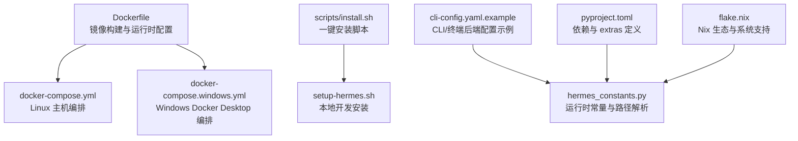
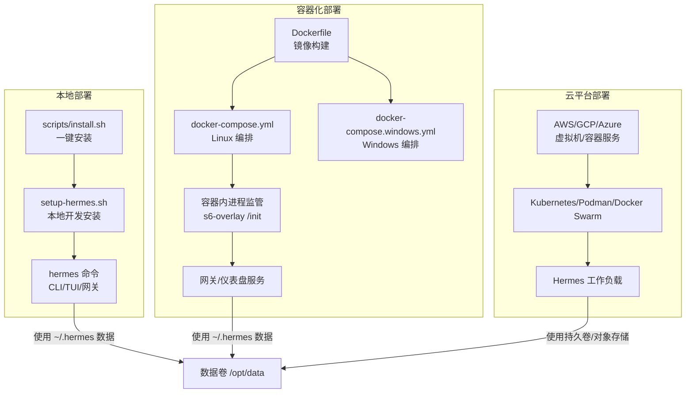
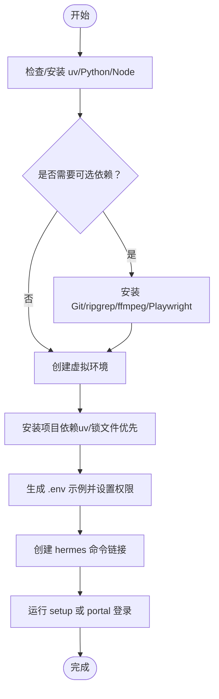
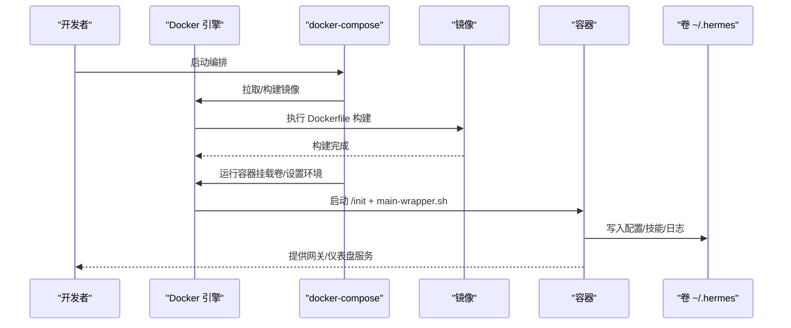
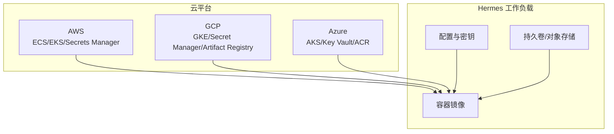
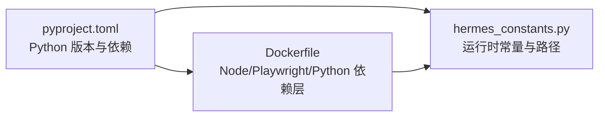

# 部署方式

<cite>
**本文引用的文件**
- [Dockerfile](file://Dockerfile)
- [docker-compose.yml](file://docker-compose.yml)
- [docker-compose.windows.yml](file://docker-compose.windows.yml)
- [setup-hermes.sh](file://setup-hermes.sh)
- [scripts/install.sh](file://scripts/install.sh)
- [cli-config.yaml.example](file://cli-config.yaml.example)
- [hermes_constants.py](file://hermes_constants.py)
- [pyproject.toml](file://pyproject.toml)
- [flake.nix](file://flake.nix)
- [README.md](file://README.md)
</cite>

## 目录
1. [简介](#简介)
2. [项目结构](#项目结构)
3. [核心组件](#核心组件)
4. [架构总览](#架构总览)
5. [详细组件分析](#详细组件分析)
6. [依赖分析](#依赖分析)
7. [性能考虑](#性能考虑)
8. [故障排查指南](#故障排查指南)
9. [结论](#结论)
10. [附录](#附录)

## 简介
本指南聚焦于三种主要部署方式：本地部署、容器化部署与云平台部署。我们将结合仓库中的安装脚本、容器编排与配置样例，给出可操作的步骤、关键配置点、优缺点对比、适用场景与最佳实践，并提供命令示例与配置文件路径指引，帮助你选择最合适的部署路径。

## 项目结构
围绕部署的关键文件与目录如下：
- 容器镜像与编排
  - Dockerfile：定义多阶段构建、系统依赖、Node/Playwright、Python 依赖缓存层、s6-overlay 进程监管、入口与卷挂载等
  - docker-compose.yml：Linux 主机网络模式下的网关与仪表盘服务编排
  - docker-compose.windows.yml：Windows Docker Desktop 兼容版（端口映射、卷路径）
- 本地安装脚本
  - setup-hermes.sh：开发者手动克隆仓库后的快速本地安装流程（uv/venv、依赖安装、.env 创建、命令链接）
  - scripts/install.sh：跨平台一键安装脚本（uv/Python/Node/可选 Git、浏览器工具链、终端后端等）
- 配置与常量
  - cli-config.yaml.example：CLI 行为、模型与提供商、终端后端（本地/SSH/Docker/Singularity/Modal/Daytona）等配置示例
  - hermes_constants.py：HERMES_HOME 默认路径、容器检测、子进程 HOME 策略等运行时常量与辅助函数
- 包管理与开发环境
  - pyproject.toml：项目元数据、Python 版本约束、可选依赖与 extras（如 web/dashboard、messaging、matrix 等）
  - flake.nix：Nix 生态输入与系统支持（x86_64-linux、aarch64-linux、aarch64-darwin）

**图示来源**
- [Dockerfile:1-338](file://Dockerfile#L1-L338)
- [docker-compose.yml:1-77](file://docker-compose.yml#L1-L77)
- [docker-compose.windows.yml:1-39](file://docker-compose.windows.yml#L1-L39)
- [scripts/install.sh:1-800](file://scripts/install.sh#L1-L800)
- [setup-hermes.sh:1-463](file://setup-hermes.sh#L1-L463)
- [cli-config.yaml.example:1-800](file://cli-config.yaml.example#L1-L800)
- [hermes_constants.py:1-595](file://hermes_constants.py#L1-L595)
- [pyproject.toml:1-379](file://pyproject.toml#L1-L379)
- [flake.nix:1-46](file://flake.nix#L1-L46)

**章节来源**
- [Dockerfile:1-338](file://Dockerfile#L1-L338)
- [docker-compose.yml:1-77](file://docker-compose.yml#L1-L77)
- [docker-compose.windows.yml:1-39](file://docker-compose.windows.yml#L1-L39)
- [scripts/install.sh:1-800](file://scripts/install.sh#L1-L800)
- [setup-hermes.sh:1-463](file://setup-hermes.sh#L1-L463)
- [cli-config.yaml.example:1-800](file://cli-config.yaml.example#L1-L800)
- [hermes_constants.py:1-595](file://hermes_constants.py#L1-L595)
- [pyproject.toml:1-379](file://pyproject.toml#L1-L379)
- [flake.nix:1-46](file://flake.nix#L1-L46)

## 核心组件
- 容器镜像与运行时
  - 多阶段构建：Node 22 LTS、Python 依赖缓存、Playwright 浏览器预装、s6-overlay 进程监管、非 root 用户 hermes
  - 卷与环境：/opt/data 挂载用于持久化数据；HERMES_UID/HERMES_GID 控制宿主权限映射
  - 入口与命令：/init + main-wrapper.sh 组合，支持 gateway/dashboard 子命令
- 本地安装与依赖
  - scripts/install.sh：自动检测/安装 uv、Python 3.11、Node 22、可选 Git、浏览器工具链，创建 venv 并安装依赖
  - setup-hermes.sh：面向已克隆仓库的开发者路径，创建 venv、安装依赖、生成 .env、创建 hermes 命令链接
- 配置与路径
  - cli-config.yaml.example：终端后端（local/ssh/docker/singularity/modal/daytona）、容器资源限制、安全扫描等
  - hermes_constants.py：HERMES_HOME 默认路径解析、容器检测、子进程 HOME 策略、well-known 路径

**章节来源**
- [Dockerfile:1-338](file://Dockerfile#L1-L338)
- [scripts/install.sh:1-800](file://scripts/install.sh#L1-L800)
- [setup-hermes.sh:1-463](file://setup-hermes.sh#L1-L463)
- [cli-config.yaml.example:1-800](file://cli-config.yaml.example#L1-L800)
- [hermes_constants.py:1-595](file://hermes_constants.py#L1-L595)

## 架构总览
下图展示了三种部署方式在系统中的位置关系与交互：

**图示来源**
- [Dockerfile:1-338](file://Dockerfile#L1-L338)
- [docker-compose.yml:1-77](file://docker-compose.yml#L1-L77)
- [docker-compose.windows.yml:1-39](file://docker-compose.windows.yml#L1-L39)
- [scripts/install.sh:1-800](file://scripts/install.sh#L1-L800)
- [setup-hermes.sh:1-463](file://setup-hermes.sh#L1-L463)

## 详细组件分析

### 本地部署（Linux/macOS/WSL2/Termux/Windows）
- 系统要求与依赖
  - Python 3.11（推荐使用 uv 管理），Node.js 22 LTS，可选 Git、ripgrep、ffmpeg、Playwright 浏览器
  - Windows 支持原生运行，安装器会处理 MinGit 与环境变量
- 安装步骤
  - 使用一键安装脚本（跨平台）：下载并执行安装脚本，自动检测/安装 uv、Python、Node、可选 Git 与浏览器工具链
  - 开发者手动安装：克隆仓库后运行本地安装脚本，创建 venv、安装依赖、生成 .env、创建 hermes 命令链接
- 环境配置
  - 首次运行后，根据提示执行 setup 或 portal 登录，完成模型提供商与工具配置
  - 可通过 cli-config.yaml.example 自定义终端后端（local/ssh/docker/singularity/modal/daytona）与容器资源限制
- 优点
  - 部署简单、可控性强、便于调试与二次开发
- 缺点
  - 需自行维护系统依赖与升级
- 适用场景
  - 开发测试、个人使用、对隔离性要求不高或已有运维体系

**图示来源**
- [scripts/install.sh:1-800](file://scripts/install.sh#L1-L800)
- [setup-hermes.sh:1-463](file://setup-hermes.sh#L1-L463)
- [cli-config.yaml.example:1-800](file://cli-config.yaml.example#L1-L800)

**章节来源**
- [scripts/install.sh:1-800](file://scripts/install.sh#L1-L800)
- [setup-hermes.sh:1-463](file://setup-hermes.sh#L1-L463)
- [cli-config.yaml.example:1-800](file://cli-config.yaml.example#L1-L800)
- [README.md:34-81](file://README.md#L34-L81)

### 容器化部署（Docker）
- 镜像构建
  - 多阶段构建：Node 22 LTS 来源镜像、Python 依赖缓存、前端构建缓存、s6-overlay 进程监管、非 root hermes 用户
  - 关键环境变量：PLAYWRIGHT_BROWSERS_PATH、PYTHONUNBUFFERED、PYTHONDONTWRITEBYTECODE
  - 运行时参数：HERMES_HOME=/opt/data、HERMES_UID/HERMES_GID、PATH 注入 /opt/hermes/bin 与 venv
- 服务编排
  - Linux 主机：network_mode: host，挂载 ~/.hermes 到 /opt/data，分别启动 gateway/dashboard
  - Windows Docker Desktop：移除 host 网络，使用端口映射与 Windows 风格卷路径
- 卷与权限
  - /opt/data 为唯一数据卷，HERMES_UID/HERMES_GID 控制容器内 hermes 用户与宿主权限映射
  - s6-overlay stage2 hook 负责 chown、配置种子与服务注册
- 优势
  - 一致性高、隔离性好、便于横向扩展与回滚
- 劣势
  - 对网络与卷挂载有额外要求，Windows 桌面需注意 host 网络不支持
- 适用场景
  - 生产环境、CI/CD、多实例部署、仪表盘与网关分离

**图示来源**
- [Dockerfile:1-338](file://Dockerfile#L1-L338)
- [docker-compose.yml:1-77](file://docker-compose.yml#L1-L77)
- [docker-compose.windows.yml:1-39](file://docker-compose.windows.yml#L1-L39)

**章节来源**
- [Dockerfile:1-338](file://Dockerfile#L1-L338)
- [docker-compose.yml:1-77](file://docker-compose.yml#L1-L77)
- [docker-compose.windows.yml:1-39](file://docker-compose.windows.yml#L1-L39)

### 云平台部署（AWS/GCP/Azure）
- 策略概述
  - 通用策略：以容器镜像为基础，结合云厂商的容器编排能力（ECS/EKS/GKE/AKS/Podman/Kubernetes）进行部署
  - 数据持久化：使用云盘/对象存储作为 /opt/data 的持久卷或共享存储
  - 网络与安全：通过安全组/防火墙控制访问，仪表盘默认仅监听 127.0.0.1，远程访问需隧道或反向代理
- AWS
  - ECS/Fargate：适合无服务器容器编排；EKS：自管 Kubernetes，适合复杂拓扑
  - IAM 角色与 Secrets Manager：用于注入敏感配置（API 密钥、证书）
- GCP
  - GKE：托管 Kubernetes；Secret Manager/Workload Identity 管理密钥与身份
  - Artifact Registry：存放镜像，结合 Cloud Build 自动化
- Azure
  - AKS：托管 Kubernetes；Key Vault/Managed Identities 管理密钥与身份
  - Container Registry：镜像仓库，结合 DevOps 管道
- 最佳实践
  - 将敏感信息放入云密钥管理服务，避免硬编码进镜像或配置
  - 使用健康检查与探针，配合滚动更新与蓝绿发布
  - 仪表盘暴露仅限内网或通过 SSH 隧道访问
  - 为每个环境（dev/staging/prod）配置独立命名空间/集群与资源配额

**图示来源**
- [docker-compose.yml:13-28](file://docker-compose.yml#L13-L28)
- [Dockerfile:283-312](file://Dockerfile#L283-L312)

**章节来源**
- [docker-compose.yml:13-28](file://docker-compose.yml#L13-L28)
- [Dockerfile:283-312](file://Dockerfile#L283-L312)

## 依赖分析
- Python 版本与依赖
  - Python 3.11～3.14（上限 3.14），核心依赖最小化，可选依赖通过 extras 分离
  - [all] 仅包含无法懒加载的依赖，其余后端（provider/search/TTS/memory/platform）通过首次使用安装
- Node/Playwright
  - Node 22 LTS，Playwright Chromium 预装，确保浏览器工具可用
- 运行时常量
  - hermes_constants.py 提供 HERMES_HOME 解析、容器检测、子进程 HOME 策略等

**图示来源**
- [pyproject.toml:1-379](file://pyproject.toml#L1-L379)
- [hermes_constants.py:1-595](file://hermes_constants.py#L1-L595)
- [Dockerfile:1-338](file://Dockerfile#L1-L338)

**章节来源**
- [pyproject.toml:1-379](file://pyproject.toml#L1-L379)
- [hermes_constants.py:1-595](file://hermes_constants.py#L1-L595)
- [Dockerfile:1-338](file://Dockerfile#L1-L338)

## 性能考虑
- 容器镜像分层优化
  - 依赖安装与前端构建分层缓存，减少变更导致的全量重装
  - Playwright 二进制与浏览器预装，避免运行时冷启动
- 进程监管与权限
  - s6-overlay 替代 tini，非 root hermes 用户运行，降低权限风险
- 端到端体验
  - 本地安装脚本优先使用锁文件进行哈希校验安装，提升供应链安全性与一致性

[本节为通用指导，无需特定文件引用]

## 故障排查指南
- 容器权限问题
  - 确认 HERMES_UID/HERMES_GID 与宿主用户一致，避免文件属主不匹配
  - Windows Docker Desktop 不支持 host 网络，需使用端口映射与 0.0.0.0 监听
- 仪表盘访问
  - 默认仅监听 127.0.0.1，远程访问请使用 SSH 隧道或反向代理
- 本地安装失败
  - 检查 uv/Python/Node 是否正确安装，必要时使用 --no-venv/--skip-setup 参数跳过部分步骤
  - 在 Termux 环境下，使用 [termux] extras 安装受限依赖
- 容器内命令执行
  - 使用 /opt/hermes/bin/hermes 权限降级 shim，避免 root 写入导致的权限问题

**章节来源**
- [docker-compose.yml:13-28](file://docker-compose.yml#L13-L28)
- [docker-compose.windows.yml:1-39](file://docker-compose.windows.yml#L1-39)
- [scripts/install.sh:1-800](file://scripts/install.sh#L1-L800)
- [Dockerfile:283-312](file://Dockerfile#L283-L312)

## 结论
- 本地部署适合开发与个人使用，安装脚本自动化程度高，但需自行维护系统依赖
- 容器化部署提供强一致性与隔离性，适合生产与多实例场景，Windows 桌面需注意网络模式差异
- 云平台部署可借助厂商托管能力实现弹性与可观测性，建议结合密钥管理与网络策略保障安全

[本节为总结，无需特定文件引用]

## 附录

### 本地部署命令与配置要点
- 一键安装（跨平台）
  - Linux/macOS/WSL2/Termux：参考安装脚本的用法与选项
  - Windows：PowerShell 一键安装
- 本地开发安装（已克隆仓库）
  - 运行本地安装脚本，创建 venv、安装依赖、生成 .env、创建 hermes 命令链接
- 配置文件
  - 参考 cli-config.yaml.example 中的 terminal 配置段，选择本地/SSH/Docker 等后端

**章节来源**
- [scripts/install.sh:1-800](file://scripts/install.sh#L1-L800)
- [setup-hermes.sh:1-463](file://setup-hermes.sh#L1-L463)
- [cli-config.yaml.example:1-800](file://cli-config.yaml.example#L1-L800)
- [README.md:34-81](file://README.md#L34-L81)

### 容器化部署命令与配置要点
- 构建与运行
  - 使用 docker-compose.yml（Linux）或 docker-compose.windows.yml（Windows Docker Desktop）
- 关键环境变量
  - HERMES_UID/HERMES_GID：控制容器内 hermes 用户与宿主权限映射
  - API_SERVER_*：如需对外暴露 API，请同时设置鉴权密钥与主机绑定
- 卷挂载
  - ~/.hermes → /opt/data，确保数据持久化与权限正确

**章节来源**
- [docker-compose.yml:1-77](file://docker-compose.yml#L1-L77)
- [docker-compose.windows.yml:1-39](file://docker-compose.windows.yml#L1-L39)
- [Dockerfile:283-312](file://Dockerfile#L283-L312)

### 云平台部署策略要点
- 镜像与密钥
  - 使用云制品库保存镜像；密钥放入云密钥管理服务
- 网络与安全
  - 仪表盘默认仅监听 127.0.0.1，远程访问需隧道或反向代理
  - 为网关/API 服务器配置最小权限与鉴权
- 弹性与可观测性
  - 使用健康检查与探针；结合滚动更新与蓝绿发布

**章节来源**
- [docker-compose.yml:13-28](file://docker-compose.yml#L13-L28)
- [Dockerfile:283-312](file://Dockerfile#L283-L312)