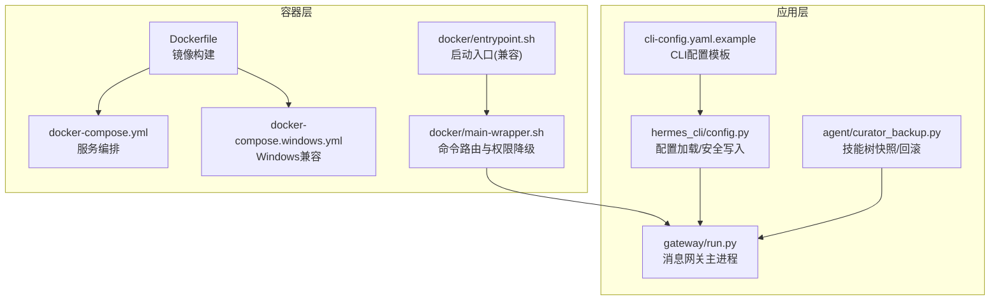
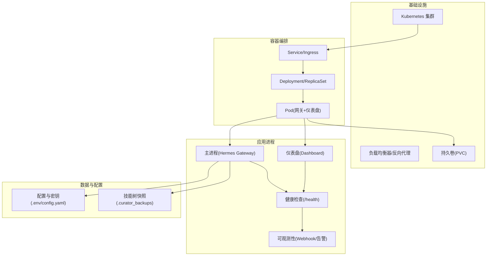
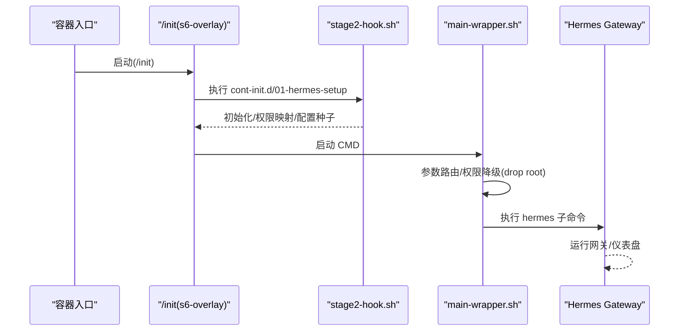
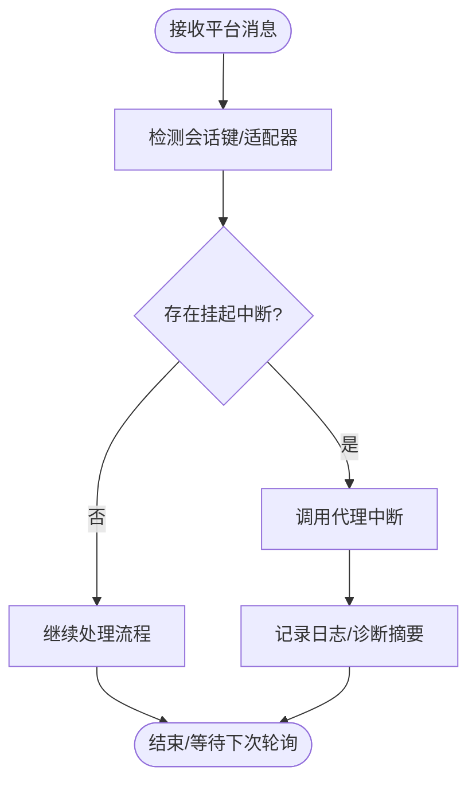
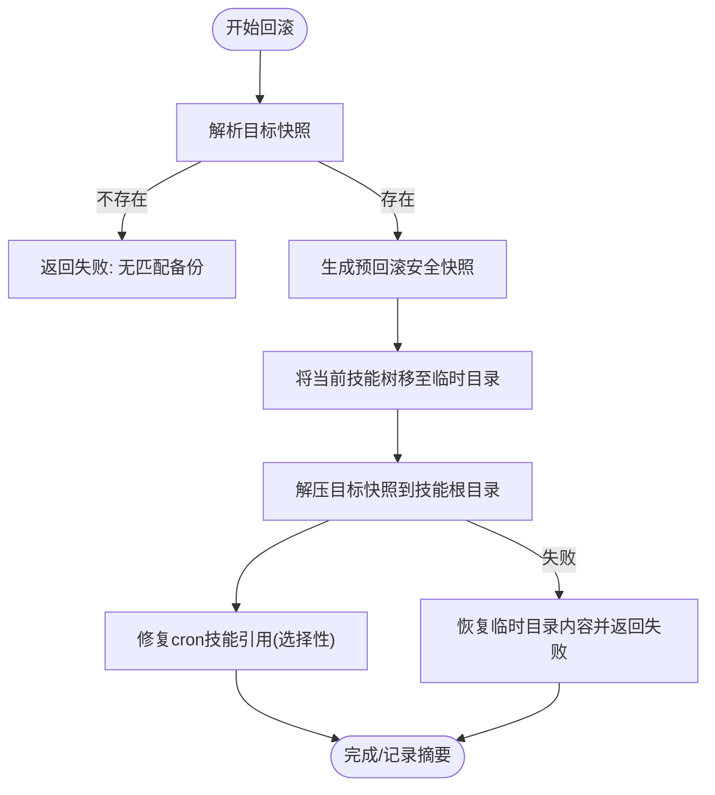
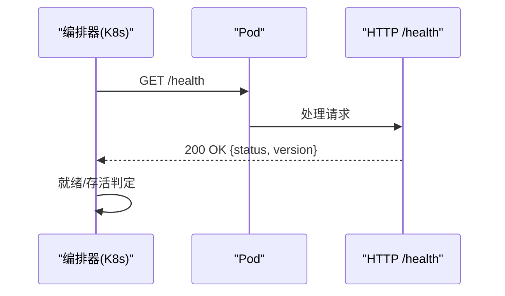
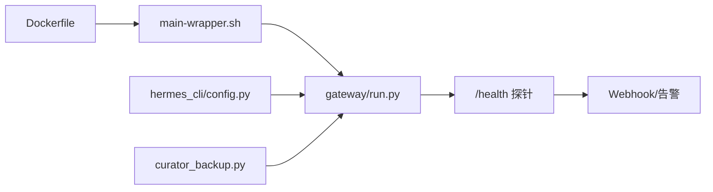

# 高可用性架构

<cite>
**本文引用的文件**
- [README.md](file://README.md)
- [Dockerfile](file://Dockerfile)
- [docker-compose.yml](file://docker-compose.yml)
- [docker-compose.windows.yml](file://docker-compose.windows.yml)
- [docker/entrypoint.sh](file://docker/entrypoint.sh)
- [docker/main-wrapper.sh](file://docker/main-wrapper.sh)
- [agent/error_classifier.py](file://agent/error_classifier.py)
- [agent/curator_backup.py](file://agent/curator_backup.py)
- [tests/agent/test_curator_backup.py](file://tests/agent/test_curator_backup.py)
- [tests/gateway/test_api_server.py](file://tests/gateway/test_api_server.py)
- [tools/process_registry.py](file://tools/process_registry.py)
- [cli-config.yaml.example](file://cli-config.yaml.example)
- [hermes_cli/config.py](file://hermes_cli/config.py)
- [gateway/run.py](file://gateway/run.py)
- [skills/mlops/inference/vllm/references/server-deployment.md](file://skills/mlops/inference/vllm/references/server-deployment.md)
- [optional-skills/mlops/tensorrt-llm/references/serving.md](file://optional-skills/mlops/tensorrt-llm/references/serving.md)
</cite>

## 目录
1. [引言](#引言)
2. [项目结构](#项目结构)
3. [核心组件](#核心组件)
4. [架构总览](#架构总览)
5. [详细组件分析](#详细组件分析)
6. [依赖关系分析](#依赖关系分析)
7. [性能考量](#性能考量)
8. [故障排查指南](#故障排查指南)
9. [结论](#结论)
10. [附录](#附录)

## 引言
本文件面向构建高可用系统的工程团队，基于仓库中的容器化、网关与消息平台、监控与健康检查、备份与回滚、以及可扩展的推理服务参考实现，系统化梳理高可用性架构的设计原则与落地实践。内容覆盖冗余设计、故障转移、负载均衡、容器编排与集群管理、数据高可用策略、监控与告警体系、灾难恢复与备份、性能监控与容量规划等主题，并提供可操作的运维建议与可视化图示。

## 项目结构
该仓库以“多后端、多平台、多运行模式”的Agent为核心，围绕以下关键路径组织：
- 容器与编排：Dockerfile、docker-compose.*、s6-overlay 进程监督
- 网关与消息平台：gateway/*、run.py、平台适配器
- 配置与环境：cli-config.yaml.example、hermes_cli/config.py
- 备份与回滚：agent/curator_backup.py、tests/agent/test_curator_backup.py
- 监控与健康检查：tests/gateway/test_api_server.py、/health 探针
- 可观测性与告警：website 文档中自动化蓝图与Webhook集成
- 推理服务高可用参考：skills/mlops/inference/vllm、optional-skills/mlops/tensorrt-llm

**图表来源**
- [Dockerfile:1-338](file://Dockerfile#L1-L338)
- [docker-compose.yml:1-77](file://docker-compose.yml#L1-L77)
- [docker-compose.windows.yml:1-39](file://docker-compose.windows.yml#L1-L39)
- [docker/entrypoint.sh:1-28](file://docker/entrypoint.sh#L1-L28)
- [docker/main-wrapper.sh:1-83](file://docker/main-wrapper.sh#L1-L83)
- [gateway/run.py:15775-15863](file://gateway/run.py#L15775-L15863)
- [hermes_cli/config.py:1-800](file://hermes_cli/config.py#L1-L800)
- [cli-config.yaml.example:1-800](file://cli-config.yaml.example#L1-L800)
- [agent/curator_backup.py:1-712](file://agent/curator_backup.py#L1-L712)

**章节来源**
- [README.md:1-224](file://README.md#L1-L224)
- [Dockerfile:1-338](file://Dockerfile#L1-L338)
- [docker-compose.yml:1-77](file://docker-compose.yml#L1-L77)
- [docker-compose.windows.yml:1-39](file://docker-compose.windows.yml#L1-L39)
- [docker/entrypoint.sh:1-28](file://docker/entrypoint.sh#L1-L28)
- [docker/main-wrapper.sh:1-83](file://docker/main-wrapper.sh#L1-L83)
- [gateway/run.py:15775-15863](file://gateway/run.py#L15775-L15863)
- [hermes_cli/config.py:1-800](file://hermes_cli/config.py#L1-L800)
- [cli-config.yaml.example:1-800](file://cli-config.yaml.example#L1-L800)
- [agent/curator_backup.py:1-712](file://agent/curator_backup.py#L1-L712)

## 核心组件
- 容器与进程监督
  - 使用 s6-overlay 提供进程监督、重启与权限降级，确保主进程与仪表盘服务稳定运行。
  - 入口脚本与命令路由：/init + main-wrapper.sh 实现参数透传与非 root 用户降权执行。
- 网关与消息平台
  - gateway/run.py 作为消息网关主进程，负责平台适配、会话管理与中断检测。
  - 支持多平台（Telegram、Discord、Slack、WhatsApp、Signal、邮件等），统一接入与转发。
- 配置与环境
  - hermes_cli/config.py 提供配置缓存、线程安全读写、敏感环境变量白名单/黑名单、容器/托管模式检测。
  - cli-config.yaml.example 提供模型、终端、工具集、会话重置等配置模板。
- 备份与回滚
  - agent/curator_backup.py 提供技能树快照、保留策略、回滚与cron作业链接一致性修复。
  - tests/agent/test_curator_backup.py 验证安全性（拒绝绝对路径/穿越）、回滚正确性与边界条件。
- 监控与健康检查
  - tests/gateway/test_api_server.py 验证 /health 返回状态与版本信息。
  - 参考 vLLM/TensorRT-LLM 文档中的 readiness/liveness 探针与负载均衡实践。

**章节来源**
- [Dockerfile:34-90](file://Dockerfile#L34-L90)
- [docker/main-wrapper.sh:1-83](file://docker/main-wrapper.sh#L1-L83)
- [gateway/run.py:15775-15863](file://gateway/run.py#L15775-L15863)
- [hermes_cli/config.py:1-800](file://hermes_cli/config.py#L1-L800)
- [cli-config.yaml.example:1-800](file://cli-config.yaml.example#L1-L800)
- [agent/curator_backup.py:1-712](file://agent/curator_backup.py#L1-L712)
- [tests/agent/test_curator_backup.py:203-653](file://tests/agent/test_curator_backup.py#L203-L653)
- [tests/gateway/test_api_server.py:493-525](file://tests/gateway/test_api_server.py#L493-L525)
- [skills/mlops/inference/vllm/references/server-deployment.md:1-119](file://skills/mlops/inference/vllm/references/server-deployment.md#L1-L119)
- [optional-skills/mlops/tensorrt-llm/references/serving.md:234-294](file://optional-skills/mlops/tensorrt-llm/references/serving.md#L234-L294)

## 架构总览
下图展示从容器到应用、再到消息平台与可观测性的整体架构，突出冗余、故障转移与健康检查的关键节点。

**图表来源**
- [docker-compose.yml:29-77](file://docker-compose.yml#L29-L77)
- [docker-compose.windows.yml:12-39](file://docker-compose.windows.yml#L12-L39)
- [Dockerfile:241-338](file://Dockerfile#L241-L338)
- [gateway/run.py:15775-15863](file://gateway/run.py#L15775-L15863)
- [tests/gateway/test_api_server.py:493-525](file://tests/gateway/test_api_server.py#L493-L525)
- [agent/curator_backup.py:1-712](file://agent/curator_backup.py#L1-L712)

## 详细组件分析

### 容器编排与进程监督
- s6-overlay 进程监督
  - PID 1 由 /init 承担，负责 cont-init.d 初始化、服务注册与监督树建立。
  - main-wrapper.sh 在容器 CMD 层面进行参数路由与权限降级，避免直接以 root 运行。
- 启动兼容性
  - docker/entrypoint.sh 为旧版入口脚本的兼容层，实际默认入口为 /init + main-wrapper.sh。
- 环境变量与权限
  - HERMES_UID/HERMES_GID 控制数据卷所有权；容器内强制最小权限与安全文件/目录权限设置。
  - 主机 Windows/WSL 与 Linux 使用不同的 docker-compose 配置，前者使用端口映射与 Windows 风格路径。

**图表来源**
- [docker/entrypoint.sh:1-28](file://docker/entrypoint.sh#L1-L28)
- [docker/main-wrapper.sh:1-83](file://docker/main-wrapper.sh#L1-L83)
- [Dockerfile:241-338](file://Dockerfile#L241-L338)

**章节来源**
- [Dockerfile:34-90](file://Dockerfile#L34-L90)
- [docker/entrypoint.sh:1-28](file://docker/entrypoint.sh#L1-L28)
- [docker/main-wrapper.sh:1-83](file://docker/main-wrapper.sh#L1-L83)
- [docker-compose.yml:1-77](file://docker-compose.yml#L1-L77)
- [docker-compose.windows.yml:1-39](file://docker-compose.windows.yml#L1-L39)

### 网关与消息平台
- 会话与中断
  - gateway/run.py 在长轮询/异步处理中检测备份适配器的挂起中断事件，必要时触发代理中断，保障会话可控。
- 平台适配
  - gateway/platforms/* 提供多平台适配器，统一消息收发、鉴权与回调处理。
- 限流与过载保护
  - tools/process_registry.py 提供全局观察器断路器与冷却窗口，抑制通知洪泛，避免系统过载。

**图表来源**
- [gateway/run.py:15775-15863](file://gateway/run.py#L15775-L15863)
- [tools/process_registry.py:323-347](file://tools/process_registry.py#L323-L347)

**章节来源**
- [gateway/run.py:15775-15863](file://gateway/run.py#L15775-L15863)
- [tools/process_registry.py:323-347](file://tools/process_registry.py#L323-L347)

### 配置与环境管理
- 配置缓存与并发安全
  - hermes_cli/config.py 使用 RLock 保护配置读写，缓存最近一次解析结果，避免重复解析开销。
- 敏感变量防护
  - 对潜在危险环境变量（如 LD_PRELOAD、PATH、EDITOR 等）进行写入拒绝，仅允许集成凭证类变量。
- 容器/托管模式
  - 自动识别 NixOS/Homebrew 等托管安装方式，提供升级/更新建议与错误提示。
- CLI 配置模板
  - cli-config.yaml.example 提供模型、终端、工具集、会话重置、压缩策略等配置项，便于按需定制。

**章节来源**
- [hermes_cli/config.py:1-800](file://hermes_cli/config.py#L1-L800)
- [cli-config.yaml.example:1-800](file://cli-config.yaml.example#L1-L800)

### 数据高可用与备份回滚
- 快照策略
  - agent/curator_backup.py 默认启用，对技能树进行 tar.gz 压缩归档，保留 manifest.json 与 cron 作业引用。
  - 支持保留数量控制与保护特定快照不被清理，确保回滚目标不被误删。
- 回滚流程
  - 回滚前先生成“预回滚”安全快照，随后将当前技能树移动至临时目录，再解压目标快照。
  - 对 cron 作业的技能引用进行选择性修复，保持其他运行态不变。
- 安全性
  - tests/agent/test_curator_backup.py 验证拒绝绝对路径与穿越攻击、回滚成功与边界条件。

**图表来源**
- [agent/curator_backup.py:539-683](file://agent/curator_backup.py#L539-L683)
- [tests/agent/test_curator_backup.py:203-653](file://tests/agent/test_curator_backup.py#L203-L653)

**章节来源**
- [agent/curator_backup.py:1-712](file://agent/curator_backup.py#L1-L712)
- [tests/agent/test_curator_backup.py:203-653](file://tests/agent/test_curator_backup.py#L203-L653)

### 监控与健康检查
- 健康探针
  - tests/gateway/test_api_server.py 验证 /health 与 /v1/health 返回状态与版本信息，确保编排系统可进行就绪/存活探测。
- 参考实现
  - vLLM 与 TensorRT-LLM 参考文档提供 readiness/liveness 探针配置与负载均衡实践，可直接用于推理服务高可用部署。

**图表来源**
- [tests/gateway/test_api_server.py:493-525](file://tests/gateway/test_api_server.py#L493-L525)
- [skills/mlops/inference/vllm/references/server-deployment.md:89-100](file://skills/mlops/inference/vllm/references/server-deployment.md#L89-L100)
- [optional-skills/mlops/tensorrt-llm/references/serving.md:268-275](file://optional-skills/mlops/tensorrt-llm/references/serving.md#L268-L275)

**章节来源**
- [tests/gateway/test_api_server.py:493-525](file://tests/gateway/test_api_server.py#L493-L525)
- [skills/mlops/inference/vllm/references/server-deployment.md:1-119](file://skills/mlops/inference/vllm/references/server-deployment.md#L1-L119)
- [optional-skills/mlops/tensorrt-llm/references/serving.md:234-294](file://optional-skills/mlops/tensorrt-llm/references/serving.md#L234-L294)

### 容灾与灾难恢复
- 快照与回滚
  - 通过 curator_backup 提供的快照/回滚能力，可在配置变更、技能破坏或外部依赖失效时快速恢复。
- 建议流程
  - 定期快照 + 保留策略（如最近 N 个）；在重大变更前自动快照；回滚失败时使用“预回滚”安全快照恢复。
- 外部依赖
  - 参考 vLLM/TensorRT-LLM 的多副本与探针配置，结合编排器的滚动更新与就绪检查，实现平滑切换与故障隔离。

**章节来源**
- [agent/curator_backup.py:1-712](file://agent/curator_backup.py#L1-L712)
- [tests/agent/test_curator_backup.py:203-653](file://tests/agent/test_curator_backup.py#L203-L653)
- [skills/mlops/inference/vllm/references/server-deployment.md:58-117](file://skills/mlops/inference/vllm/references/server-deployment.md#L58-L117)
- [optional-skills/mlops/tensorrt-llm/references/serving.md:234-294](file://optional-skills/mlops/tensorrt-llm/references/serving.md#L234-L294)

### 性能监控与容量规划
- 资源利用与瓶颈识别
  - 结合容器编排的资源限制与探针健康度，识别 CPU/内存/IO 瓶颈；对推理服务可参考 vLLM/TensorRT-LLM 的指标端口与探针配置。
- 扩容决策
  - 当健康检查失败率上升、响应时间增长或队列积压时，触发水平扩展（增加副本数）或垂直扩容（提升 CPU/内存/显存）。
- 日志与可观测性
  - 通过 /health 版本信息与自定义 Webhook 告警，结合自动化蓝图进行故障定位与自动处置。

**章节来源**
- [skills/mlops/inference/vllm/references/server-deployment.md:33-54](file://skills/mlops/inference/vllm/references/server-deployment.md#L33-L54)
- [optional-skills/mlops/tensorrt-llm/references/serving.md:234-294](file://optional-skills/mlops/tensorrt-llm/references/serving.md#L234-L294)
- [tests/gateway/test_api_server.py:500-512](file://tests/gateway/test_api_server.py#L500-L512)

## 依赖关系分析
- 组件耦合
  - 容器层与应用层通过 s6-overlay 解耦，主进程与仪表盘独立监督，降低单点故障影响。
  - 网关与平台适配器松耦合，便于新增平台与替换适配器。
- 外部依赖
  - 推理服务参考文档展示了 readiness/liveness 探针与负载均衡，适用于生产级推理服务高可用部署。
- 循环依赖
  - 未见明显循环导入；配置模块与网关模块通过接口调用交互，无强耦合。

**图表来源**
- [Dockerfile:241-338](file://Dockerfile#L241-L338)
- [docker/main-wrapper.sh:1-83](file://docker/main-wrapper.sh#L1-L83)
- [gateway/run.py:15775-15863](file://gateway/run.py#L15775-L15863)
- [hermes_cli/config.py:1-800](file://hermes_cli/config.py#L1-L800)
- [agent/curator_backup.py:1-712](file://agent/curator_backup.py#L1-L712)
- [tests/gateway/test_api_server.py:493-525](file://tests/gateway/test_api_server.py#L493-L525)

**章节来源**
- [Dockerfile:241-338](file://Dockerfile#L241-L338)
- [docker/main-wrapper.sh:1-83](file://docker/main-wrapper.sh#L1-L83)
- [gateway/run.py:15775-15863](file://gateway/run.py#L15775-L15863)
- [hermes_cli/config.py:1-800](file://hermes_cli/config.py#L1-L800)
- [agent/curator_backup.py:1-712](file://agent/curator_backup.py#L1-L712)
- [tests/gateway/test_api_server.py:493-525](file://tests/gateway/test_api_server.py#L493-L525)

## 性能考量
- 进程监督与资源隔离
  - s6-overlay 提供非阻塞僵尸回收与服务监督，减少资源泄漏与进程堆积风险。
- 健康检查与弹性
  - 通过 /health 与 readiness/liveness 探针，编排器可及时摘除不健康实例，实现快速故障转移。
- 配置与缓存
  - hermes_cli/config.py 的缓存与锁机制降低配置读取开销，避免并发冲突。
- 推理服务高可用
  - 参考 vLLM/TensorRT-LLM 的多副本与指标端口，结合负载均衡与探针，实现弹性扩缩容与故障隔离。

[本节为通用指导，无需具体文件引用]

## 故障排查指南
- 健康检查失败
  - 使用 /health 端点确认服务状态与版本；若失败，检查探针路径与端口映射。
- 容器启动问题
  - 确认 /init 与 main-wrapper.sh 正常执行，避免硬编码旧入口脚本；检查 HERMES_UID/HERMES_GID 映射与数据卷权限。
- 配置解析错误
  - hermes_cli/config.py 会在解析失败时记录警告并保留损坏配置的备份；修复 YAML 后重启生效。
- 技能树回滚失败
  - 检查 .curator_backups 下的安全快照是否存在；查看回滚日志与 cron 修复报告；必要时使用“预回滚”快照恢复。

**章节来源**
- [tests/gateway/test_api_server.py:493-525](file://tests/gateway/test_api_server.py#L493-L525)
- [docker/main-wrapper.sh:1-83](file://docker/main-wrapper.sh#L1-L83)
- [hermes_cli/config.py:42-139](file://hermes_cli/config.py#L42-L139)
- [agent/curator_backup.py:539-683](file://agent/curator_backup.py#L539-L683)

## 结论
本方案以容器监督、多平台网关、配置安全与快照回滚为核心，结合健康检查与可观测性，形成可演进的高可用架构。通过编排器的就绪/存活探针与滚动更新，配合推理服务的多副本与负载均衡实践，可实现平滑故障转移与弹性扩容。建议在生产环境中启用定期快照、严格的环境变量管控与完善的告警联动，持续优化容量与性能。

[本节为总结性内容，无需具体文件引用]

## 附录
- 参考文档与最佳实践
  - vLLM 与 TensorRT-LLM 的部署与探针配置，可直接用于推理服务高可用部署。
- 常用命令与路径
  - hermes config、hermes curator rollback、docker compose up/down 等命令与配置文件位置。

**章节来源**
- [skills/mlops/inference/vllm/references/server-deployment.md:1-119](file://skills/mlops/inference/vllm/references/server-deployment.md#L1-L119)
- [optional-skills/mlops/tensorrt-llm/references/serving.md:234-294](file://optional-skills/mlops/tensorrt-llm/references/serving.md#L234-L294)
- [README.md:69-81](file://README.md#L69-L81)