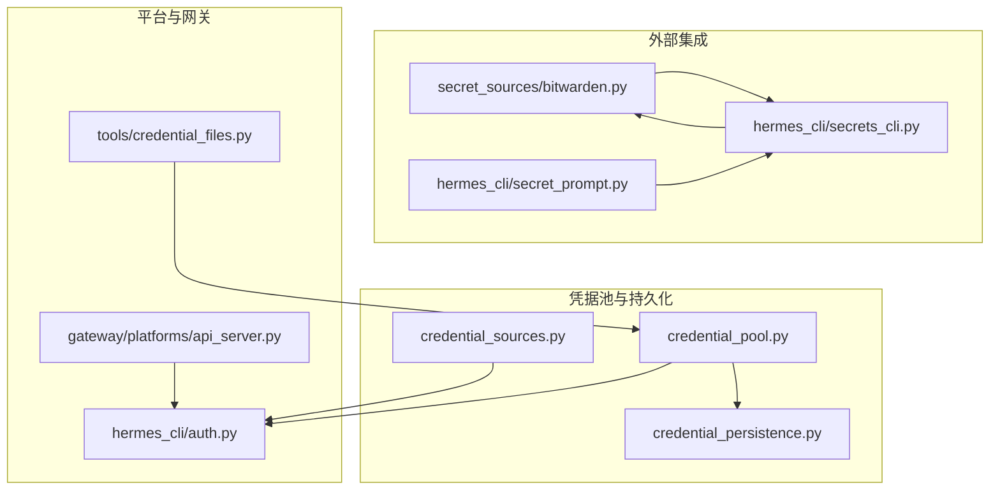
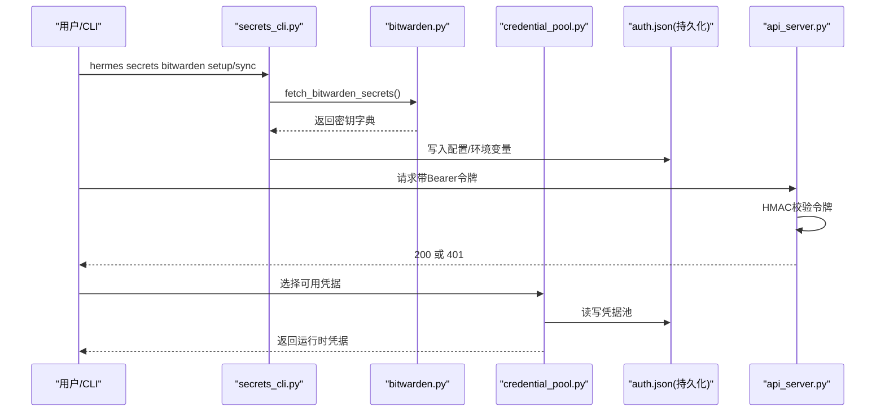
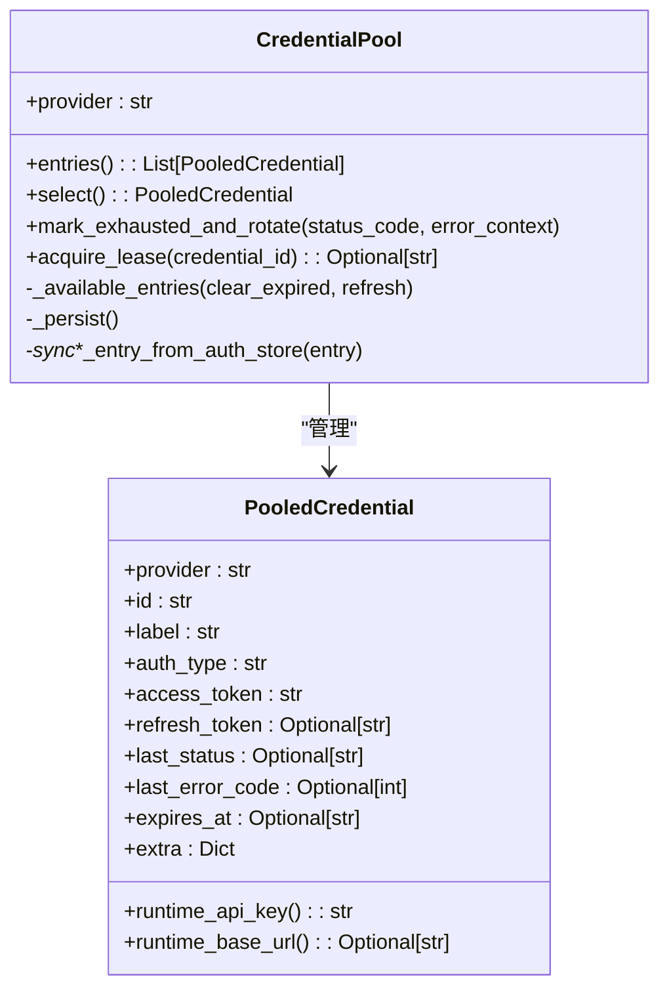
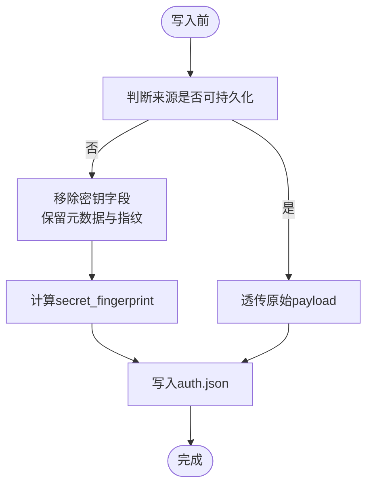
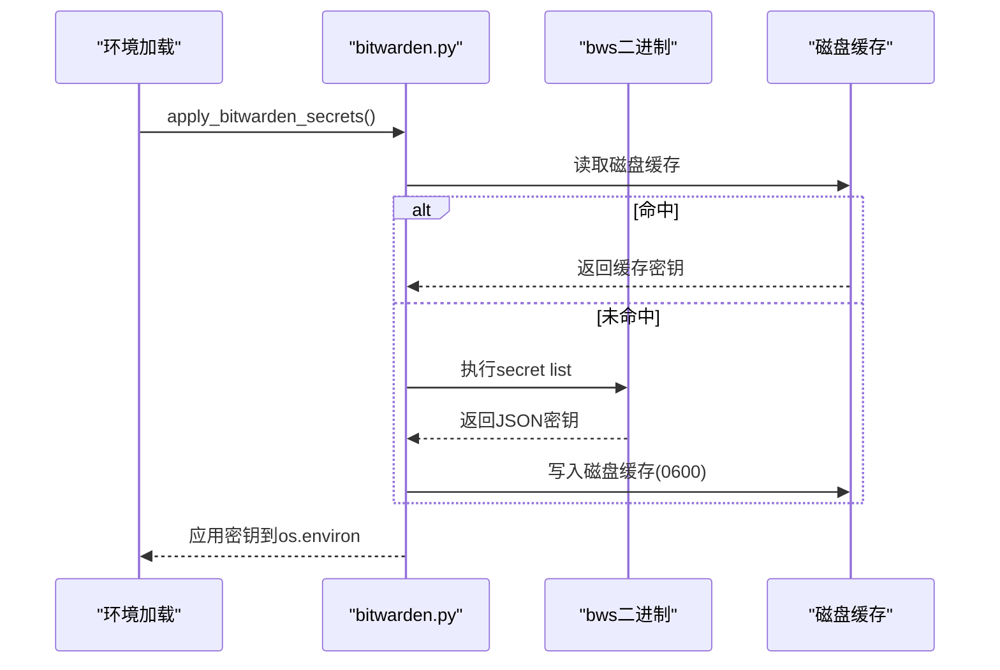
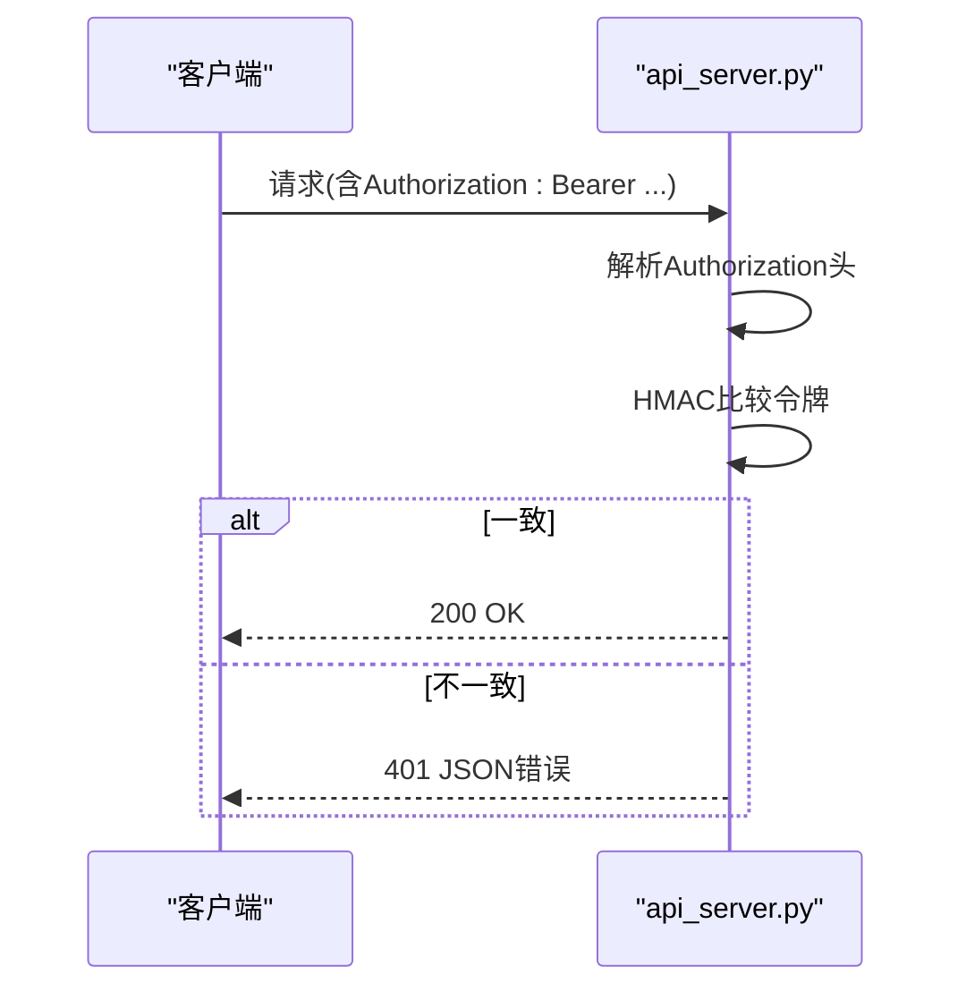
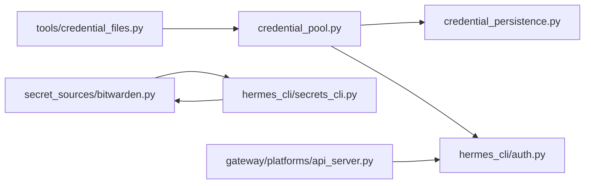

# 凭据安全管理

<cite>
**本文档引用的文件**
- [agent/credential_pool.py](file://agent/credential_pool.py)
- [agent/credential_persistence.py](file://agent/credential_persistence.py)
- [agent/credential_sources.py](file://agent/credential_sources.py)
- [agent/secret_sources/bitwarden.py](file://agent/secret_sources/bitwarden.py)
- [hermes_cli/secrets_cli.py](file://hermes_cli/secrets_cli.py)
- [hermes_cli/secret_prompt.py](file://hermes_cli/secret_prompt.py)
- [hermes_cli/auth.py](file://hermes_cli/auth.py)
- [tools/credential_files.py](file://tools/credential_files.py)
- [gateway/platforms/api_server.py](file://gateway/platforms/api_server.py)
- [tests/agent/test_credential_pool.py](file://tests/agent/test_credential_pool.py)
- [tests/hermes_cli/test_auth_usable_secret.py](file://tests/hermes_cli/test_auth_usable_secret.py)
- [tests/gateway/test_api_server.py](file://tests/gateway/test_api_server.py)
</cite>

## 目录
1. [简介](#简介)
2. [项目结构](#项目结构)
3. [核心组件](#核心组件)
4. [架构总览](#架构总览)
5. [详细组件分析](#详细组件分析)
6. [依赖关系分析](#依赖关系分析)
7. [性能考虑](#性能考虑)
8. [故障排除指南](#故障排除指南)
9. [结论](#结论)
10. [附录](#附录)

## 简介
本技术文档围绕凭据安全管理系统展开，系统性阐述API密钥与其他敏感凭据在Hermes中的存储、加密与管理机制，涵盖凭据池的工作原理、生命周期管理、安全存储策略、验证与测试流程，并提供最佳实践与故障排除建议。重点包括：
- 凭据池的多来源种子、选择策略与冷却/死亡状态管理
- 本地持久化与“借用型”凭据的指纹化保护
- Bitwarden Secrets Manager集成与二进制缓存策略
- 访问控制与权限边界（含API服务器鉴权）
- 凭据验证与测试（占位符检测、令牌有效性）
- 密钥轮换与安全审计建议
- 故障排除与恢复机制

## 项目结构
凭据安全相关能力分布在多个模块中：
- 凭据池与生命周期管理：agent/credential_pool.py
- 凭据持久化与安全策略：agent/credential_persistence.py
- 凭据来源统一移除接口：agent/credential_sources.py
- Bitwarden集成与缓存：agent/secret_sources/bitwarden.py
- CLI工具与交互：hermes_cli/secrets_cli.py、hermes_cli/secret_prompt.py
- 平台层鉴权：gateway/platforms/api_server.py
- 文件挂载与远程后端隔离：tools/credential_files.py
- 认证与运行时解析：hermes_cli/auth.py

图表来源
- [agent/credential_pool.py:449-800](file://agent/credential_pool.py#L449-L800)
- [agent/credential_persistence.py:1-175](file://agent/credential_persistence.py#L1-L175)
- [agent/credential_sources.py:1-449](file://agent/credential_sources.py#L1-L449)
- [agent/secret_sources/bitwarden.py:1-693](file://agent/secret_sources/bitwarden.py#L1-L693)
- [hermes_cli/secrets_cli.py:1-601](file://hermes_cli/secrets_cli.py#L1-L601)
- [hermes_cli/secret_prompt.py:1-127](file://hermes_cli/secret_prompt.py#L1-L127)
- [gateway/platforms/api_server.py:898-929](file://gateway/platforms/api_server.py#L898-L929)
- [hermes_cli/auth.py:1-200](file://hermes_cli/auth.py#L1-L200)
- [tools/credential_files.py:1-456](file://tools/credential_files.py#L1-L456)

章节来源
- [agent/credential_pool.py:1-2185](file://agent/credential_pool.py#L1-L2185)
- [agent/credential_persistence.py:1-175](file://agent/credential_persistence.py#L1-L175)
- [agent/credential_sources.py:1-449](file://agent/credential_sources.py#L1-L449)
- [agent/secret_sources/bitwarden.py:1-693](file://agent/secret_sources/bitwarden.py#L1-L693)
- [hermes_cli/secrets_cli.py:1-601](file://hermes_cli/secrets_cli.py#L1-L601)
- [hermes_cli/secret_prompt.py:1-127](file://hermes_cli/secret_prompt.py#L1-L127)
- [gateway/platforms/api_server.py:898-929](file://gateway/platforms/api_server.py#L898-L929)
- [hermes_cli/auth.py:1-200](file://hermes_cli/auth.py#L1-L200)
- [tools/credential_files.py:1-456](file://tools/credential_files.py#L1-L456)

## 核心组件
- 凭据池（CredentialPool）：支持多来源凭据聚合、冷却/死亡状态、轮换策略与持久化；提供选择器与租约机制。
- 持久化与安全策略：定义可持久化来源、剥离原始密钥值、仅保留不可逆指纹，防止敏感数据落盘。
- Bitwarden集成：拉取密钥、二进制自动安装与校验、进程内/磁盘双层缓存、失败不阻塞启动。
- 来源统一移除：为每种来源提供标准化清理步骤，确保删除操作粘性生效。
- 平台鉴权：API服务器基于HMAC比较的Bearer令牌校验。
- 文件挂载：远程后端凭据文件挂载与路径安全检查。

章节来源
- [agent/credential_pool.py:449-800](file://agent/credential_pool.py#L449-L800)
- [agent/credential_persistence.py:103-175](file://agent/credential_persistence.py#L103-L175)
- [agent/secret_sources/bitwarden.py:439-674](file://agent/secret_sources/bitwarden.py#L439-L674)
- [agent/credential_sources.py:115-133](file://agent/credential_sources.py#L115-L133)
- [gateway/platforms/api_server.py:898-929](file://gateway/platforms/api_server.py#L898-L929)
- [tools/credential_files.py:52-104](file://tools/credential_files.py#L52-L104)

## 架构总览
下图展示凭据从“来源种子”到“运行时使用”的整体流程，以及与持久化、鉴权、外部集成的关系。

图表来源
- [hermes_cli/secrets_cli.py:102-288](file://hermes_cli/secrets_cli.py#L102-L288)
- [agent/secret_sources/bitwarden.py:439-674](file://agent/secret_sources/bitwarden.py#L439-L674)
- [gateway/platforms/api_server.py:898-929](file://gateway/platforms/api_server.py#L898-L929)
- [agent/credential_pool.py:449-800](file://agent/credential_pool.py#L449-L800)

## 详细组件分析

### 凭据池（CredentialPool）
- 多来源种子：支持env、OAuth设备码、Copilot/GitHub、自定义配置、模型配置等。
- 选择策略：fill_first、round_robin、random、least_used；按优先级与活跃租约选择。
- 冷却与死亡：根据HTTP状态与错误原因区分临时耗尽与永久失效（如token_revoked），前者进入冷却窗口，后者标记为“死亡”，不再参与轮转直至显式重认证同步。
- 同步与回写：针对OAuth单例（device_code/loopback_pkce）从auth.json同步最新令牌，避免“刷新令牌复用”导致的4xx。
- 持久化：变更通过write_credential_pool写回，线程锁保护。

图表来源
- [agent/credential_pool.py:129-238](file://agent/credential_pool.py#L129-L238)
- [agent/credential_pool.py:449-800](file://agent/credential_pool.py#L449-L800)

章节来源
- [agent/credential_pool.py:449-1437](file://agent/credential_pool.py#L449-L1437)

### 凭据持久化与安全策略
- 可持久化来源白名单：仅部分由Hermes直接拥有的OAuth来源允许写入auth.json，其他来源视为“借用/只读引用”。
- 剥离原始密钥：对非白名单来源，写盘前移除所有密钥字段，仅保留标签、来源、状态元数据与不可逆指纹（sha256前缀）。
- 元数据与指纹：保留token_type、scope、client_id、expires_at等安全相关元数据，同时生成secret_fingerprint用于审计追踪。

图表来源
- [agent/credential_persistence.py:103-175](file://agent/credential_persistence.py#L103-L175)

章节来源
- [agent/credential_persistence.py:1-175](file://agent/credential_persistence.py#L1-L175)

### Bitwarden集成与缓存
- 自动安装与校验：首次使用自动下载固定版本bws二进制，校验SHA-256，失败不影响启动。
- 拉取与应用：执行bws secret list获取密钥字典，按配置决定是否覆盖已有环境变量。
- 缓存策略：进程内字典缓存 + 磁盘JSON缓存（<hermes_home>/cache/bws_cache.json），原子写入，模式0600。
- 失败降级：网络/认证/超时等异常仅记录警告，不阻断Hermes启动。

图表来源
- [agent/secret_sources/bitwarden.py:439-674](file://agent/secret_sources/bitwarden.py#L439-L674)

章节来源
- [agent/secret_sources/bitwarden.py:1-693](file://agent/secret_sources/bitwarden.py#L1-L693)
- [hermes_cli/secrets_cli.py:1-601](file://hermes_cli/secrets_cli.py#L1-L601)
- [hermes_cli/secret_prompt.py:1-127](file://hermes_cli/secret_prompt.py#L1-L127)

### 来源统一移除（RemovalStep）
- 针对每种来源注册清理步骤，保证删除操作粘性生效，避免下次load_pool重新导入。
- 支持env变量、Claude/Qwen/Minimax等OAuth来源与Copilot多变体的统一处理。

章节来源
- [agent/credential_sources.py:115-449](file://agent/credential_sources.py#L115-L449)

### 平台鉴权（API服务器）
- 使用HMAC比较Authorization头中的Bearer令牌，拒绝则返回401 JSON响应。
- 无配置时允许所有请求（仅测试或特殊场景）。

图表来源
- [gateway/platforms/api_server.py:898-929](file://gateway/platforms/api_server.py#L898-L929)
- [tests/gateway/test_api_server.py:346-378](file://tests/gateway/test_api_server.py#L346-L378)

章节来源
- [gateway/platforms/api_server.py:898-929](file://gateway/platforms/api_server.py#L898-L929)
- [tests/gateway/test_api_server.py:346-378](file://tests/gateway/test_api_server.py#L346-L378)

### 文件挂载与远程后端隔离
- 会话级凭据文件注册与挂载，限制绝对路径与路径穿越，确保仅HERMES_HOME内文件可挂载。
- 技能目录挂载时处理符号链接，必要时复制为安全副本，避免容器逃逸。

章节来源
- [tools/credential_files.py:52-200](file://tools/credential_files.py#L52-L200)
- [tools/credential_files.py:248-291](file://tools/credential_files.py#L248-L291)

## 依赖关系分析
- 凭据池依赖持久化策略进行安全写盘；依赖认证模块解析运行时令牌与基础URL。
- Bitwarden集成独立于主流程，失败不阻断；CLI负责引导安装与配置。
- 平台鉴权依赖认证模块提供的令牌解析与比较逻辑。
- 文件挂载与远程后端解耦，仅在需要时启用。

图表来源
- [agent/credential_pool.py:1-80](file://agent/credential_pool.py#L1-L80)
- [agent/credential_persistence.py:1-175](file://agent/credential_persistence.py#L1-L175)
- [agent/secret_sources/bitwarden.py:1-693](file://agent/secret_sources/bitwarden.py#L1-L693)
- [hermes_cli/secrets_cli.py:1-601](file://hermes_cli/secrets_cli.py#L1-L601)
- [gateway/platforms/api_server.py:898-929](file://gateway/platforms/api_server.py#L898-L929)
- [tools/credential_files.py:1-456](file://tools/credential_files.py#L1-L456)

章节来源
- [agent/credential_pool.py:1-80](file://agent/credential_pool.py#L1-L80)
- [agent/credential_persistence.py:1-175](file://agent/credential_persistence.py#L1-L175)
- [agent/secret_sources/bitwarden.py:1-693](file://agent/secret_sources/bitwarden.py#L1-L693)
- [hermes_cli/secrets_cli.py:1-601](file://hermes_cli/secrets_cli.py#L1-L601)
- [gateway/platforms/api_server.py:898-929](file://gateway/platforms/api_server.py#L898-L929)
- [tools/credential_files.py:1-456](file://tools/credential_files.py#L1-L456)

## 性能考虑
- 凭据池冷却与轮换：根据HTTP状态设置不同冷却时间，减少无效重试；对401的永久失败直接标记为“死亡”，避免反复尝试。
- Bitwarden缓存：进程内字典缓存与磁盘JSON缓存降低重复拉取开销；磁盘缓存原子写入，避免竞态。
- 文件挂载：技能目录在存在符号链接时复制为安全副本，避免容器逃逸风险，但会增加IO成本；无符号链接时直挂载零开销。
- 平台鉴权：HMAC比较为常数时间操作，避免明文存储与传输。

## 故障排除指南
- Bitwarden无法安装/拉取
  - 症状：提示bws不可用或fetch失败。
  - 排查：确认bws二进制存在且可执行；检查网络与服务器URL；查看磁盘缓存权限（0600）。
  - 参考
    - [agent/secret_sources/bitwarden.py:290-349](file://agent/secret_sources/bitwarden.py#L290-L349)
    - [agent/secret_sources/bitwarden.py:439-504](file://agent/secret_sources/bitwarden.py#L439-L504)
- API服务器401
  - 症状：请求被拒绝。
  - 排查：确认Authorization头格式正确且令牌与服务端一致；检查HMAC比较逻辑。
  - 参考
    - [gateway/platforms/api_server.py:898-929](file://gateway/platforms/api_server.py#L898-L929)
    - [tests/gateway/test_api_server.py:346-378](file://tests/gateway/test_api_server.py#L346-L378)
- 凭据池全部耗尽
  - 症状：无可用凭据。
  - 排查：检查冷却窗口是否过长；确认“死亡”凭据是否需要重认证同步；核对策略配置。
  - 参考
    - [agent/credential_pool.py:1297-1340](file://agent/credential_pool.py#L1297-L1340)
    - [tests/agent/test_credential_pool.py:27-120](file://tests/agent/test_credential_pool.py#L27-L120)
- 占位符令牌被接受
  - 症状：文档占位符被误认为有效。
  - 排查：使用has_usable_secret检测占位符；避免在生产环境使用占位符。
  - 参考
    - [tests/hermes_cli/test_auth_usable_secret.py:1-13](file://tests/hermes_cli/test_auth_usable_secret.py#L1-L13)

章节来源
- [agent/secret_sources/bitwarden.py:290-349](file://agent/secret_sources/bitwarden.py#L290-L349)
- [agent/secret_sources/bitwarden.py:439-504](file://agent/secret_sources/bitwarden.py#L439-L504)
- [gateway/platforms/api_server.py:898-929](file://gateway/platforms/api_server.py#L898-L929)
- [tests/gateway/test_api_server.py:346-378](file://tests/gateway/test_api_server.py#L346-L378)
- [agent/credential_pool.py:1297-1340](file://agent/credential_pool.py#L1297-L1340)
- [tests/agent/test_credential_pool.py:27-120](file://tests/agent/test_credential_pool.py#L27-L120)
- [tests/hermes_cli/test_auth_usable_secret.py:1-13](file://tests/hermes_cli/test_auth_usable_secret.py#L1-L13)

## 结论
本系统通过“凭据池+持久化安全策略+外部集成+平台鉴权+文件挂载隔离”的组合，实现了对API密钥与敏感凭据的全生命周期安全管控。其关键优势在于：
- 对“借用型”凭据采用指纹化策略，避免原始密钥落盘；
- 凭据池具备冷却与“死亡”状态管理，提升鲁棒性；
- Bitwarden集成提供安全拉取与缓存，失败不阻断；
- 平台层鉴权采用HMAC比较，降低令牌泄露风险；
- 文件挂载严格限制路径范围，保障远程后端隔离。

## 附录

### 凭据生命周期管理
- 创建：通过hermes auth add或外部来源（env、Bitwarden、OAuth）注入。
- 更新：凭据池支持从auth.json同步最新令牌；OAuth单例通过写回auth.json保持一致性。
- 轮换：根据HTTP状态与错误原因自动切换；对永久失败标记为“死亡”，需显式重认证。
- 销毁：统一移除接口确保来源清理与抑制，避免再次导入。

章节来源
- [agent/credential_pool.py:578-799](file://agent/credential_pool.py#L578-L799)
- [agent/credential_sources.py:222-324](file://agent/credential_sources.py#L222-L324)

### 安全存储机制
- 本地加密存储：磁盘缓存以0600权限写入；auth.json写入前剥离原始密钥值。
- 访问控制与权限管理：仅白名单来源可写入auth.json；非白名单来源仅保留指纹与元数据。
- 远程后端隔离：文件挂载严格校验HERMES_HOME沙箱，拒绝绝对路径与路径穿越。

章节来源
- [agent/credential_persistence.py:103-175](file://agent/credential_persistence.py#L103-L175)
- [tools/credential_files.py:52-104](file://tools/credential_files.py#L52-L104)

### 验证与测试机制
- 占位符检测：has_usable_secret拒绝常见文档占位符，避免误用。
- API服务器鉴权：HMAC比较Authorization头，401返回标准化错误。
- 凭据池行为：单元测试覆盖冷却、死亡标记、轮换等关键路径。

章节来源
- [tests/hermes_cli/test_auth_usable_secret.py:1-13](file://tests/hermes_cli/test_auth_usable_secret.py#L1-L13)
- [gateway/platforms/api_server.py:898-929](file://gateway/platforms/api_server.py#L898-L929)
- [tests/agent/test_credential_pool.py:27-120](file://tests/agent/test_credential_pool.py#L27-L120)

### 最佳实践与安全指南
- 密钥轮换策略
  - 定期轮换API密钥与访问令牌；对OAuth单例（device_code/loopback_pkce）通过重认证写回auth.json实现同步。
  - 对永久失败（token_revoked/token_invalidated）标记为“死亡”，等待显式重认证后再恢复。
- 安全审计
  - 仅保留不可逆指纹与安全元数据；定期审查auth.json与磁盘缓存权限。
  - 使用Bitwarden集中管理密钥，避免散落在.env或命令行历史中。
- 日志与告警
  - 对凭据池“死亡”状态与轮换事件进行日志记录，便于审计与问题定位。

章节来源
- [agent/credential_pool.py:510-540](file://agent/credential_pool.py#L510-L540)
- [agent/secret_sources/bitwarden.py:439-470](file://agent/secret_sources/bitwarden.py#L439-L470)