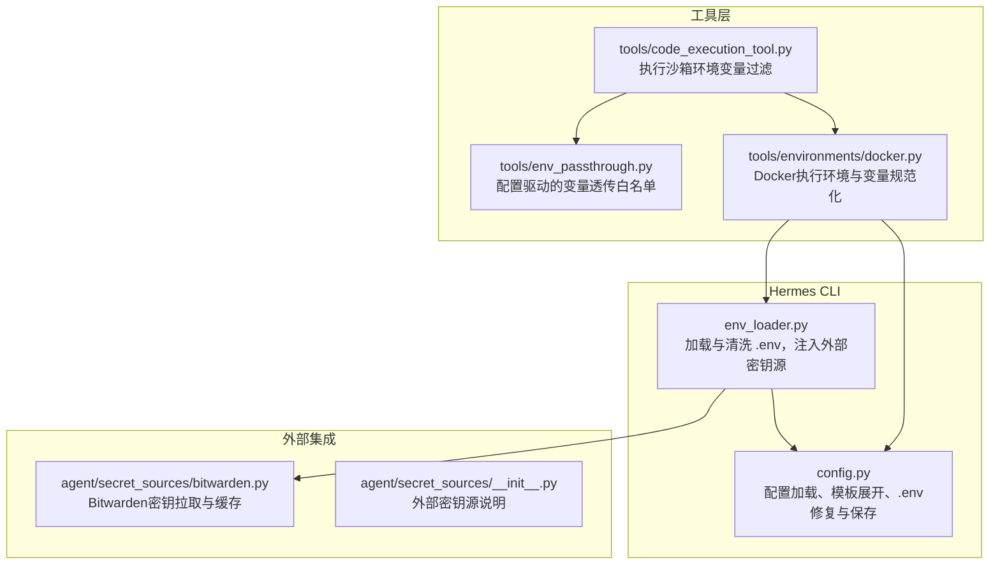
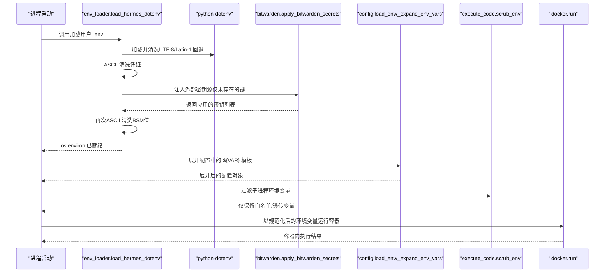
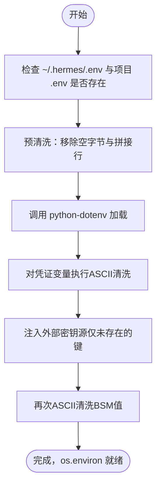
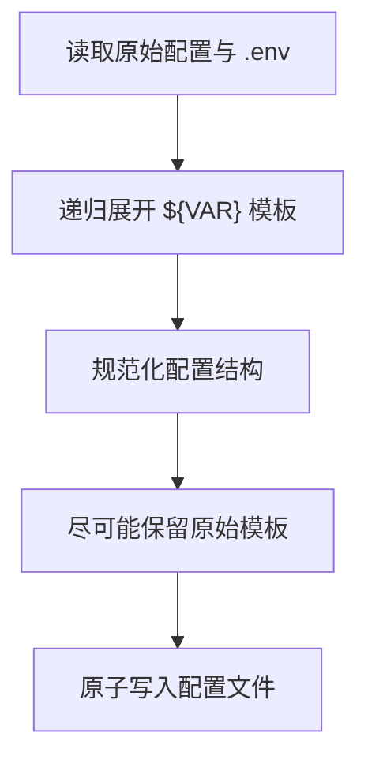
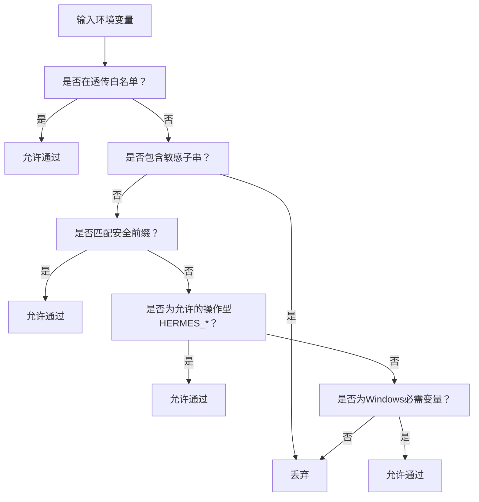
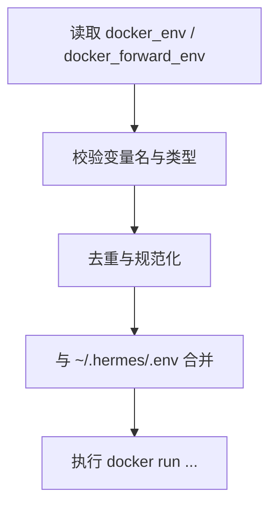
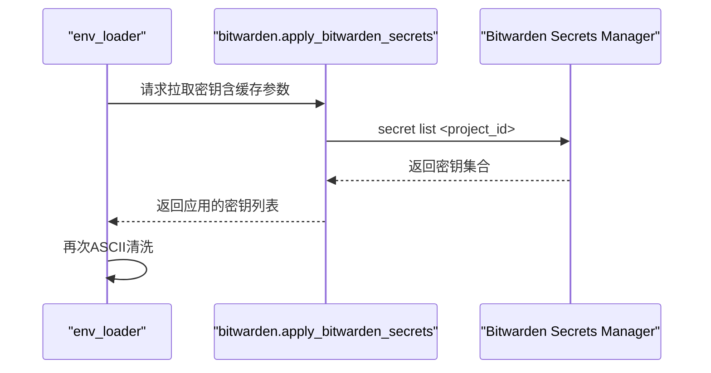
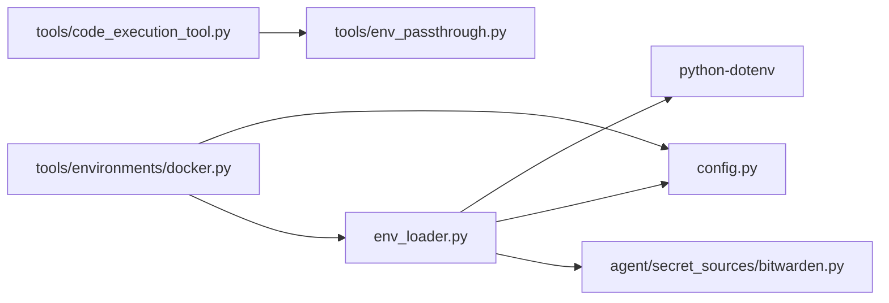

# 环境变量管理

<cite>
**本文档引用的文件**
- [hermes_cli/env_loader.py](file://hermes_cli/env_loader.py)
- [hermes_cli/config.py](file://hermes_cli/config.py)
- [tools/environments/docker.py](file://tools/environments/docker.py)
- [agent/secret_sources/__init__.py](file://agent/secret_sources/__init__.py)
- [agent/secret_sources/bitwarden.py](file://agent/secret_sources/bitwarden.py)
- [tools/env_passthrough.py](file://tools/env_passthrough.py)
- [tools/code_execution_tool.py](file://tools/code_execution_tool.py)
- [tests/tools/test_env_passthrough.py](file://tests/tools/test_env_passthrough.py)
- [tests/tools/test_code_execution_windows_env.py](file://tests/tools/test_code_execution_windows_env.py)
- [tests/agent/test_file_safety.py](file://tests/agent/test_file_safety.py)
- [tests/tools/test_docker_environment.py](file://tests/tools/test_docker_environment.py)
</cite>

## 目录
1. [简介](#简介)
2. [项目结构](#项目结构)
3. [核心组件](#核心组件)
4. [架构总览](#架构总览)
5. [详细组件分析](#详细组件分析)
6. [依赖分析](#依赖分析)
7. [性能考量](#性能考量)
8. [故障排除指南](#故障排除指南)
9. [结论](#结论)
10. [附录](#附录)

## 简介
本文件系统性梳理Hermes的环境变量管理系统，涵盖以下主题：
- 环境变量的读取、解析与应用机制
- 安全的环境变量“白名单/黑名单”策略与实现
- 继承与覆盖规则（系统环境变量、用户环境变量、配置文件）
- 容器化环境（Docker）下的环境变量处理
- 最佳实践与安全使用指南
- 故障排除与调试技巧

## 项目结构
围绕环境变量管理的关键模块分布如下：
- hermes_cli/env_loader.py：统一加载~/.hermes/.env，执行ASCII清洗与外部密钥源注入
- hermes_cli/config.py：配置文件加载、环境变量模板展开、.env文件修复与持久化
- tools/environments/docker.py：Docker沙箱执行环境，负责环境变量规范化与转发
- agent/secret_sources/*：外部密钥源（如Bitwarden）集成与注入
- tools/env_passthrough.py 与 tools/code_execution_tool.py：执行沙箱中环境变量的白名单/黑名单过滤
- tests/*：覆盖上述行为的测试用例

**图表来源**
- [hermes_cli/env_loader.py:212-247](file://hermes_cli/env_loader.py#L212-L247)
- [hermes_cli/config.py:5635-5689](file://hermes_cli/config.py#L5635-L5689)
- [tools/environments/docker.py:93-101](file://tools/environments/docker.py#L93-L101)
- [agent/secret_sources/bitwarden.py:1-200](file://agent/secret_sources/bitwarden.py#L1-L200)
- [tools/env_passthrough.py:103-140](file://tools/env_passthrough.py#L103-L140)
- [tools/code_execution_tool.py:136-187](file://tools/code_execution_tool.py#L136-L187)

**章节来源**
- [hermes_cli/env_loader.py:1-345](file://hermes_cli/env_loader.py#L1-L345)
- [hermes_cli/config.py:5635-5800](file://hermes_cli/config.py#L5635-L5800)
- [tools/environments/docker.py:1-279](file://tools/environments/docker.py#L1-L279)
- [agent/secret_sources/__init__.py:1-13](file://agent/secret_sources/__init__.py#L1-L13)
- [agent/secret_sources/bitwarden.py:1-200](file://agent/secret_sources/bitwarden.py#L1-L200)
- [tools/env_passthrough.py:94-163](file://tools/env_passthrough.py#L94-L163)
- [tools/code_execution_tool.py:125-187](file://tools/code_execution_tool.py#L125-L187)

## 核心组件
- 环境变量加载与清洗
  - 统一从~/.hermes/.env加载，支持UTF-8/UTF-8-SIG编码与拉丁编码回退；对非ASCII凭证进行清洗并警告
  - 对已知错误格式的行进行预清洗，避免合并键值导致令牌重复等问题
- 外部密钥源注入
  - 在dotenv加载后、其他模块读取前，从Bitwarden等外部源拉取密钥，仅对未存在的键生效
  - 注入后再次执行ASCII清洗，确保HTTP头兼容
- 配置与模板展开
  - 支持在配置中使用${VAR}模板语法，运行时展开为当前环境变量值
  - 持久化时尽量保留原始模板，避免将明文密钥写回磁盘
- 执行沙箱环境变量过滤
  - 默认阻断包含敏感子串的变量名，允许安全前缀与显式透传列表
  - Windows平台保留必要系统变量，POSIX平台严格遵循白名单
- Docker执行环境
  - 规范化docker_env与docker_forward_env，校验变量名合法性，避免复杂类型注入

**章节来源**
- [hermes_cli/env_loader.py:102-157](file://hermes_cli/env_loader.py#L102-L157)
- [hermes_cli/env_loader.py:159-210](file://hermes_cli/env_loader.py#L159-L210)
- [hermes_cli/env_loader.py:250-324](file://hermes_cli/env_loader.py#L250-L324)
- [hermes_cli/config.py:5108-5116](file://hermes_cli/config.py#L5108-L5116)
- [hermes_cli/config.py:5635-5689](file://hermes_cli/config.py#L5635-L5689)
- [hermes_cli/config.py:5712-5769](file://hermes_cli/config.py#L5712-L5769)
- [tools/code_execution_tool.py:136-187](file://tools/code_execution_tool.py#L136-L187)
- [tools/env_passthrough.py:103-140](file://tools/env_passthrough.py#L103-L140)
- [tools/environments/docker.py:38-91](file://tools/environments/docker.py#L38-L91)

## 架构总览
下图展示从启动到运行期间环境变量的加载、清洗、注入与过滤路径。

**图表来源**
- [hermes_cli/env_loader.py:212-247](file://hermes_cli/env_loader.py#L212-L247)
- [hermes_cli/env_loader.py:250-324](file://hermes_cli/env_loader.py#L250-L324)
- [hermes_cli/config.py:5108-5116](file://hermes_cli/config.py#L5108-L5116)
- [tools/code_execution_tool.py:136-187](file://tools/code_execution_tool.py#L136-L187)
- [tools/environments/docker.py:93-101](file://tools/environments/docker.py#L93-L101)

## 详细组件分析

### 组件A：环境变量加载与清洗（env_loader）
- 关键职责
  - 修复损坏的~/.hermes/.env（拼接行拆分、占位符清理）
  - 两阶段清洗：dotenv加载后对凭证变量执行ASCII清洗，防止非ASCII字符导致HTTP头发送失败
  - 外部密钥源注入：在dotenv之后、其他模块读取之前，将密钥注入os.environ，且仅对未存在的键生效
- 安全与健壮性
  - 编码回退：UTF-8失败时尝试Latin-1，避免因编辑器编码问题导致崩溃
  - 预清洗：在python-dotenv读取前移除空字节与拼接行，避免ValueError与令牌重复
  - 失败不阻断：外部密钥源拉取异常仅打印警告，不影响启动
- 可观测性
  - 记录密钥来源（如Bitwarden），用于setup/model流程标注“来自Bitwarden”

**图表来源**
- [hermes_cli/env_loader.py:146-157](file://hermes_cli/env_loader.py#L146-L157)
- [hermes_cli/env_loader.py:159-210](file://hermes_cli/env_loader.py#L159-L210)
- [hermes_cli/env_loader.py:250-324](file://hermes_cli/env_loader.py#L250-L324)

**章节来源**
- [hermes_cli/env_loader.py:102-157](file://hermes_cli/env_loader.py#L102-L157)
- [hermes_cli/env_loader.py:159-210](file://hermes_cli/env_loader.py#L159-L210)
- [hermes_cli/env_loader.py:250-324](file://hermes_cli/env_loader.py#L250-L324)

### 组件B：配置中的环境变量模板展开（config）
- 关键职责
  - 在配置加载时将${VAR}模板展开为当前环境变量值
  - 持久化时尽量保留原始模板，避免将明文密钥写回磁盘
- 性能与一致性
  - 对~/.hermes/.env提供进程级缓存（基于mtime/size键），减少重复解析开销
  - 对拼接行与占位符进行修复，保证解析稳定性

**图表来源**
- [hermes_cli/config.py:5108-5116](file://hermes_cli/config.py#L5108-L5116)
- [hermes_cli/config.py:5600-5632](file://hermes_cli/config.py#L5600-L5632)
- [hermes_cli/config.py:5635-5689](file://hermes_cli/config.py#L5635-L5689)
- [hermes_cli/config.py:5712-5769](file://hermes_cli/config.py#L5712-L5769)

**章节来源**
- [hermes_cli/config.py:5108-5116](file://hermes_cli/config.py#L5108-L5116)
- [hermes_cli/config.py:5600-5632](file://hermes_cli/config.py#L5600-L5632)
- [hermes_cli/config.py:5635-5689](file://hermes_cli/config.py#L5635-L5689)
- [hermes_cli/config.py:5712-5769](file://hermes_cli/config.py#L5712-L5769)

### 组件C：执行沙箱中的环境变量过滤（code_execution_tool + env_passthrough）
- 白名单/黑名单策略
  - 默认阻断：变量名包含敏感子串（如KEY/TOKEN/SECRET/PASSWORD/DSN/WEBHOOK等）
  - 允许：安全前缀（PATH/HOME/USER/LANG/LC_/TERM/TMPDIR/TMP/TEMP/SHELL/LOGNAME/XDG_/PYTHONPATH/VIRTUAL_ENV/CONDA等）、显式透传列表、特定操作型HERMES_*变量、Windows平台必需变量
  - 特殊规则：HERMES_*变量默认不透传（除明确允许外），避免泄露内部配置
- 配置驱动透传
  - 通过tools.env_passthrough从配置读取terminal.env_passthrough列表，并与技能注册的透传项合并
  - 显式阻止将Hermes提供商凭证透传至执行沙箱，防止安全风险

**图表来源**
- [tools/code_execution_tool.py:136-187](file://tools/code_execution_tool.py#L136-L187)
- [tools/env_passthrough.py:103-140](file://tools/env_passthrough.py#L103-L140)
- [tests/tools/test_env_passthrough.py:60-136](file://tests/tools/test_env_passthrough.py#L60-L136)
- [tests/tools/test_code_execution_windows_env.py:327-359](file://tests/tools/test_code_execution_windows_env.py#L327-L359)

**章节来源**
- [tools/code_execution_tool.py:125-187](file://tools/code_execution_tool.py#L125-L187)
- [tools/env_passthrough.py:94-163](file://tools/env_passthrough.py#L94-L163)
- [tests/tools/test_env_passthrough.py:60-136](file://tests/tools/test_env_passthrough.py#L60-L136)
- [tests/tools/test_code_execution_windows_env.py:327-359](file://tests/tools/test_code_execution_windows_env.py#L327-L359)

### 组件D：Docker执行环境中的变量处理（docker）
- 规范化与校验
  - docker_env与docker_forward_env均进行变量名合法性校验与去重
  - 非字符串值被拒绝或强制转换为字符串，避免复杂类型注入
- 与Hermes环境的衔接
  - 从hermes_cli.config.load_env加载~/.hermes/.env作为容器内可用变量的基础
  - 保持容器标签安全（仅允许字母数字与_.-）

**图表来源**
- [tools/environments/docker.py:38-91](file://tools/environments/docker.py#L38-L91)
- [tools/environments/docker.py:93-101](file://tools/environments/docker.py#L93-L101)
- [tests/tools/test_docker_environment.py:421-438](file://tests/tools/test_docker_environment.py#L421-L438)

**章节来源**
- [tools/environments/docker.py:38-101](file://tools/environments/docker.py#L38-L101)
- [tests/tools/test_docker_environment.py:421-438](file://tests/tools/test_docker_environment.py#L421-L438)

### 组件E：外部密钥源（Bitwarden）集成
- 设计要点
  - 通过bws二进制从Bitwarden Secrets Manager拉取密钥，支持本地缓存与磁盘缓存
  - 初始访问令牌存储于~/.hermes/.env，其余密钥从BSM获取
  - 失败不阻断：网络/认证/二进制缺失等异常仅记录警告
- 注入策略
  - 仅在os.environ中不存在对应键时才注入，确保用户.env优先级
  - 注入后再次执行ASCII清洗，应对复制粘贴引入的Unicode字符

**图表来源**
- [hermes_cli/env_loader.py:250-324](file://hermes_cli/env_loader.py#L250-L324)
- [agent/secret_sources/bitwarden.py:1-200](file://agent/secret_sources/bitwarden.py#L1-L200)

**章节来源**
- [agent/secret_sources/__init__.py:1-13](file://agent/secret_sources/__init__.py#L1-L13)
- [agent/secret_sources/bitwarden.py:1-200](file://agent/secret_sources/bitwarden.py#L1-L200)
- [hermes_cli/env_loader.py:250-324](file://hermes_cli/env_loader.py#L250-L324)

## 依赖分析
- 模块耦合
  - env_loader依赖python-dotenv与hermes_cli.config（预清洗逻辑复用）
  - 执行沙箱过滤依赖tools.env_passthrough提供的透传白名单
  - Docker执行环境依赖hermes_cli.config.load_env与tools.environments.base
- 外部依赖
  - Bitwarden SDK通过bws二进制调用，避免Python包依赖复杂性
- 循环依赖
  - 通过延迟导入与最小接口设计避免循环依赖

**图表来源**
- [hermes_cli/env_loader.py:1-11](file://hermes_cli/env_loader.py#L1-L11)
- [hermes_cli/config.py:5635-5689](file://hermes_cli/config.py#L5635-L5689)
- [tools/environments/docker.py:93-101](file://tools/environments/docker.py#L93-L101)
- [tools/env_passthrough.py:103-140](file://tools/env_passthrough.py#L103-L140)
- [tools/code_execution_tool.py:136-156](file://tools/code_execution_tool.py#L136-L156)

**章节来源**
- [hermes_cli/env_loader.py:1-11](file://hermes_cli/env_loader.py#L1-L11)
- [hermes_cli/config.py:5635-5689](file://hermes_cli/config.py#L5635-L5689)
- [tools/environments/docker.py:93-101](file://tools/environments/docker.py#L93-L101)
- [tools/env_passthrough.py:103-140](file://tools/env_passthrough.py#L103-L140)
- [tools/code_execution_tool.py:136-156](file://tools/code_execution_tool.py#L136-L156)

## 性能考量
- .env解析缓存
  - hermes_cli/config.py对load_env提供进程级缓存（基于mtime/size键），显著降低重复解析成本
- 预清洗与ASCII清洗
  - 在读取前修复拼接行与占位符，避免后续解析与运行时错误
- 外部密钥源缓存
  - in-process与磁盘缓存减少重复拉取，提升启动速度
- Docker变量规范化
  - 严格的类型与命名校验避免无效参数传递，减少容器启动失败重试

**章节来源**
- [hermes_cli/config.py:5635-5689](file://hermes_cli/config.py#L5635-L5689)
- [hermes_cli/env_loader.py:159-210](file://hermes_cli/env_loader.py#L159-L210)
- [agent/secret_sources/bitwarden.py:70-170](file://agent/secret_sources/bitwarden.py#L70-L170)
- [tools/environments/docker.py:38-91](file://tools/environments/docker.py#L38-L91)

## 故障排除指南
- .env文件损坏或复制粘贴导致的令牌重复
  - 症状：令牌被重复或包含不可见字符
  - 排查：运行环境修复流程，确认预清洗与ASCII清洗是否生效
  - 参考
    - [hermes_cli/env_loader.py:159-210](file://hermes_cli/env_loader.py#L159-L210)
    - [hermes_cli/config.py:5712-5769](file://hermes_cli/config.py#L5712-L5769)
- 外部密钥源未生效
  - 症状：启动后仍提示需要配置密钥
  - 排查：确认secrets配置与Bitwarden访问令牌设置；查看注入日志与错误输出
  - 参考
    - [hermes_cli/env_loader.py:250-324](file://hermes_cli/env_loader.py#L250-L324)
    - [agent/secret_sources/bitwarden.py:1-200](file://agent/secret_sources/bitwarden.py#L1-L200)
- 执行沙箱中变量被意外丢弃
  - 症状：脚本无法读取期望的环境变量
  - 排查：检查tools.env_passthrough配置与技能注册的透传项；确认变量名是否命中敏感子串或HERMES_*默认拒绝
  - 参考
    - [tools/env_passthrough.py:103-140](file://tools/env_passthrough.py#L103-L140)
    - [tools/code_execution_tool.py:136-187](file://tools/code_execution_tool.py#L136-L187)
    - [tests/tools/test_env_passthrough.py:60-136](file://tests/tools/test_env_passthrough.py#L60-L136)
- Docker容器内变量异常
  - 症状：容器启动失败或变量未生效
  - 排查：确认docker_env/docker_forward_env的变量名合法性与类型；检查~/.hermes/.env是否正确合并
  - 参考
    - [tools/environments/docker.py:38-91](file://tools/environments/docker.py#L38-L91)
    - [tests/tools/test_docker_environment.py:421-438](file://tests/tools/test_docker_environment.py#L421-L438)
- 项目本地.env读取被阻断
  - 症状：读取项目.env时报错“禁止访问”
  - 排查：项目本地.env属于受保护文件名，不应被读取；请改用示例文件或在Hermes HOME中存放密钥
  - 参考
    - [tests/agent/test_file_safety.py:22-70](file://tests/agent/test_file_safety.py#L22-L70)

**章节来源**
- [hermes_cli/env_loader.py:159-210](file://hermes_cli/env_loader.py#L159-L210)
- [hermes_cli/config.py:5712-5769](file://hermes_cli/config.py#L5712-L5769)
- [hermes_cli/env_loader.py:250-324](file://hermes_cli/env_loader.py#L250-L324)
- [agent/secret_sources/bitwarden.py:1-200](file://agent/secret_sources/bitwarden.py#L1-L200)
- [tools/env_passthrough.py:103-140](file://tools/env_passthrough.py#L103-L140)
- [tools/code_execution_tool.py:136-187](file://tools/code_execution_tool.py#L136-L187)
- [tests/tools/test_env_passthrough.py:60-136](file://tests/tools/test_env_passthrough.py#L60-L136)
- [tools/environments/docker.py:38-91](file://tools/environments/docker.py#L38-L91)
- [tests/tools/test_docker_environment.py:421-438](file://tests/tools/test_docker_environment.py#L421-L438)
- [tests/agent/test_file_safety.py:22-70](file://tests/agent/test_file_safety.py#L22-L70)

## 结论
Hermes的环境变量管理体系通过“统一加载—预清洗—外部注入—模板展开—沙箱过滤—容器规范”的多层保障，实现了高安全性与高可用性：
- 用户环境优先、外部密钥源补充、配置模板展开，形成清晰的继承与覆盖规则
- 严格的白名单/黑名单策略与可观测的来源标注，有效降低密钥泄露风险
- Docker执行环境的变量规范化与缓存优化，提升了容器化场景的稳定性与性能

## 附录

### 环境变量继承与覆盖规则
- 用户环境（~/.hermes/.env）优先于系统环境
- 项目本地.env仅在用户环境不存在时作为回退
- 外部密钥源（如Bitwarden）仅在键不存在时注入
- 配置中的${VAR}模板在运行时展开，持久化时尽量保留原始模板

**章节来源**
- [hermes_cli/env_loader.py:212-247](file://hermes_cli/env_loader.py#L212-L247)
- [hermes_cli/env_loader.py:250-324](file://hermes_cli/env_loader.py#L250-L324)
- [hermes_cli/config.py:5108-5116](file://hermes_cli/config.py#L5108-L5116)
- [hermes_cli/config.py:5600-5632](file://hermes_cli/config.py#L5600-L5632)

### 容器化环境下的特殊考虑
- docker_env与docker_forward_env必须为字符串键值，变量名需符合正则规范
- 通过hermes_cli.config.load_env加载Hermes HOME中的环境变量作为基础
- Windows必需变量在容器内可透传，POSIX平台严格遵循白名单

**章节来源**
- [tools/environments/docker.py:38-101](file://tools/environments/docker.py#L38-L101)
- [tests/tools/test_docker_environment.py:421-438](file://tests/tools/test_docker_environment.py#L421-L438)

### 最佳实践与安全使用指南
- 密钥管理
  - 使用外部密钥源（如Bitwarden）存储密钥，避免直接写入~/.hermes/.env
  - 避免在配置中硬编码明文密钥，优先使用${VAR}模板
- 变量透传
  - 仅在必要时启用tools.env_passthrough，且限定到最小集合
  - 明确禁止透传Hermes提供商凭证
- 文件安全
  - 不要将项目本地.env放入版本控制；示例文件使用.env.example
- 编码与格式
  - 使用UTF-8-SIG编码保存.env，避免Latin-1回退带来的兼容问题
  - 定期运行环境修复工具，清理拼接行与占位符

**章节来源**
- [agent/secret_sources/__init__.py:1-13](file://agent/secret_sources/__init__.py#L1-L13)
- [hermes_cli/env_loader.py:159-210](file://hermes_cli/env_loader.py#L159-L210)
- [hermes_cli/config.py:5712-5769](file://hermes_cli/config.py#L5712-L5769)
- [tests/agent/test_file_safety.py:22-70](file://tests/agent/test_file_safety.py#L22-L70)