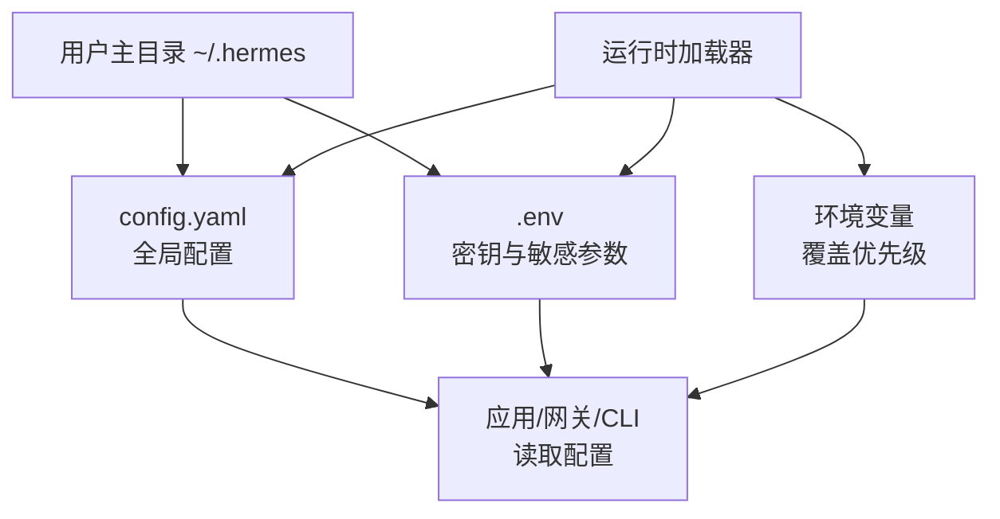
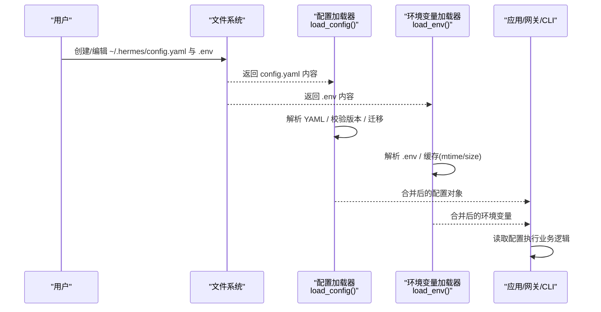
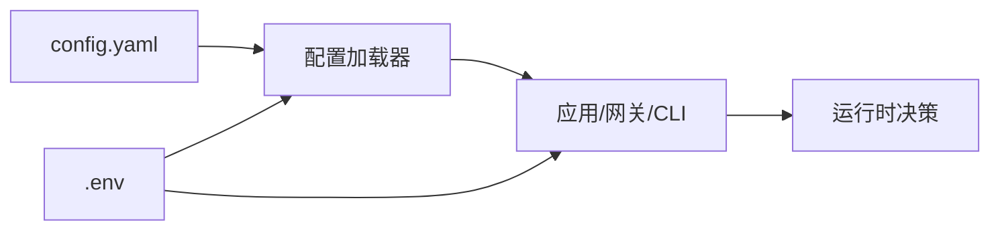

# 配置文件结构

<cite>
**本文引用的文件**
- [cli-config.yaml.example](file://cli-config.yaml.example)
- [hermes_cli/config.py](file://hermes_cli/config.py)
- [hermes_cli/env_loader.py](file://hermes_cli/env_loader.py)
- [tests/hermes_cli/test_env_loader.py](file://tests/hermes_cli/test_env_loader.py)
- [gateway/config.py](file://gateway/config.py)
- [gateway/slash_commands.py](file://gateway/slash_commands.py)
- [tui_gateway/server.py](file://tui_gateway/server.py)
- [hermes_cli/xai_retirement.py](file://hermes_cli/xai_retirement.py)
- [scripts/docker_config_migrate.py](file://scripts/docker_config_migrate.py)
- [website/i18n/zh-Hans/docusaurus-plugin-content-docs/current/user-guide/configuration.md](file://website/i18n/zh-Hans/docusaurus-plugin-content-docs/current/user-guide/configuration.md)
</cite>

## 目录
1. [简介](#简介)
2. [项目结构](#项目结构)
3. [核心组件](#核心组件)
4. [架构总览](#架构总览)
5. [详细组件分析](#详细组件分析)
6. [依赖分析](#依赖分析)
7. [性能考虑](#性能考虑)
8. [故障排查指南](#故障排查指南)
9. [结论](#结论)
10. [附录](#附录)

## 简介
本文件面向使用者与维护者，系统化梳理 Hermes Agent 的配置文件结构与工作机制，重点覆盖以下内容：
- config.yaml 与 .env 的存储位置、命名规则与组织方式
- 全局配置、用户配置、会话配置等层级及其优先级机制
- 配置项分类与用途（模型选择、工具开关、安全设置、网络配置、显示设置等）
- 配置验证、默认值处理与错误恢复策略
- 配置模板与典型使用示例
- 备份、迁移与版本兼容处理机制

## 项目结构
Hermes 的配置体系由两类文件构成：
- config.yaml：集中式全局配置，涵盖模型、终端、工具集、平台、会话重置策略、压缩、记忆、流式传输等
- .env：环境变量密钥与敏感参数，支持多来源合并加载

配置文件的物理位置与加载顺序如下：
- 默认位置：~/.hermes/config.yaml 与 ~/.hermes/.env
- 加载优先级：.env 文件优先于环境变量；config.yaml 的根层键在特定条件下回退到 model 分组
- 运行时缓存：config.yaml 与 .env 均采用基于 mtime/size 的进程内缓存，避免重复解析带来的开销

图表来源
- [hermes_cli/config.py:1-200](file://hermes_cli/config.py#L1-L200)
- [hermes_cli/config.py:5291-5327](file://hermes_cli/config.py#L5291-L5327)
- [hermes_cli/config.py:5644-5697](file://hermes_cli/config.py#L5644-L5697)

章节来源
- [hermes_cli/config.py:1-200](file://hermes_cli/config.py#L1-L200)
- [hermes_cli/config.py:5291-5327](file://hermes_cli/config.py#L5291-L5327)
- [hermes_cli/config.py:5644-5697](file://hermes_cli/config.py#L5644-L5697)

## 核心组件
- 配置读取与合并
  - 读取 config.yaml 并进行版本校验与迁移
  - 将根层遗留键迁移到 model 子树，确保后续一致性
  - 合并默认配置与用户覆盖，提供只读快路径与深拷贝路径
- 环境变量加载与优先级
  - 支持用户 .env 与项目级 .env 双路径加载，用户 .env 优先
  - 对 Windows 使用 UTF-8-sig 打开，容忍 BOM
  - 缓存 .env 内容，基于 mtime/size 自动失效
- 配置验证与错误恢复
  - 解析失败时生成时间戳 .bak 备份，保留用户手改内容
  - 仅警告不中断，保证系统可用性
- 迁移与版本控制
  - 通过 _config_version 字段识别当前 schema 版本
  - 提供脚本化迁移与交互式向导，自动备份原配置

章节来源
- [hermes_cli/config.py:42-139](file://hermes_cli/config.py#L42-L139)
- [hermes_cli/config.py:5200-5242](file://hermes_cli/config.py#L5200-L5242)
- [hermes_cli/config.py:5329-5367](file://hermes_cli/config.py#L5329-L5367)
- [hermes_cli/config.py:5644-5697](file://hermes_cli/config.py#L5644-L5697)
- [hermes_cli/config.py:5692-5707](file://hermes_cli/config.py#L5692-L5707)
- [hermes_cli/config.py:4132-4151](file://hermes_cli/config.py#L4132-L4151)
- [scripts/docker_config_migrate.py:45-67](file://scripts/docker_config_migrate.py#L45-L67)

## 架构总览
下图展示了配置文件在系统中的关键交互流程：从磁盘读取到运行时生效，以及与环境变量的合并策略。

图表来源
- [hermes_cli/config.py:5329-5367](file://hermes_cli/config.py#L5329-L5367)
- [hermes_cli/config.py:5644-5697](file://hermes_cli/config.py#L5644-L5697)

## 详细组件分析

### 1) 配置文件结构与层次关系
- 存储位置与命名
  - config.yaml：位于 ~/.hermes/config.yaml
  - .env：位于 ~/.hermes/.env
- 组织方式
  - config.yaml 采用分层结构，常见根键包括：model、terminal、browser、compression、prompt_caching、memory、session_reset、streaming、skills、agent、platform_toolsets、gateway 等
  - .env 采用 KEY=VALUE 的扁平结构，支持注释与空白行
- 根层键回退规则
  - 旧版遗留键（如 provider、base_url、context_length）在未显式设置 model.* 时作为回退值使用，并在迁移阶段被提升至 model 分组

章节来源
- [cli-config.yaml.example:1-1241](file://cli-config.yaml.example#L1-L1241)
- [hermes_cli/config.py:5200-5242](file://hermes_cli/config.py#L5200-L5242)

### 2) 全局配置、用户配置、会话配置的层级与优先级
- 层级划分
  - 全局配置：config.yaml 的顶层键，影响所有会话与平台
  - 用户配置：通过 hermes config set 或编辑 config.yaml 生效
  - 会话配置：部分平台支持按会话覆盖（如网关中的会话重置策略）
- 优先级机制
  - .env > 环境变量：.env 中的键会覆盖同名环境变量
  - config.yaml > 默认配置：用户覆盖优先于默认值
  - 平台级覆盖：某些平台可单独设置（如 gateway 下的平台配置）

章节来源
- [hermes_cli/config.py:5644-5697](file://hermes_cli/config.py#L5644-L5697)
- [gateway/config.py:801-832](file://gateway/config.py#L801-L832)

### 3) 配置项分类与用途
- 模型与推理
  - model.default / model.provider / model.base_url / model.context_length / model.max_tokens
  - 支持多种提供商与本地服务别名（如 custom、ollama、vllm、llamacpp）
- 终端与沙箱
  - terminal.backend、cwd、timeout、home_mode、容器资源限制与持久化
  - 支持本地、SSH、Docker、Singularity、Modal、Daytona 等后端
- 安全扫描
  - security.tirith_enabled、tirith_path、tirith_timeout、tirith_fail_open
- 浏览器工具
  - browser.inactivity_timeout
- 工具循环守卫
  - tool_loop_guardrails.warnings_enabled、hard_stop_enabled、阈值配置
- 上下文压缩
  - compression.enabled、threshold、target_ratio、protect_last_n、protect_first_n
- 提示缓存 TTL
  - prompt_caching.cache_ttl
- 辅助模型
  - auxiliary.vision、web_extract、tts_audio_tags、session_search
- 持久化记忆
  - memory.memory_enabled、user_profile_enabled、字符限制与提醒间隔
- 会话重置策略
  - session_reset.mode、idle_minutes、at_hour
- 流式传输
  - streaming.enabled、transport、edit_interval、buffer_threshold、cursor
- 技能与工具集
  - skills.creation_nudge_interval、platform_toolsets（按平台定制工具集）
- 代理行为
  - agent.max_turns、reasoning_effort、个性预设

章节来源
- [cli-config.yaml.example:8-1241](file://cli-config.yaml.example#L8-L1241)

### 4) 配置验证、默认值处理与错误恢复
- 验证与默认值
  - 通过 DEFAULT_CONFIG 与递归检查缺失字段，提供新字段默认值
  - 对数值型字段提供容错回退（如非数字输入回退到默认值）
- 错误恢复
  - 解析失败时生成 .corrupt.<ts>.bak 备份，保留用户手改内容
  - 不中断运行，仅输出一次警告并记录日志
- 环境变量安全
  - 对写入 .env 的键名进行白名单/黑名单校验，禁止危险变量（如 LD_PRELOAD、PATH 等）

章节来源
- [hermes_cli/config.py:42-139](file://hermes_cli/config.py#L42-L139)
- [hermes_cli/config.py:3739-3747](file://hermes_cli/config.py#L3739-L3747)
- [tests/gateway/test_config.py:174-190](file://tests/gateway/test_config.py#L174-L190)
- [hermes_cli/config.py:181-199](file://hermes_cli/config.py#L181-L199)

### 5) 配置模板与使用示例
- 模板文件
  - cli-config.yaml.example 提供了完整的配置模板与注释说明
- 示例场景
  - 模型选择：指定 provider、base_url、context_length、max_tokens
  - 终端后端：本地、SSH、Docker、Singularity、Modal、Daytona 的配置要点
  - 安全扫描：启用 tirith 扫描并设置超时与失败开火策略
  - 浏览器工具：设置空闲超时
  - 工具循环守卫：软警告与硬停止阈值
  - 上下文压缩：触发阈值、尾部保留比例、保护首尾消息数
  - 提示缓存 TTL：5m 或 1h
  - 辅助模型：为视觉、网页抽取、TTS 音频标签、会话检索分别指定提供商与模型
  - 持久化记忆：开启记忆与用户画像、设置字符上限与提醒间隔
  - 会话重置：按空闲或每日重置模式
  - 流式传输：启用并调整编辑间隔与缓冲阈值
  - 技能与工具集：按平台定制工具集
  - 代理行为：最大轮次、推理努力级别、预设个性

章节来源
- [cli-config.yaml.example:1-1241](file://cli-config.yaml.example#L1-L1241)

### 6) 备份、迁移与版本兼容
- 备份策略
  - 解析失败时自动备份 config.yaml 到 .corrupt.<ts>.bak
  - 迁移前对 config.yaml 与 .env 进行备份
- 迁移机制
  - 通过 _config_version 字段识别版本，必要时执行迁移
  - 提供脚本化迁移入口与交互式向导
- 版本兼容
  - 根层遗留键自动迁移到 model 子树
  - 保持向后兼容，避免破坏用户自定义配置

章节来源
- [hermes_cli/config.py:42-139](file://hermes_cli/config.py#L42-L139)
- [hermes_cli/config.py:4132-4151](file://hermes_cli/config.py#L4132-L4151)
- [hermes_cli/config.py:5200-5242](file://hermes_cli/config.py#L5200-L5242)
- [scripts/docker_config_migrate.py:45-67](file://scripts/docker_config_migrate.py#L45-L67)
- [hermes_cli/xai_retirement.py:194-253](file://hermes_cli/xai_retirement.py#L194-L253)

### 7) 环境变量加载与合并
- 加载顺序
  - 用户 .env（~/.hermes/.env）优先于项目级 .env（项目根目录 .env）
  - 最终覆盖环境变量（未在 .env 中声明的键不受影响）
- Windows 兼容
  - 使用 UTF-8-sig 打开 .env，容忍 BOM
- 缓存与失效
  - 基于 (path, mtime, size) 的进程内缓存，修改文件后自动失效
- 安全与限制
  - 写入 .env 的键名受严格限制，禁止注入系统级变量

章节来源
- [hermes_cli/env_loader.py](file://hermes_cli/env_loader.py)
- [tests/hermes_cli/test_env_loader.py:1-74](file://tests/hermes_cli/test_env_loader.py#L1-L74)
- [hermes_cli/config.py:5644-5697](file://hermes_cli/config.py#L5644-L5697)
- [hermes_cli/config.py:181-199](file://hermes_cli/config.py#L181-L199)

### 8) 平台与网关配置集成
- 网关侧读取
  - 网关启动时从 config.yaml 读取平台相关配置（如 session_reset、quick_commands、stt、并发会话数等）
- 动态更新
  - 支持运行时通过命令动态更新配置键值（如 reasoning 显示状态）
- 环境变量补充
  - 网关还支持通过环境变量覆盖部分会话重置策略

章节来源
- [gateway/config.py:801-832](file://gateway/config.py#L801-L832)
- [gateway/config.py:1990-2022](file://gateway/config.py#L1990-L2022)
- [gateway/slash_commands.py:2073-2104](file://gateway/slash_commands.py#L2073-L2104)

## 依赖分析
- 配置加载依赖
  - config.yaml 依赖 YAML 解析与版本迁移逻辑
  - .env 依赖安全解析与缓存机制
- 运行时依赖
  - 应用/网关/CLI 通过统一的配置读取接口获取配置
  - 网关额外依赖环境变量对会话策略进行微调

图表来源
- [hermes_cli/config.py:5329-5367](file://hermes_cli/config.py#L5329-L5367)
- [hermes_cli/config.py:5644-5697](file://hermes_cli/config.py#L5644-L5697)

章节来源
- [hermes_cli/config.py:5329-5367](file://hermes_cli/config.py#L5329-L5367)
- [hermes_cli/config.py:5644-5697](file://hermes_cli/config.py#L5644-L5697)

## 性能考虑
- 缓存策略
  - config.yaml 与 .env 均采用基于 mtime/size 的进程内缓存，显著降低重复解析成本
- 读取路径优化
  - 提供只读快路径（load_config_readonly），减少深拷贝开销
- 迁移与校验
  - 迁移过程仅在版本变更时触发，避免每次启动的额外负担

章节来源
- [hermes_cli/config.py:5346-5367](file://hermes_cli/config.py#L5346-L5367)
- [hermes_cli/config.py:5692-5707](file://hermes_cli/config.py#L5692-L5707)

## 故障排查指南
- 配置解析失败
  - 现象：启动时报“Failed to parse config.yaml”并回退默认配置
  - 处理：查看日志中的警告信息，检查 .corrupt.<ts>.bak，修复 YAML 语法后重启
- .env 加载异常
  - 现象：Windows 下出现编码错误或 BOM 导致的解析问题
  - 处理：确认 .env 使用 UTF-8-sig 编码，避免混合编码
- 键名写入受限
  - 现象：尝试写入 PATH、LD_PRELOAD 等键被拒绝
  - 处理：遵循安全白名单，使用支持的键名
- 迁移冲突
  - 现象：迁移过程中生成备份但未生效
  - 处理：检查备份文件，手动合并后再试

章节来源
- [hermes_cli/config.py:96-139](file://hermes_cli/config.py#L96-L139)
- [hermes_cli/config.py:5644-5697](file://hermes_cli/config.py#L5644-L5697)
- [hermes_cli/config.py:181-199](file://hermes_cli/config.py#L181-L199)

## 结论
Hermes 的配置体系以 config.yaml 为核心，结合 .env 实现密钥与全局配置的分离与合并。通过严格的解析与迁移机制、完善的错误恢复策略、以及面向性能的缓存设计，系统在保证易用性的同时兼顾稳定性与安全性。建议用户在首次使用时参考 cli-config.yaml.example 模板，逐步完善各模块配置，并定期备份与迁移以获得最佳体验。

## 附录
- 相关文档链接
  - [配置指南（英文）:1467-1496](file://website/i18n/zh-Hans/docusaurus-plugin-content-docs/current/user-guide/configuration.md#L1467-L1496)
- 关键实现参考
  - 配置加载与迁移：[hermes_cli/config.py:5329-5367](file://hermes_cli/config.py#L5329-L5367)、[hermes_cli/config.py:4132-4151](file://hermes_cli/config.py#L4132-L4151)
  - .env 加载与缓存：[hermes_cli/config.py:5644-5697](file://hermes_cli/config.py#L5644-L5697)
  - 网关配置读取：[gateway/config.py:801-832](file://gateway/config.py#L801-L832)
  - 运行时动态更新：[gateway/slash_commands.py:2073-2104](file://gateway/slash_commands.py#L2073-L2104)
  - 迁移脚本入口：[scripts/docker_config_migrate.py:45-67](file://scripts/docker_config_migrate.py#L45-L67)