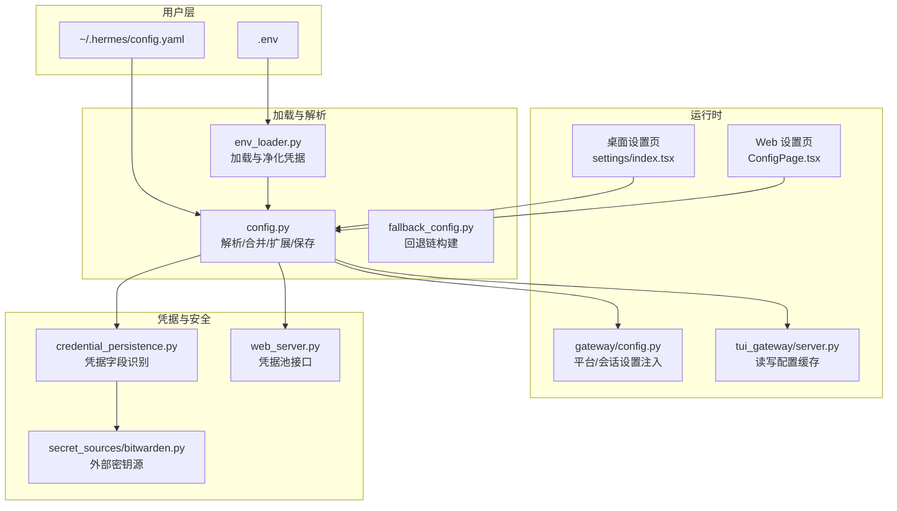
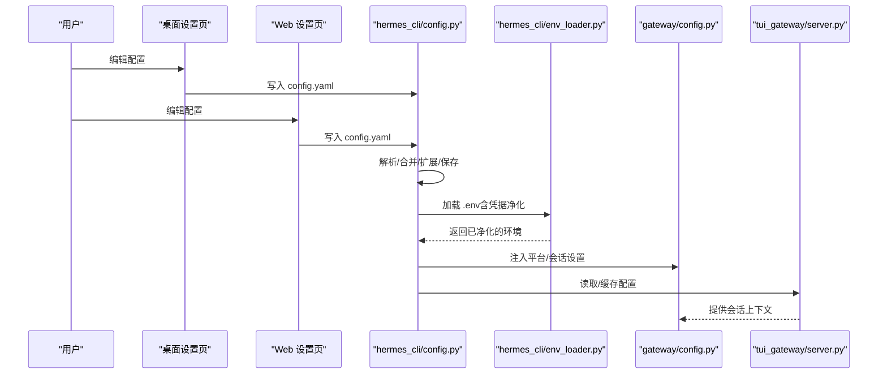
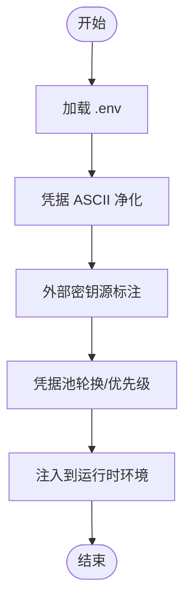
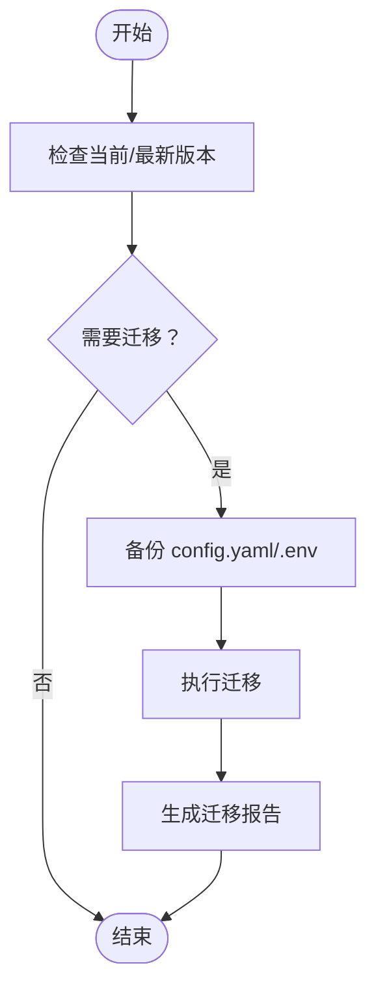
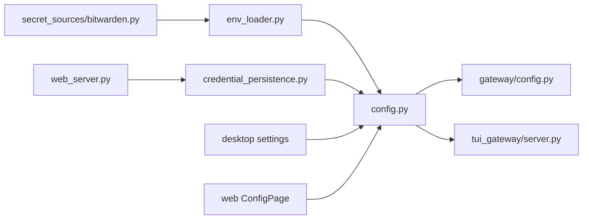

# 配置管理

<cite>
**本文引用的文件**
- [cli-config.yaml.example](file://cli-config.yaml.example)
- [hermes_cli/config.py](file://hermes_cli/config.py)
- [hermes_cli/env_loader.py](file://hermes_cli/env_loader.py)
- [hermes_cli/fallback_config.py](file://hermes_cli/fallback_config.py)
- [hermes_cli/web_server.py](file://hermes_cli/web_server.py)
- [hermes_cli/setup.py](file://hermes_cli/setup.py)
- [gateway/config.py](file://gateway/config.py)
- [agent/credential_persistence.py](file://agent/credential_persistence.py)
- [agent/secret_sources/bitwarden.py](file://agent/secret_sources/bitwarden.py)
- [apps/desktop/src/app/settings/index.tsx](file://apps/desktop/src/app/settings/index.tsx)
- [apps/desktop/src/app/settings/keys-settings.tsx](file://apps/desktop/src/app/settings/keys-settings.tsx)
- [apps/desktop/src/app/settings/credential-key-ui.tsx](file://apps/desktop/src/app/settings/credential-key-ui.tsx)
- [apps/desktop/src/app/settings/helpers.ts](file://apps/desktop/src/app/settings/helpers.ts)
- [ui-tui/packages/hermes-ink/src/utils/envUtils.ts](file://ui-tui/packages/hermes-ink/src/utils/envUtils.ts)
- [web/src/pages/ConfigPage.tsx](file://web/src/pages/ConfigPage.tsx)
- [tui_gateway/server.py](file://tui_gateway/server.py)
- [scripts/docker_config_migrate.py](file://scripts/docker_config_migrate.py)
- [tests/tools/test_docker_config_migrate.py](file://tests/tools/test_docker_config_migrate.py)
- [optional-skills/migration/openclaw-migration/scripts/openclaw_to_hermes.py](file://optional-skills/migration/openclaw-migration/scripts/openclaw_to_hermes.py)
- [hermes_cli/xai_retirement.py](file://hermes_cli/xai_retirement.py)
</cite>

## 目录
1. [简介](#简介)
2. [项目结构](#项目结构)
3. [核心组件](#核心组件)
4. [架构总览](#架构总览)
5. [详细组件分析](#详细组件分析)
6. [依赖关系分析](#依赖关系分析)
7. [性能考量](#性能考量)
8. [故障排除指南](#故障排除指南)
9. [结论](#结论)
10. [附录](#附录)

## 简介
本文件系统化梳理配置管理系统，覆盖配置文件结构与层次（全局、用户、会话）、配置项功能与用法（模型选择、工具开关、安全设置、网络配置）、凭据管理与安全机制（API 密钥存储、加密与轮换策略）、环境变量使用与配置继承机制、配置验证与迁移及版本兼容处理，并提供模板与最佳实践示例以及常见问题的排错与调试技巧。

## 项目结构
配置管理涉及以下关键位置与职责：
- 全局与用户配置：位于 ~/.hermes/ 下的 config.yaml 与 .env，前者为结构化配置，后者为环境变量凭据与运行时参数。
- 运行时加载：通过 hermes_cli/env_loader.py 统一加载 .env 并进行凭据净化；hermes_cli/config.py 负责解析、合并、扩展与持久化配置。
- 前端与网关：桌面端设置页与 Web 设置页用于可视化编辑；TUI 网关与网关进程读取配置并应用到会话。
- 凭据来源：支持本地 .env、Bitwarden 等外部密钥源；凭据池用于多键轮换与优先级调度。
- 迁移与兼容：提供配置迁移脚本与退休处理，保障版本演进中的向后兼容。

图示来源
- [hermes_cli/env_loader.py:1-200](file://hermes_cli/env_loader.py#L1-L200)
- [hermes_cli/config.py:1-200](file://hermes_cli/config.py#L1-L200)
- [hermes_cli/fallback_config.py:1-72](file://hermes_cli/fallback_config.py#L1-L72)
- [gateway/config.py:1990-2022](file://gateway/config.py#L1990-L2022)
- [tui_gateway/server.py:1308-1349](file://tui_gateway/server.py#L1308-L1349)
- [apps/desktop/src/app/settings/index.tsx:232-247](file://apps/desktop/src/app/settings/index.tsx#L232-L247)
- [web/src/pages/ConfigPage.tsx:97-129](file://web/src/pages/ConfigPage.tsx#L97-L129)
- [agent/credential_persistence.py:39-103](file://agent/credential_persistence.py#L39-L103)
- [agent/secret_sources/bitwarden.py:668-692](file://agent/secret_sources/bitwarden.py#L668-L692)
- [hermes_cli/web_server.py:7967-8003](file://hermes_cli/web_server.py#L7967-L8003)

章节来源
- [hermes_cli/env_loader.py:1-200](file://hermes_cli/env_loader.py#L1-L200)
- [hermes_cli/config.py:1-200](file://hermes_cli/config.py#L1-L200)
- [cli-config.yaml.example:1-1241](file://cli-config.yaml.example#L1-L1241)

## 核心组件
- 配置文件与优先级
  - config.yaml：结构化配置，包含模型、终端、压缩、内存、会话重置、工具集、平台设置等。
  - .env：环境变量凭据与运行时参数，加载时进行凭据净化与来源标注。
  - 优先级：.env 中的环境变量对 config.yaml 的同名键具有覆盖能力；部分运行时注入（如网关）可进一步覆盖。
- 配置解析与持久化
  - 解析：YAML 安全加载、默认值合并、环境变量模板展开、路径规范化。
  - 持久化：原子写入、缓存失效、备份策略、保留原始 ${VAR} 模板以避免凭据回写。
- 凭据管理
  - 识别：基于键名后缀与驼峰分隔规则识别敏感字段。
  - 存储：.env 与凭据池；外部密钥源（Bitwarden）按需拉取并标注来源。
  - 轮换：凭据池支持多条目、优先级与删除；结合环境变量轮换保持运行时无缝切换。
- 环境变量与继承
  - 支持 ${VAR} 模板；提供 denylist 限制危险变量写入；跨子进程与容器桥接（如 TERMINAL_CWD）。
- 验证、迁移与版本兼容
  - 配置损坏保护与告警；迁移脚本自动备份并转换；退休处理（如 x.ai）替换过时键。
- 前端与网关集成
  - 桌面与 Web 设置页可视化编辑；网关与 TUI 网关读取配置并应用到会话上下文。

章节来源
- [hermes_cli/config.py:4362-5173](file://hermes_cli/config.py#L4362-L5173)
- [hermes_cli/env_loader.py:102-157](file://hermes_cli/env_loader.py#L102-L157)
- [agent/credential_persistence.py:39-103](file://agent/credential_persistence.py#L39-L103)
- [hermes_cli/web_server.py:7967-8003](file://hermes_cli/web_server.py#L7967-L8003)
- [gateway/config.py:1990-2022](file://gateway/config.py#L1990-L2022)
- [tui_gateway/server.py:1308-1349](file://tui_gateway/server.py#L1308-L1349)

## 架构总览
配置从磁盘到运行时的关键流转如下：

图示来源
- [apps/desktop/src/app/settings/index.tsx:232-247](file://apps/desktop/src/app/settings/index.tsx#L232-L247)
- [web/src/pages/ConfigPage.tsx:97-129](file://web/src/pages/ConfigPage.tsx#L97-L129)
- [hermes_cli/config.py:4362-5173](file://hermes_cli/config.py#L4362-L5173)
- [hermes_cli/env_loader.py:102-157](file://hermes_cli/env_loader.py#L102-L157)
- [gateway/config.py:1990-2022](file://gateway/config.py#L1990-L2022)
- [tui_gateway/server.py:1308-1349](file://tui_gateway/server.py#L1308-L1349)

## 详细组件分析

### 配置文件结构与层次
- 全局配置（config.yaml）
  - 模型与推理：默认模型、提供商选择、基础地址、认证模式、请求头、超时与过期控制。
  - 终端后端：本地/SSH/Docker/Singularity/Modal/Daytona 等，工作目录、超时、资源限制、挂载策略。
  - 安全扫描：可选预执行命令安全扫描。
  - 浏览器工具：空闲超时。
  - 工具循环护栏：软警告与硬停止阈值。
  - 上下文压缩：阈值、尾部保留比例、首尾保护数量。
  - 辅助模型：视觉、网页抽取、TTS 音频标签、会话检索等任务的提供商与模型。
  - 持久化记忆：启用与字符上限、提醒间隔、退出/重置时的保存窗口。
  - 会话重置策略：空闲/每日/两者/不重置，以及触发时机。
  - 并发会话上限、群聊每用户会话策略、流式传输开关。
  - 技能与代理行为：技能创建提醒、最大轮次、推理努力级别等。
  - 平台工具集：按平台定制可用工具集。
- 用户配置（.env）
  - API 密钥与令牌：按提供商命名的键，加载时进行 ASCII 清理与来源标注。
  - 运行时桥接：TERMINAL_CWD、MESSAGING_CWD 等映射到配置键。
- 会话配置（网关与 TUI）
  - 空闲分钟数、每日重置小时、平台特定策略（如 Yuanbao DM/群组策略）。

章节来源
- [cli-config.yaml.example:1-1241](file://cli-config.yaml.example#L1-L1241)
- [gateway/config.py:1990-2022](file://gateway/config.py#L1990-L2022)
- [tui_gateway/server.py:1308-1349](file://tui_gateway/server.py#L1308-L1349)

### 配置项功能与使用方法
- 模型与提供商
  - 支持自动检测、OpenRouter、Nous、Anthropic、OpenAI Codex、Gemini、ZAI、Kimi、MiniMax（全球/中国）、HuggingFace、NVIDIA、Xiaomi、Arcee、Ollama Cloud、KiloCode、Azure Foundry、LM Studio、自定义等。
  - 可配置 base_url、认证模式（如 Entra ID）、请求头覆盖、按提供商/模型的超时与过期控制。
- 工具与平台
  - 通过 platform_toolsets 控制各平台可用工具集；支持预设与组合。
  - 平台特定 extra 配置（如 Telegram 的 rich_messages、禁用链接预览等）。
- 安全与网络
  - 终端后端安全策略（挂载、资源限制、容器运行用户等）。
  - 环境变量模板 ${VAR} 与 denylist 保护。
  - 网关侧会话重置策略与并发限制。
- 记忆与压缩
  - 自动上下文压缩与尾部保留策略，保护早期与近期对话。
- 流式传输
  - 实时令牌推送与消息渐进编辑策略。

章节来源
- [cli-config.yaml.example:1-1241](file://cli-config.yaml.example#L1-L1241)
- [gateway/config.py:1990-2022](file://gateway/config.py#L1990-L2022)

### 凭据管理与安全机制
- 字段识别
  - 基于键名后缀（如 _API_KEY、_TOKEN、_SECRET、_KEY）与驼峰分隔规则识别敏感字段。
- 存储与来源
  - .env 作为主要存储；外部密钥源（如 Bitwarden）在进程内拉取并标注来源，便于溯源。
- 净化与告警
  - 加载时对凭据值进行 ASCII 清理，遇非 ASCII 字符发出告警并提示重新复制。
- 轮换与池化
  - 凭据池支持多条目、优先级与删除；Web 接口提供添加/删除操作。
- denylist 保护
  - 禁止通过环境写入器修改影响子进程执行或运行时位置的关键变量。

图示来源
- [hermes_cli/env_loader.py:102-157](file://hermes_cli/env_loader.py#L102-L157)
- [agent/credential_persistence.py:39-103](file://agent/credential_persistence.py#L39-L103)
- [agent/secret_sources/bitwarden.py:668-692](file://agent/secret_sources/bitwarden.py#L668-L692)
- [hermes_cli/web_server.py:7967-8003](file://hermes_cli/web_server.py#L7967-L8003)

章节来源
- [hermes_cli/env_loader.py:102-157](file://hermes_cli/env_loader.py#L102-L157)
- [agent/credential_persistence.py:39-103](file://agent/credential_persistence.py#L39-L103)
- [agent/secret_sources/bitwarden.py:668-692](file://agent/secret_sources/bitwarden.py#L668-L692)
- [hermes_cli/web_server.py:7967-8003](file://hermes_cli/web_server.py#L7967-L8003)

### 环境变量使用与配置继承机制
- 模板展开
  - 在加载配置时对字符串中的 ${VAR} 进行环境变量展开，保留未变更的原始模板以避免凭据回写。
- 桥接与别名
  - 将顶层键（如 cwd、backend）映射到终端相关环境变量；MESSAGING_CWD 作为回退。
- denylist 保护
  - 禁止通过写入器修改影响子进程执行与运行时位置的关键变量，确保安全边界。
- 前端辅助
  - 提供布尔环境变量真值判断工具，统一前端对布尔配置的解析。

章节来源
- [hermes_cli/config.py:5108-5173](file://hermes_cli/config.py#L5108-L5173)
- [tests/gateway/test_config_cwd_bridge.py:59-93](file://tests/gateway/test_config_cwd_bridge.py#L59-L93)
- [hermes_cli/config.py:205-217](file://hermes_cli/config.py#L205-L217)
- [ui-tui/packages/hermes-ink/src/utils/envUtils.ts:1-13](file://ui-tui/packages/hermes-ink/src/utils/envUtils.ts#L1-L13)

### 配置验证、迁移与版本兼容
- 验证与告警
  - 配置解析失败时记录日志并在 stderr 输出一次性告警，同时备份损坏文件以便修复。
- 迁移与备份
  - 迁移脚本检查版本并自动备份，执行转换；支持跳过迁移的环境变量。
- 退休处理
  - 对过时键（如 x.ai）进行扫描与替换，必要时生成备份。
- 迁移报告
  - 开放式迁移脚本支持选择性迁移项、冲突阻断与报告生成。

图示来源
- [scripts/docker_config_migrate.py:45-67](file://scripts/docker_config_migrate.py#L45-L67)
- [tests/tools/test_docker_config_migrate.py:112-134](file://tests/tools/test_docker_config_migrate.py#L112-L134)
- [optional-skills/migration/openclaw-migration/scripts/openclaw_to_hermes.py:955-989](file://optional-skills/migration/openclaw-migration/scripts/openclaw_to_hermes.py#L955-L989)
- [hermes_cli/xai_retirement.py:194-240](file://hermes_cli/xai_retirement.py#L194-L240)

章节来源
- [hermes_cli/config.py:42-139](file://hermes_cli/config.py#L42-L139)
- [scripts/docker_config_migrate.py:45-67](file://scripts/docker_config_migrate.py#L45-L67)
- [tests/tools/test_docker_config_migrate.py:112-134](file://tests/tools/test_docker_config_migrate.py#L112-L134)
- [optional-skills/migration/openclaw-migration/scripts/openclaw_to_hermes.py:955-989](file://optional-skills/migration/openclaw-migration/scripts/openclaw_to_hermes.py#L955-L989)
- [hermes_cli/xai_retirement.py:194-240](file://hermes_cli/xai_retirement.py#L194-L240)

### 配置模板与最佳实践
- 模板来源
  - 使用仓库提供的示例配置文件作为模板，按需调整模型、提供商、终端后端与工具集。
- 最佳实践
  - 将敏感信息放入 .env 并启用 ASCII 清理；使用凭据池实现多键轮换。
  - 通过平台工具集精细化控制各平台权限；合理设置会话重置策略与并发上限。
  - 使用环境变量模板与 denylist 保护关键运行时变量。
  - 启用迁移与备份流程，定期检查配置版本并更新。

章节来源
- [cli-config.yaml.example:1-1241](file://cli-config.yaml.example#L1-L1241)
- [hermes_cli/config.py:5108-5173](file://hermes_cli/config.py#L5108-L5173)
- [hermes_cli/web_server.py:7967-8003](file://hermes_cli/web_server.py#L7967-L8003)

## 依赖关系分析
- 组件耦合
  - hermes_cli/config.py 是配置中枢，被 CLI、网关、TUI 网关广泛依赖。
  - hermes_cli/env_loader.py 仅负责 .env 加载与净化，耦合度低。
  - 凭据相关模块（credential_persistence.py、secret_sources/bitwarden.py）与 web_server.py 协作提供凭据池能力。
- 外部依赖
  - python-dotenv 用于 .env 解析；YAML 库用于配置序列化。
- 可能的循环依赖
  - 通过模块导入顺序与函数式调用避免直接循环；配置加载与写入分离职责。

图示来源
- [hermes_cli/env_loader.py:1-200](file://hermes_cli/env_loader.py#L1-L200)
- [hermes_cli/config.py:1-200](file://hermes_cli/config.py#L1-L200)
- [agent/credential_persistence.py:39-103](file://agent/credential_persistence.py#L39-L103)
- [agent/secret_sources/bitwarden.py:668-692](file://agent/secret_sources/bitwarden.py#L668-L692)
- [hermes_cli/web_server.py:7967-8003](file://hermes_cli/web_server.py#L7967-L8003)
- [gateway/config.py:1990-2022](file://gateway/config.py#L1990-L2022)
- [tui_gateway/server.py:1308-1349](file://tui_gateway/server.py#L1308-L1349)
- [apps/desktop/src/app/settings/index.tsx:232-247](file://apps/desktop/src/app/settings/index.tsx#L232-L247)
- [web/src/pages/ConfigPage.tsx:97-129](file://web/src/pages/ConfigPage.tsx#L97-L129)

章节来源
- [hermes_cli/env_loader.py:1-200](file://hermes_cli/env_loader.py#L1-L200)
- [hermes_cli/config.py:1-200](file://hermes_cli/config.py#L1-L200)

## 性能考量
- 配置缓存
  - 通过 (路径, mtime_ns, size) 缓存已展开配置字典，避免重复解析与合并开销。
- 原子写入
  - 保存配置采用原子写入，减少竞态与文件损坏风险。
- 超时与过期
  - 提供按提供商/模型的超时与过期控制，避免长尾请求阻塞。
- 并发与会话
  - 顶层并发会话上限与网关并发限制共同作用，防止资源争用。

## 故障排除指南
- 配置解析失败
  - 现象：启动时报“无法解析配置”且所有用户覆盖被忽略。
  - 处理：查看 stderr 与日志中的告警；根据提示修复 YAML；系统会备份损坏文件以便恢复。
- 凭据无效或认证失败
  - 现象：提供者返回“API key not valid”等错误。
  - 处理：确认 .env 中凭据是否包含非 ASCII 字符；重新复制来自面板的密钥；检查外部密钥源是否正确标注来源。
- 环境变量写入被拒绝
  - 现象：尝试通过设置页写入某些变量失败。
  - 处理：这些变量在 denylist 中，需手动编辑 .env 文件。
- 迁移失败或中断
  - 现象：迁移过程中出现冲突或报错。
  - 处理：查看迁移报告与警告；根据提示修复冲突后重试；必要时使用备份回滚。
- 会话重置异常
  - 现象：聊天上下文未按预期清理。
  - 处理：检查 session_reset.mode、idle_minutes、at_hour 设置；确认平台额外策略（如 Yuanbao）未覆盖默认行为。

章节来源
- [hermes_cli/config.py:42-139](file://hermes_cli/config.py#L42-L139)
- [hermes_cli/env_loader.py:102-157](file://hermes_cli/env_loader.py#L102-L157)
- [hermes_cli/config.py:205-217](file://hermes_cli/config.py#L205-L217)
- [optional-skills/migration/openclaw-migration/scripts/openclaw_to_hermes.py:955-989](file://optional-skills/migration/openclaw-migration/scripts/openclaw_to_hermes.py#L955-L989)

## 结论
本配置管理体系以 config.yaml 为核心，结合 .env 的凭据与运行时参数，通过统一的加载、解析、扩展与持久化流程，实现了跨 CLI、网关、TUI 的一致行为。凭据管理强调安全与可追溯，迁移与退休处理保障版本演进的稳定性。建议在生产环境中遵循模板与最佳实践，配合迁移与备份流程，确保配置的可靠性与安全性。

## 附录
- 关键配置键参考
  - 模型与提供商：model.default、model.provider、model.base_url、model.auth_mode、model.default_headers、model.providers.*
  - 终端后端：terminal.backend、terminal.cwd、terminal.timeout、terminal.home_mode、terminal.docker_*、terminal.sudo_password
  - 安全扫描：security.tirith_enabled、security.tirith_path、security.tirith_timeout、security.tirith_fail_open
  - 浏览器工具：browser.inactivity_timeout
  - 工具循环护栏：tool_loop_guardrails.warnings_enabled、tool_loop_guardrails.hard_stop_enabled、tool_loop_guardrails.warn_after.*、tool_loop_guardrails.hard_stop_after.*
  - 上下文压缩：compression.enabled、compression.threshold、compression.target_ratio、compression.protect_last_n、compression.protect_first_n
  - 辅助模型：auxiliary.*.provider、auxiliary.*.model、auxiliary.*.timeout、auxiliary.*.download_timeout
  - 持久化记忆：memory.memory_enabled、memory.user_profile_enabled、memory.memory_char_limit、memory.user_char_limit、memory.nudge_interval、memory.flush_min_turns
  - 会话重置：session_reset.mode、session_reset.idle_minutes、session_reset.at_hour
  - 并发与流式：max_concurrent_sessions、group_sessions_per_user、streaming.enabled、streaming.transport、streaming.edit_interval、streaming.buffer_threshold、streaming.cursor
  - 技能与代理行为：skills.creation_nudge_interval、agent.max_turns、agent.gateway_timeout、agent.gateway_timeout_warning、agent.restart_drain_timeout、agent.api_max_retries、agent.verbose、agent.reasoning_effort、agent.personalities.*
  - 平台工具集：platform_toolsets.*

章节来源
- [cli-config.yaml.example:1-1241](file://cli-config.yaml.example#L1-L1241)