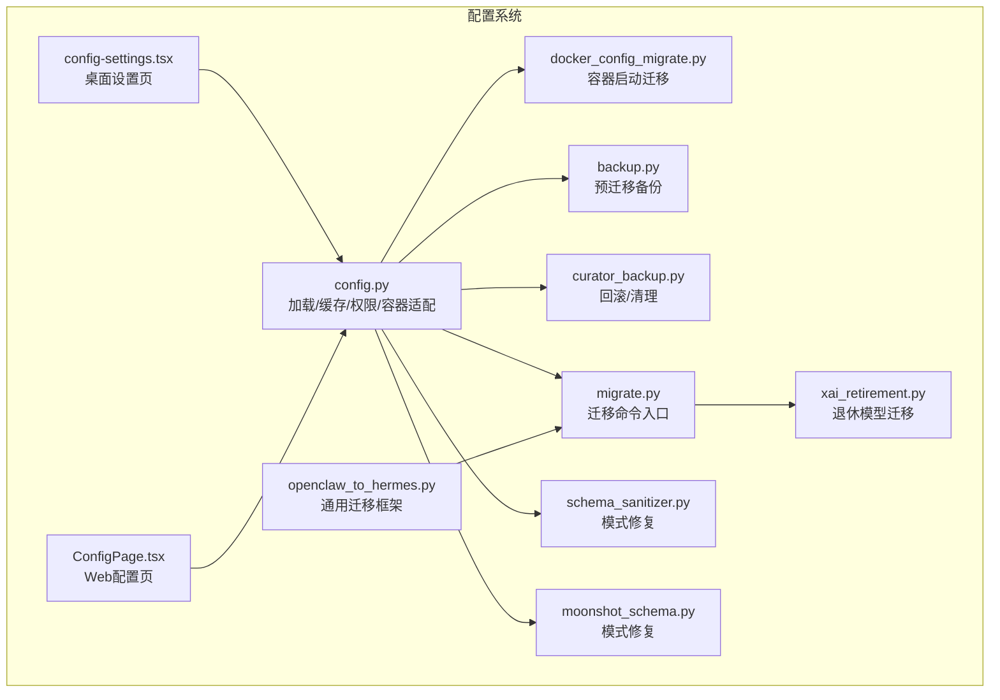
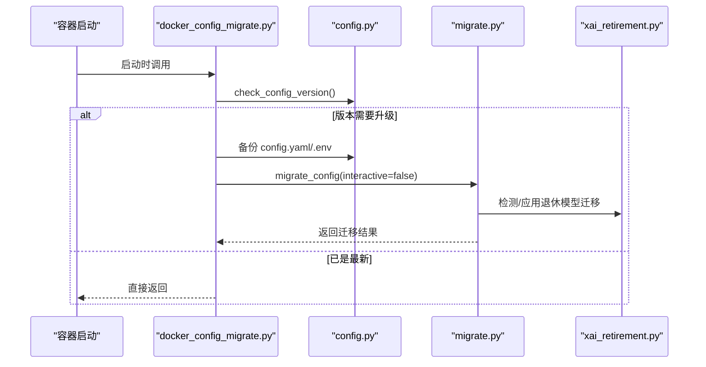
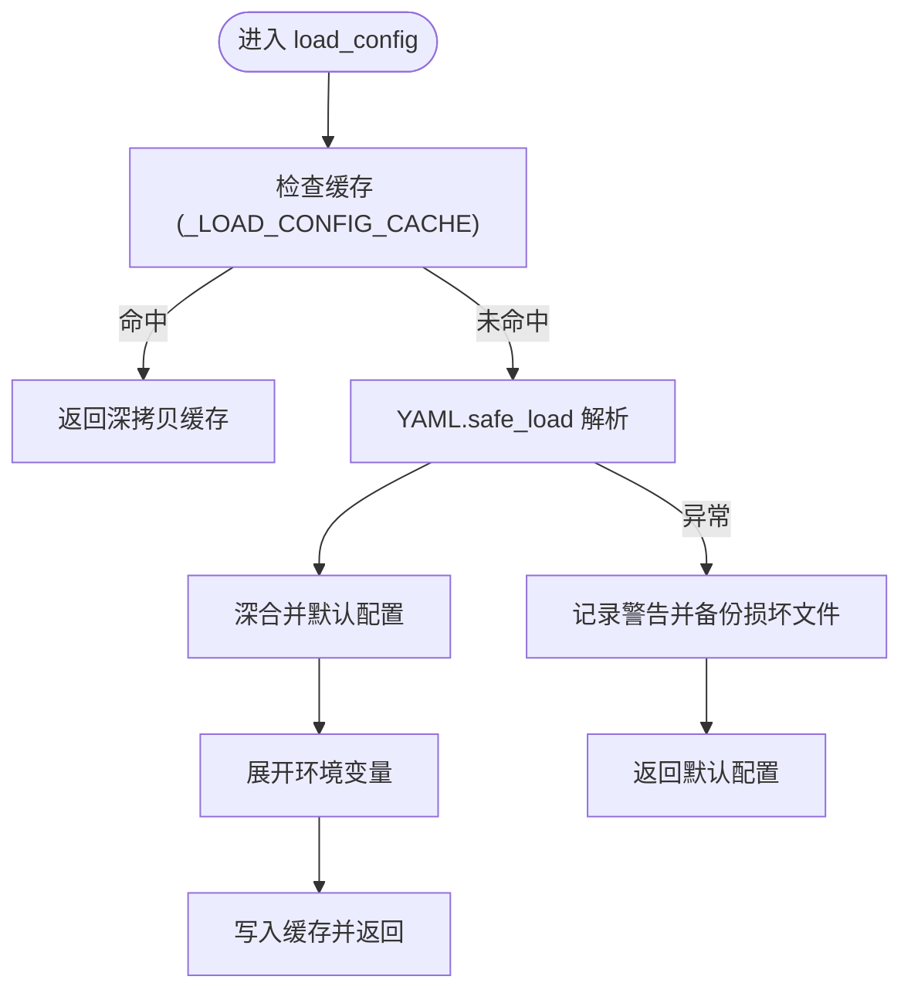
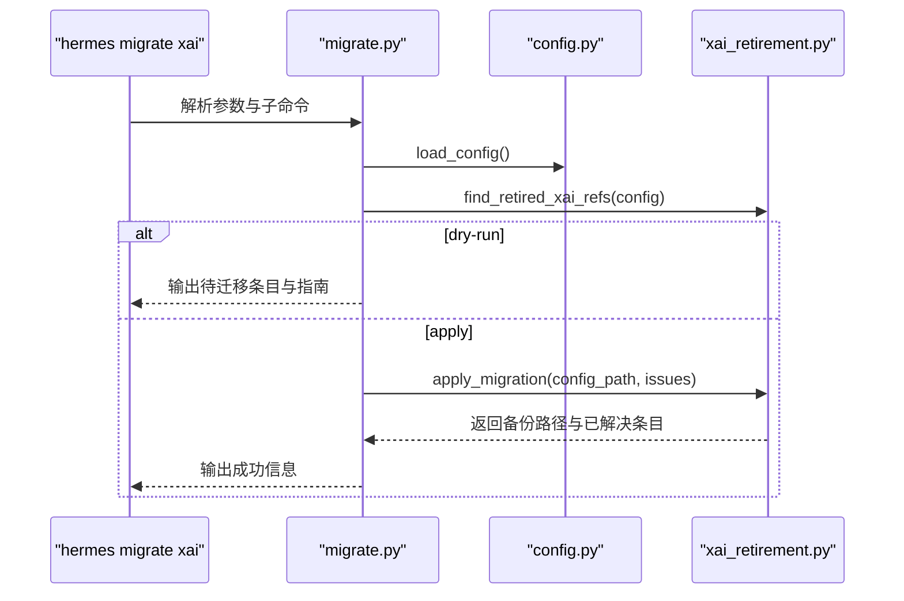
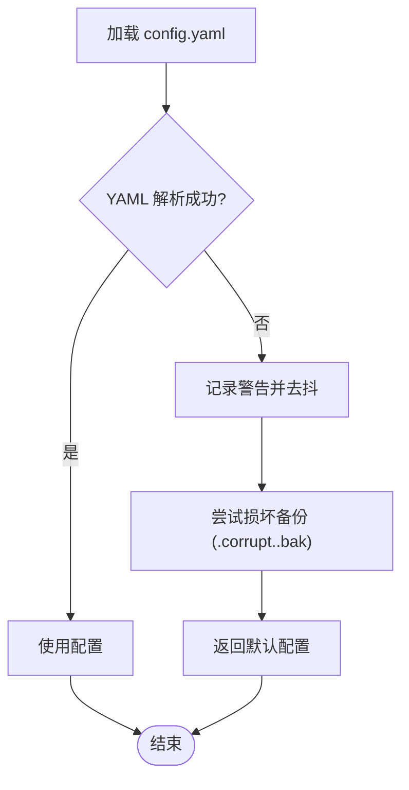
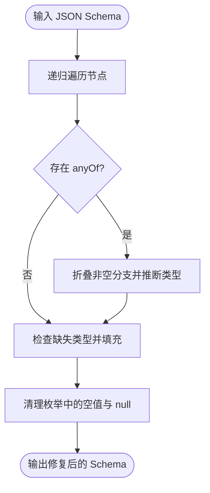
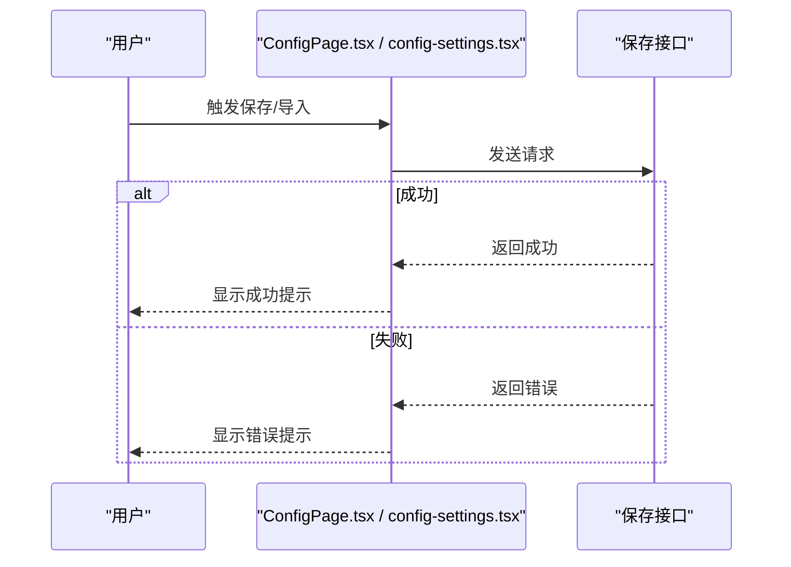

# 配置验证与迁移

<cite>
**本文引用的文件**
- [docker_config_migrate.py](file://scripts/docker_config_migrate.py)
- [config.py](file://hermes_cli/config.py)
- [migrate.py](file://hermes_cli/migrate.py)
- [xai_retirement.py](file://hermes_cli/xai_retirement.py)
- [openclaw_to_hermes.py](file://optional-skills/migration/openclaw-migration/scripts/openclaw_to_hermes.py)
- [schema_sanitizer.py](file://tools/schema_sanitizer.py)
- [moonshot_schema.py](file://agent/moonshot_schema.py)
- [backup.py](file://hermes_cli/backup.py)
- [curator_backup.py](file://agent/curator_backup.py)
- [test_docker_config_migrate.py](file://tests/scripts/test_docker_config_migrate.py)
- [test_openclaw_migration_hardening.py](file://tests/skills/test_openclaw_migration_hardening.py)
- [config-settings.tsx](file://apps/desktop/src/app/settings/config-settings.tsx)
- [ConfigPage.tsx](file://web/src/pages/ConfigPage.tsx)
</cite>

## 目录
1. [简介](#简介)
2. [项目结构](#项目结构)
3. [核心组件](#核心组件)
4. [架构总览](#架构总览)
5. [详细组件分析](#详细组件分析)
6. [依赖关系分析](#依赖关系分析)
7. [性能考虑](#性能考虑)
8. [故障排查指南](#故障排查指南)
9. [结论](#结论)
10. [附录](#附录)

## 简介
本文件系统化阐述配置验证与迁移体系：覆盖配置文件的语法检查、字段验证与约束检查；配置迁移的版本检测、自动迁移与向后兼容；配置损坏的检测与恢复（备份、修复、降级）；配置缓存与性能优化（内存缓存、热重载）；错误处理与用户反馈；以及扩展性设计（新增字段与变更兼容）。目标是帮助开发者与运维人员理解并安全地维护配置系统。

## 项目结构
配置相关能力分布在多个子系统中：
- 配置加载与缓存：hermes_cli/config.py 提供默认配置、路径解析、缓存与并发保护、权限加固、容器模式适配等。
- 迁移与补丁：scripts/docker_config_migrate.py 负责容器启动时的配置迁移；hermes_cli/migrate.py 暴露迁移命令入口；xai_retirement.py 处理特定模型退休迁移。
- 验证与修复：tools/schema_sanitizer.py 与 agent/moonshot_schema.py 提供模式修复与标准化；optional-skills/migration/openclaw-migration 提供通用迁移框架与报告。
- 恢复与备份：hermes_cli/backup.py 与 agent/curator_backup.py 提供预迁移备份与回滚；config.py 在解析失败时进行损坏备份与告警。
- 用户界面与反馈：apps/desktop 与 web 的配置页面负责保存、导入导出与错误提示。



图表来源
- [config.py](file://hermes_cli/config.py)
- [docker_config_migrate.py](file://scripts/docker_config_migrate.py)
- [migrate.py](file://hermes_cli/migrate.py)
- [xai_retirement.py](file://hermes_cli/xai_retirement.py)
- [schema_sanitizer.py](file://tools/schema_sanitizer.py)
- [moonshot_schema.py](file://agent/moonshot_schema.py)
- [openclaw_to_hermes.py](file://optional-skills/migration/openclaw-migration/scripts/openclaw_to_hermes.py)
- [backup.py](file://hermes_cli/backup.py)
- [curator_backup.py](file://agent/curator_backup.py)
- [config-settings.tsx](file://apps/desktop/src/app/settings/config-settings.tsx)
- [ConfigPage.tsx](file://web/src/pages/ConfigPage.tsx)

章节来源
- [config.py](file://hermes_cli/config.py)
- [docker_config_migrate.py](file://scripts/docker_config_migrate.py)
- [migrate.py](file://hermes_cli/migrate.py)
- [xai_retirement.py](file://hermes_cli/xai_retirement.py)
- [schema_sanitizer.py](file://tools/schema_sanitizer.py)
- [moonshot_schema.py](file://agent/moonshot_schema.py)
- [openclaw_to_hermes.py](file://optional-skills/migration/openclaw-migration/scripts/openclaw_to_hermes.py)
- [backup.py](file://hermes_cli/backup.py)
- [curator_backup.py](file://agent/curator_backup.py)
- [config-settings.tsx](file://apps/desktop/src/app/settings/config-settings.tsx)
- [ConfigPage.tsx](file://web/src/pages/ConfigPage.tsx)

## 核心组件
- 配置加载与缓存
  - 默认配置字典 DEFAULT_CONFIG 定义所有可用键及默认值，确保未显式配置时的行为可预测。
  - 缓存机制：基于文件路径、修改时间与大小的三元组缓存已解析配置，避免重复解析与深拷贝开销。
  - 并发保护：RLock 串行化读写，避免 libyaml C 扩展在多线程下的竞态。
  - 权限与容器适配：对 ~/.hermes 及其子目录设置安全权限；容器内跳过 chmod；受管理安装（NixOS/Homebrew）采用组共享权限。
- 配置迁移
  - 版本检测：通过 _config_version 字段比较当前与最新版本，决定是否执行迁移。
  - 自动迁移：在非交互模式下执行迁移，保持原子写入与备份。
  - 容器启动迁移：脚本在容器启动时自动执行迁移，支持跳过环境变量控制。
- 配置损坏检测与恢复
  - 解析失败告警：记录到日志与标准错误，避免静默失败；同一文件的相同 mtime/size 组合仅警告一次。
  - 损坏备份：将无法解析的 config.yaml 复制为 .corrupt.<ts>.bak，保留用户手改内容以便后续修复。
  - 回滚与清理：预迁移备份按前缀筛选与裁剪；回滚时保护目标快照不被清理。
- 验证与修复
  - 模式修复：针对 JSON Schema 的常见问题（anyOf 类型、nullable、enum 值等）进行修复与标准化。
  - 通用迁移框架：提供选项选择、冲突处理、报告生成与阻断机制，保证迁移过程的安全性与可观测性。
- 错误处理与用户反馈
  - CLI 命令：迁移命令提供干运行与应用两种模式，输出清晰的迁移指南链接与结果。
  - Web/桌面 UI：提供保存、导入、导出、重置默认值等操作，失败时弹出错误提示并保留原配置。

章节来源
- [config.py](file://hermes_cli/config.py)
- [docker_config_migrate.py](file://scripts/docker_config_migrate.py)
- [migrate.py](file://hermes_cli/migrate.py)
- [xai_retirement.py](file://hermes_cli/xai_retirement.py)
- [schema_sanitizer.py](file://tools/schema_sanitizer.py)
- [moonshot_schema.py](file://agent/moonshot_schema.py)
- [openclaw_to_hermes.py](file://optional-skills/migration/openclaw-migration/scripts/openclaw_to_hermes.py)
- [backup.py](file://hermes_cli/backup.py)
- [curator_backup.py](file://agent/curator_backup.py)
- [config-settings.tsx](file://apps/desktop/src/app/settings/config-settings.tsx)
- [ConfigPage.tsx](file://web/src/pages/ConfigPage.tsx)

## 架构总览
配置系统围绕“安全加载—严格验证—平滑迁移—可靠恢复—高效缓存”展开，形成从底层文件到上层 UI 的全链路闭环。



图表来源
- [docker_config_migrate.py](file://scripts/docker_config_migrate.py)
- [config.py](file://hermes_cli/config.py)
- [migrate.py](file://hermes_cli/migrate.py)
- [xai_retirement.py](file://hermes_cli/xai_retirement.py)

## 详细组件分析

### 组件A：配置加载与缓存（config.py）
- 设计要点
  - 默认配置 DEFAULT_CONFIG：集中定义所有键与默认值，便于扩展与一致性校验。
  - 缓存策略：_LOAD_CONFIG_CACHE/_RAW_CONFIG_CACHE 以 (路径, mtime_ns, size) 为键，命中则直接返回深拷贝后的配置，避免 YAML 解析与合并成本。
  - 并发控制：_CONFIG_LOCK 使用 RLock，既保护读写也避免递归调用导致的死锁。
  - 安全与容器：ensure_hermes_home 创建安全目录结构；_secure_file/_secure_dir 设置权限；容器检测与跳过 chmod；受管安装（NixOS/Homebrew）采用组共享权限。
- 性能特性
  - 缓存命中时跳过 YAML.safe_load、深合并、环境变量展开等步骤，显著降低热路径开销。
  - 提供 load_config_readonly 快速只读路径，进一步减少深拷贝分配。
- 错误处理
  - 解析失败时记录警告并保留 .corrupt.<ts>.bak，避免覆盖用户手改内容。
  - 对 denylist 环境变量名进行拒绝写入，防止通过 .env 写入高危变量。



图表来源
- [config.py](file://hermes_cli/config.py)

章节来源
- [config.py](file://hermes_cli/config.py)

### 组件B：配置迁移（docker_config_migrate.py 与 migrate.py）
- 设计要点
  - 版本检测：通过 check_config_version 获取当前与最新版本，若当前版本小于最新版本则执行迁移。
  - 自动迁移：在非交互模式下调用 migrate_config，保持原子写入与备份。
  - 容器启动迁移：脚本在容器启动时自动执行，支持 HERMES_SKIP_CONFIG_MIGRATION 跳过。
  - 命令入口：hermes_cli/migrate.py 提供迁移命令分发，目前支持 xai 模型退休迁移。
- 迁移流程
  - 预备：备份 config.yaml 与 .env。
  - 应用：执行迁移逻辑（如退休模型替换），必要时更新 reasoning_effort。
  - 结果：输出备份路径与迁移条目数量，建议运行 hermes doctor 校验。



图表来源
- [migrate.py](file://hermes_cli/migrate.py)
- [xai_retirement.py](file://hermes_cli/xai_retirement.py)
- [config.py](file://hermes_cli/config.py)

章节来源
- [docker_config_migrate.py](file://scripts/docker_config_migrate.py)
- [migrate.py](file://hermes_cli/migrate.py)
- [xai_retirement.py](file://hermes_cli/xai_retirement.py)

### 组件C：配置损坏检测与恢复（config.py 与 backup.py）
- 设计要点
  - 损坏检测：解析失败时调用 _warn_config_parse_failure，记录日志与标准错误，避免静默失败。
  - 损坏备份：_backup_corrupt_config 将损坏的 config.yaml 复制为 .corrupt.<ts>.bak，保留用户手改内容。
  - 预迁移备份：create_pre_migration_backup 以 pre-migration- 前缀命名压缩包，按 keep 数量裁剪旧备份。
  - 回滚与清理：curator_backup.py 清理过期备份，同时保护目标回滚快照不被删除。
- 测试保障
  - tests/scripts/test_docker_config_migrate.py 验证容器迁移脚本在损坏 YAML 时不迁移且产生警告。
  - tests/skills/test_openclaw_migration_hardening.py 验证迁移冲突阻断与报告生成。



图表来源
- [config.py](file://hermes_cli/config.py)
- [backup.py](file://hermes_cli/backup.py)
- [curator_backup.py](file://agent/curator_backup.py)

章节来源
- [config.py](file://hermes_cli/config.py)
- [backup.py](file://hermes_cli/backup.py)
- [curator_backup.py](file://agent/curator_backup.py)
- [test_docker_config_migrate.py](file://tests/scripts/test_docker_config_migrate.py)
- [test_openclaw_migration_hardening.py](file://tests/skills/test_openclaw_migration_hardening.py)

### 组件D：验证与修复（schema_sanitizer.py 与 moonshot_schema.py）
- 设计要点
  - 模式修复：针对 anyOf、nullable、enum 等关键字进行修复与标准化，提升跨平台兼容性。
  - 通用迁移框架：openclaw_to_hermes.py 提供选项选择、冲突阻断、报告生成与阻断策略，确保迁移过程可控与可观测。
- 复杂度分析
  - 模式修复为树形遍历，时间复杂度 O(N)，空间复杂度 O(N)（递归栈）。
  - 通用迁移框架通过状态机与阻断标志，避免部分迁移导致的半成品写入。



图表来源
- [schema_sanitizer.py](file://tools/schema_sanitizer.py)
- [moonshot_schema.py](file://agent/moonshot_schema.py)
- [openclaw_to_hermes.py](file://optional-skills/migration/openclaw-migration/scripts/openclaw_to_hermes.py)

章节来源
- [schema_sanitizer.py](file://tools/schema_sanitizer.py)
- [moonshot_schema.py](file://agent/moonshot_schema.py)
- [openclaw_to_hermes.py](file://optional-skills/migration/openclaw-migration/scripts/openclaw_to_hermes.py)

### 组件E：错误处理与用户反馈（UI 层）
- 设计要点
  - 桌面端：config-settings.tsx 支持导入/导出、重置默认值、滚动定位到目标字段、错误通知等。
  - Web 端：ConfigPage.tsx 提供保存、YAML 保存、搜索与分类过滤、导入 JSON、成功/失败提示等。
- 反馈机制
  - 保存失败时弹出错误提示，保留原配置不变；成功后显示“已保存”提示。
  - 导入 JSON 失败时提示无效 JSON，避免覆盖当前配置。



图表来源
- [ConfigPage.tsx](file://web/src/pages/ConfigPage.tsx)
- [config-settings.tsx](file://apps/desktop/src/app/settings/config-settings.tsx)

章节来源
- [ConfigPage.tsx](file://web/src/pages/ConfigPage.tsx)
- [config-settings.tsx](file://apps/desktop/src/app/settings/config-settings.tsx)

## 依赖关系分析
- 组件耦合
  - config.py 是核心枢纽，被 docker_config_migrate.py、migrate.py、backup.py、curator_backup.py 等广泛依赖。
  - xai_retirement.py 作为迁移插件被 migrate.py 调用，保持低耦合与可测试性。
  - UI 层通过 API 与 config.py 解耦，避免直接操作底层文件。
- 外部依赖
  - ruamel.yaml 用于 YAML 的保留注释与类型写回。
  - threading.RLock 保证并发安全。
  - 测试用例覆盖关键路径，确保迁移与损坏恢复行为稳定。

```mermaid
graph LR
config_py["config.py"] <- --> docker_migrate["docker_config_migrate.py"]
config_py <- --> migrate_cmd["migrate.py"]
migrate_cmd --> xai_ret["xai_retirement.py"]
config_py <- --> backup_mod["backup.py"]
config_py <- --> curator["curator_backup.py"]
ui_web["ConfigPage.tsx"] --> config_py
ui_desktop["config-settings.tsx"] --> config_py
```

图表来源
- [config.py](file://hermes_cli/config.py)
- [docker_config_migrate.py](file://scripts/docker_config_migrate.py)
- [migrate.py](file://hermes_cli/migrate.py)
- [xai_retirement.py](file://hermes_cli/xai_retirement.py)
- [backup.py](file://hermes_cli/backup.py)
- [curator_backup.py](file://agent/curator_backup.py)
- [ConfigPage.tsx](file://web/src/pages/ConfigPage.tsx)
- [config-settings.tsx](file://apps/desktop/src/app/settings/config-settings.tsx)

章节来源
- [config.py](file://hermes_cli/config.py)
- [docker_config_migrate.py](file://scripts/docker_config_migrate.py)
- [migrate.py](file://hermes_cli/migrate.py)
- [xai_retirement.py](file://hermes_cli/xai_retirement.py)
- [backup.py](file://hermes_cli/backup.py)
- [curator_backup.py](file://agent/curator_backup.py)
- [ConfigPage.tsx](file://web/src/pages/ConfigPage.tsx)
- [config-settings.tsx](file://apps/desktop/src/app/settings/config-settings.tsx)

## 性能考虑
- 缓存与热重载
  - 通过 _LOAD_CONFIG_CACHE/_RAW_CONFIG_CACHE 与 RLock，避免重复解析与深拷贝；save_config 通过原子写入触发新的 inode，自然失效缓存。
  - load_config_readonly 为只读场景提供快速路径，减少深拷贝分配。
- I/O 与并发
  - 文件权限设置与容器检测减少不必要的 chmod；在容器内跳过 chmod，避免 I/O 开销。
- 迁移与备份
  - 预迁移备份按前缀筛选与裁剪，避免无限增长；回滚时保护目标快照不被清理，兼顾安全性与效率。

## 故障排查指南
- 配置解析失败
  - 现象：启动时出现“Failed to parse config.yaml”的警告，随后使用默认配置。
  - 排查：查看 hermes logs 中的 WARNING 日志；检查 .corrupt.<ts>.bak 是否生成；修复 YAML 语法后重启。
- 迁移未执行
  - 现象：容器启动后未发现迁移。
  - 排查：确认 _config_version 是否低于最新版本；检查 HERMES_SKIP_CONFIG_MIGRATION 是否设置；查看 docker_config_migrate.py 输出。
- 迁移冲突或半成品
  - 现象：迁移过程中出现冲突，后续迁移被阻断。
  - 排查：根据迁移报告中的 status 与 reason 定位问题；必要时手动修复后再重新迁移。
- UI 保存失败
  - 现象：Web/桌面端保存失败并提示错误。
  - 排查：确认配置格式正确；查看浏览器控制台或应用日志；避免覆盖当前有效配置。

章节来源
- [config.py](file://hermes_cli/config.py)
- [docker_config_migrate.py](file://scripts/docker_config_migrate.py)
- [migrate.py](file://hermes_cli/migrate.py)
- [test_docker_config_migrate.py](file://tests/scripts/test_docker_config_migrate.py)
- [test_openclaw_migration_hardening.py](file://tests/skills/test_openclaw_migration_hardening.py)
- [ConfigPage.tsx](file://web/src/pages/ConfigPage.tsx)
- [config-settings.tsx](file://apps/desktop/src/app/settings/config-settings.tsx)

## 结论
该配置验证与迁移系统通过“安全加载—严格验证—平滑迁移—可靠恢复—高效缓存”的设计，在保证用户体验的同时确保了配置的稳定性与可维护性。容器启动迁移、预迁移备份、损坏文件保护与 UI 友好反馈共同构成了完整的生命周期管理。未来可在以下方面持续演进：引入更强的字段级约束校验、增强迁移报告的可视化与自动化修复能力、扩展更多平台的容器与受管安装适配。

## 附录
- 关键实现路径
  - 配置加载与缓存：[config.py](file://hermes_cli/config.py)
  - 容器启动迁移：[docker_config_migrate.py](file://scripts/docker_config_migrate.py)
  - 迁移命令入口：[migrate.py](file://hermes_cli/migrate.py)
  - 退休模型迁移：[xai_retirement.py](file://hermes_cli/xai_retirement.py)
  - 模式修复工具：[schema_sanitizer.py](file://tools/schema_sanitizer.py)、[moonshot_schema.py](file://agent/moonshot_schema.py)
  - 通用迁移框架：[openclaw_to_hermes.py](file://optional-skills/migration/openclaw-migration/scripts/openclaw_to_hermes.py)
  - 预迁移备份：[backup.py](file://hermes_cli/backup.py)
  - 回滚与清理：[curator_backup.py](file://agent/curator_backup.py)
  - UI 保存与导入：[ConfigPage.tsx](file://web/src/pages/ConfigPage.tsx)、[config-settings.tsx](file://apps/desktop/src/app/settings/config-settings.tsx)