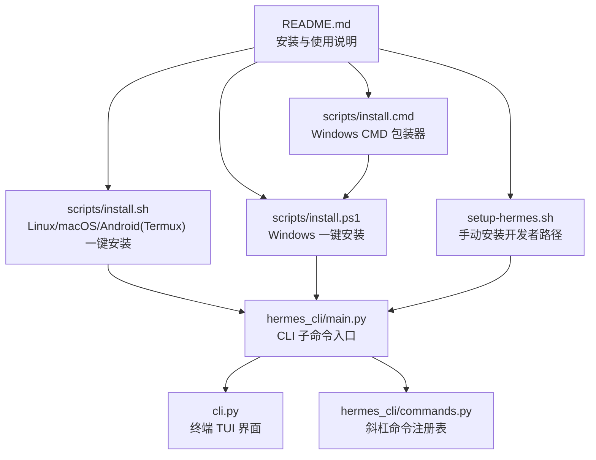
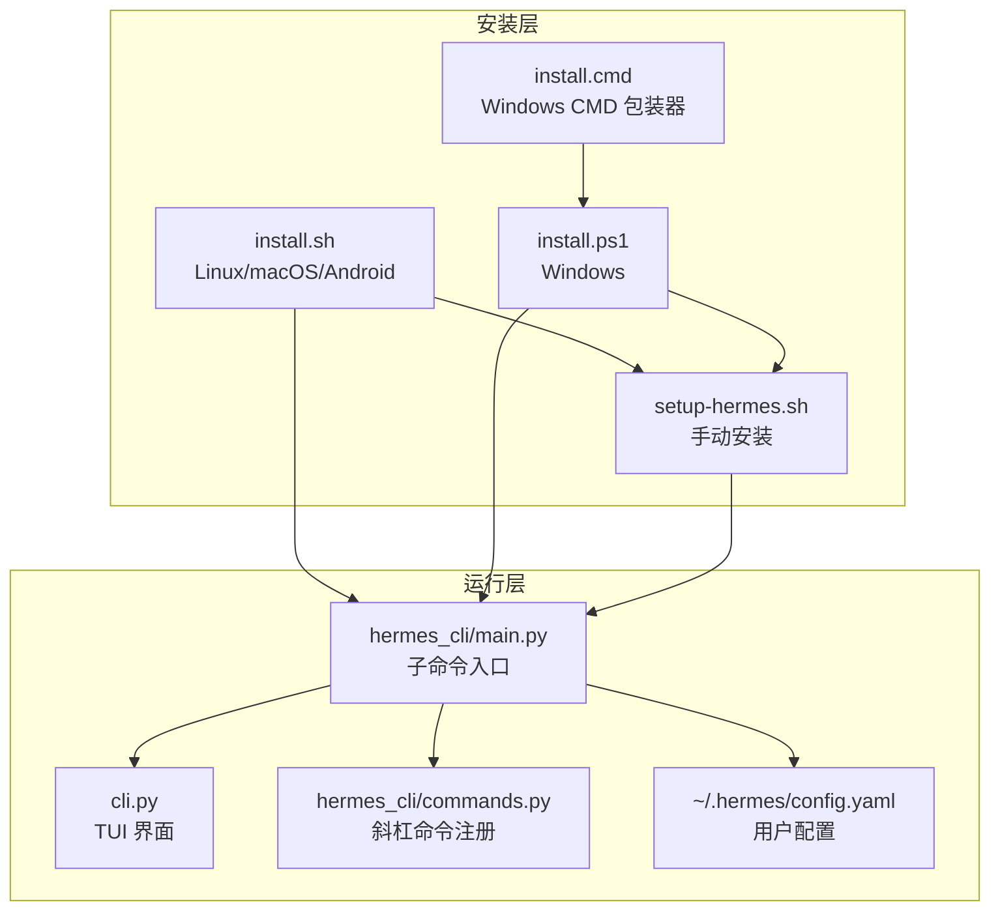
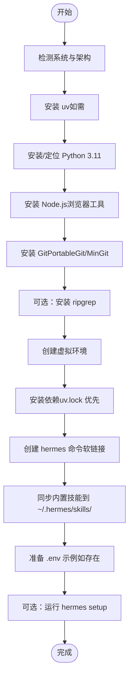
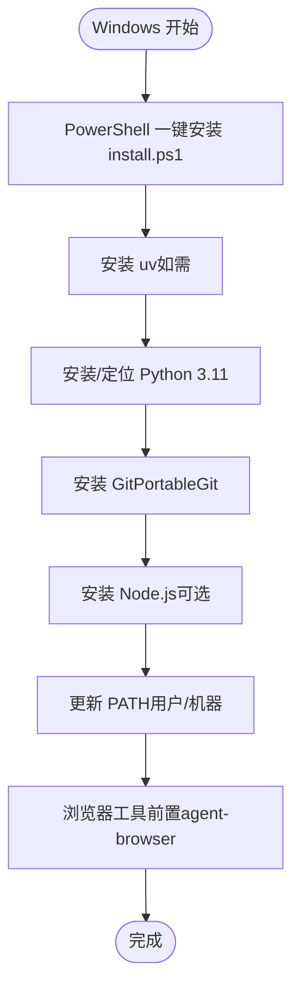
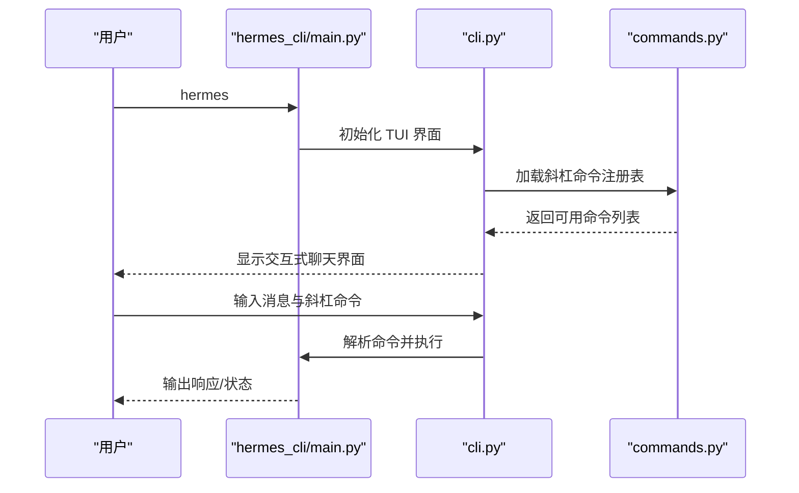
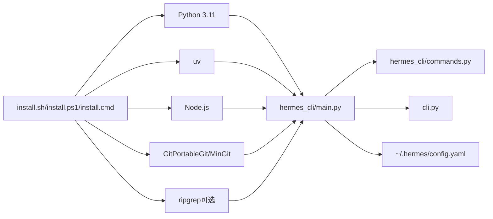

# 快速开始

<cite>
**本文引用的文件**
- [README.md](file://README.md)
- [install.sh](file://scripts/install.sh)
- [install.ps1](file://scripts/install.ps1)
- [install.cmd](file://scripts/install.cmd)
- [setup-hermes.sh](file://setup-hermes.sh)
- [main.py](file://hermes_cli/main.py)
- [commands.py](file://hermes_cli/commands.py)
- [cli.py](file://cli.py)
- [cli-config.yaml.example](file://cli-config.yaml.example)
</cite>

## 目录
1. [简介](#简介)
2. [项目结构](#项目结构)
3. [核心组件](#核心组件)
4. [架构总览](#架构总览)
5. [详细组件分析](#详细组件分析)
6. [依赖关系分析](#依赖关系分析)
7. [性能考虑](#性能考虑)
8. [故障排除指南](#故障排除指南)
9. [结论](#结论)
10. [附录](#附录)

## 简介
本指南面向首次接触 Hermes Agent 的用户，帮助你在 Linux、macOS、Windows（原生与 WSL2）、Termux 等平台上快速完成安装、初始化与首次使用。你将学会：
- 在不同平台通过一键脚本或手动方式安装 Hermes Agent
- 配置必要的依赖与环境变量
- 启动交互式 CLI 并完成第一次对话
- 选择模型与工具集，开启消息网关
- 常见安装问题的诊断与修复

## 项目结构
Hermes Agent 提供统一的安装入口与多平台支持：
- 一键安装脚本：Linux/macOS/Android（Termux）使用 install.sh；Windows 使用 install.ps1 或 install.cmd 包装器
- 手动安装脚本：setup-hermes.sh 用于从源码克隆后的本地开发环境
- CLI 入口：hermes_cli/main.py 提供命令行子命令与交互式 TUI
- CLI 终端界面：cli.py 提供终端内 TUI 体验
- 命令注册表：commands.py 定义所有斜杠命令及其分类与提示

**图表来源**
- [README.md:34-81](file://README.md#L34-L81)
- [install.sh:1-120](file://scripts/install.sh#L1-L120)
- [install.ps1:1-120](file://scripts/install.ps1#L1-L120)
- [install.cmd:1-29](file://scripts/install.cmd#L1-L29)
- [setup-hermes.sh:1-60](file://setup-hermes.sh#L1-L60)
- [main.py:1-60](file://hermes_cli/main.py#L1-L60)
- [cli.py:1-60](file://cli.py#L1-L60)
- [commands.py:1-60](file://hermes_cli/commands.py#L1-L60)

**章节来源**
- [README.md:34-81](file://README.md#L34-L81)

## 核心组件
- 安装脚本（Linux/macOS/Android）
  - 自动检测系统、安装 uv、Python 3.11、Node.js、Git（PortableGit/MinGit）、可选 ripgrep，并创建虚拟环境与依赖安装
  - 在非 Termux 环境下自动将 hermes 命令链接到 ~/.local/bin 并建议将该目录加入 PATH
- 安装脚本（Windows）
  - 自动安装 uv、Python 3.11、Git（PortableGit）、Node.js（可选），并处理 PATH 注册与浏览器工具前置条件
- 手动安装脚本（开发者）
  - 适用于已克隆仓库的本地开发环境，按平台差异安装依赖、创建 venv、安装包并准备技能目录
- CLI 入口与命令系统
  - hermes_cli/main.py 提供子命令解析与路由，commands.py 定义斜杠命令注册表，cli.py 提供交互式 TUI
- 配置与示例
  - 支持从 ~/.hermes/config.yaml 读取用户配置，cli.py 中包含默认配置结构与环境变量桥接逻辑

**章节来源**
- [install.sh:1-120](file://scripts/install.sh#L1-L120)
- [install.ps1:1-120](file://scripts/install.ps1#L1-L120)
- [setup-hermes.sh:1-60](file://setup-hermes.sh#L1-L60)
- [main.py:1-60](file://hermes_cli/main.py#L1-L60)
- [commands.py:1-60](file://hermes_cli/commands.py#L1-L60)
- [cli.py:356-704](file://cli.py#L356-L704)

## 架构总览
Hermes Agent 的安装与运行由“安装脚本”“CLI 入口”“TUI 界面”“命令系统”四部分协同完成。

**图表来源**
- [install.sh:1-120](file://scripts/install.sh#L1-L120)
- [install.ps1:1-120](file://scripts/install.ps1#L1-L120)
- [install.cmd:1-29](file://scripts/install.cmd#L1-L29)
- [setup-hermes.sh:1-60](file://setup-hermes.sh#L1-L60)
- [main.py:1-60](file://hermes_cli/main.py#L1-L60)
- [cli.py:356-704](file://cli.py#L356-L704)
- [commands.py:1-60](file://hermes_cli/commands.py#L1-L60)

## 详细组件分析

### 平台安装流程（Linux/macOS/WSL2/Termux）
- 适用场景
  - 通过 curl 一键安装（推荐）
  - 手动安装（开发者或离线环境）
- 关键步骤
  - 检测系统类型与架构，安装 uv（若未找到）
  - 安装 Python 3.11（优先 uv 管理）
  - 安装 Node.js（用于浏览器工具）、Git（PortableGit/MinGit）、可选 ripgrep
  - 创建虚拟环境并安装依赖（Termux 使用 pip，其他平台优先 uv.lock 锁定安装）
  - 将 hermes 命令链接到 ~/.local/bin 并建议将该目录加入 PATH
  - 准备技能目录与 .env 示例（如存在）
  - 可选：立即运行 hermes setup 进入交互式配置向导

**图表来源**
- [install.sh:1-120](file://scripts/install.sh#L1-L120)
- [install.sh:230-320](file://scripts/install.sh#L230-L320)
- [install.sh:320-420](file://scripts/install.sh#L320-L420)
- [install.sh:420-520](file://scripts/install.sh#L420-L520)
- [install.sh:520-620](file://scripts/install.sh#L520-L620)
- [install.sh:620-720](file://scripts/install.sh#L620-L720)
- [install.sh:720-820](file://scripts/install.sh#L720-L820)
- [install.sh:820-920](file://scripts/install.sh#L820-L920)
- [install.sh:920-1020](file://scripts/install.sh#L920-L1020)
- [install.sh:1020-1120](file://scripts/install.sh#L1020-L1120)
- [install.sh:1120-1220](file://scripts/install.sh#L1120-L1220)
- [install.sh:1220-1320](file://scripts/install.sh#L1220-L1320)
- [install.sh:1320-1420](file://scripts/install.sh#L1320-L1420)
- [install.sh:1420-1520](file://scripts/install.sh#L1420-L1520)
- [install.sh:1520-1620](file://scripts/install.sh#L1520-L1620)
- [install.sh:1620-1720](file://scripts/install.sh#L1620-L1720)
- [install.sh:1720-1820](file://scripts/install.sh#L1720-L1820)
- [install.sh:1820-1920](file://scripts/install.sh#L1820-L1920)
- [install.sh:1920-2020](file://scripts/install.sh#L1920-L2020)
- [install.sh:2020-2120](file://scripts/install.sh#L2020-L2120)
- [install.sh:2120-2220](file://scripts/install.sh#L2120-L2220)
- [install.sh:2220-2320](file://scripts/install.sh#L2220-L2320)
- [install.sh:2320-2420](file://scripts/install.sh#L2320-L2420)
- [install.sh:2420-2520](file://scripts/install.sh#L2420-L2520)
- [install.sh:2520-2620](file://scripts/install.sh#L2520-L2620)
- [install.sh:2620-2720](file://scripts/install.sh#L2620-L2720)
- [install.sh:2720-2820](file://scripts/install.sh#L2720-L2820)

**章节来源**
- [install.sh:1-120](file://scripts/install.sh#L1-L120)
- [install.sh:230-320](file://scripts/install.sh#L230-L320)
- [install.sh:320-420](file://scripts/install.sh#L320-L420)
- [install.sh:420-520](file://scripts/install.sh#L420-L520)
- [install.sh:520-620](file://scripts/install.sh#L520-L620)
- [install.sh:620-720](file://scripts/install.sh#L620-L720)
- [install.sh:720-820](file://scripts/install.sh#L720-L820)
- [install.sh:820-920](file://scripts/install.sh#L820-L920)
- [install.sh:920-1020](file://scripts/install.sh#L920-L1020)
- [install.sh:1020-1120](file://scripts/install.sh#L1020-L1120)
- [install.sh:1120-1220](file://scripts/install.sh#L1120-L1220)
- [install.sh:1220-1320](file://scripts/install.sh#L1220-L1320)
- [install.sh:1320-1420](file://scripts/install.sh#L1320-L1420)
- [install.sh:1420-1520](file://scripts/install.sh#L1420-L1520)
- [install.sh:1520-1620](file://scripts/install.sh#L1520-L1620)
- [install.sh:1620-1720](file://scripts/install.sh#L1620-L1720)
- [install.sh:1720-1820](file://scripts/install.sh#L1720-L1820)
- [install.sh:1820-1920](file://scripts/install.sh#L1820-L1920)
- [install.sh:1920-2020](file://scripts/install.sh#L1920-L2020)
- [install.sh:2020-2120](file://scripts/install.sh#L2020-L2120)
- [install.sh:2120-2220](file://scripts/install.sh#L2120-L2220)
- [install.sh:2220-2320](file://scripts/install.sh#L2220-L2320)
- [install.sh:2320-2420](file://scripts/install.sh#L2320-L2420)
- [install.sh:2420-2520](file://scripts/install.sh#L2420-L2520)
- [install.sh:2520-2620](file://scripts/install.sh#L2520-L2620)
- [install.sh:2620-2720](file://scripts/install.sh#L2620-L2720)
- [install.sh:2720-2820](file://scripts/install.sh#L2720-L2820)

### 平台安装流程（Windows 原生与 WSL2）
- 适用场景
  - Windows 原生安装（PowerShell 一键）
  - WSL2（Linux 子系统）安装（复用 Linux/macOS 脚本）
- 关键步骤
  - PowerShell 一键安装 install.ps1：自动安装 uv、Python 3.11、Git（PortableGit）、Node.js（可选）
  - 处理 PATH 注册（用户态与机器态）、浏览器工具前置条件（agent-browser）
  - 可选：安装桌面应用构建依赖（需要时）

**图表来源**
- [install.ps1:1-120](file://scripts/install.ps1#L1-L120)
- [install.ps1:320-420](file://scripts/install.ps1#L320-L420)
- [install.ps1:420-520](file://scripts/install.ps1#L420-L520)
- [install.ps1:520-620](file://scripts/install.ps1#L520-L620)
- [install.ps1:620-720](file://scripts/install.ps1#L620-L720)
- [install.ps1:720-820](file://scripts/install.ps1#L720-L820)
- [install.ps1:820-920](file://scripts/install.ps1#L820-L920)
- [install.ps1:920-1020](file://scripts/install.ps1#L920-L1020)
- [install.ps1:1020-1120](file://scripts/install.ps1#L1020-L1120)
- [install.ps1:1120-1220](file://scripts/install.ps1#L1120-L1220)
- [install.ps1:1220-1320](file://scripts/install.ps1#L1220-L1320)
- [install.ps1:1320-1420](file://scripts/install.ps1#L1320-L1420)
- [install.ps1:1420-1520](file://scripts/install.ps1#L1420-L1520)
- [install.ps1:1520-1620](file://scripts/install.ps1#L1520-L1620)
- [install.ps1:1620-1720](file://scripts/install.ps1#L1620-L1720)
- [install.ps1:1720-1820](file://scripts/install.ps1#L1720-L1820)
- [install.ps1:1820-1920](file://scripts/install.ps1#L1820-L1920)
- [install.ps1:1920-2020](file://scripts/install.ps1#L1920-L2020)
- [install.ps1:2020-2120](file://scripts/install.ps1#L2020-L2120)
- [install.ps1:2120-2220](file://scripts/install.ps1#L2120-L2220)
- [install.ps1:2220-2320](file://scripts/install.ps1#L2220-L2320)
- [install.ps1:2320-2420](file://scripts/install.ps1#L2320-L2420)
- [install.ps1:2420-2520](file://scripts/install.ps1#L2420-L2520)
- [install.ps1:2520-2620](file://scripts/install.ps1#L2520-L2620)
- [install.ps1:2620-2720](file://scripts/install.ps1#L2620-L2720)
- [install.ps1:2720-2820](file://scripts/install.ps1#L2720-L2820)

**章节来源**
- [install.ps1:1-120](file://scripts/install.ps1#L1-L120)
- [install.ps1:320-420](file://scripts/install.ps1#L320-L420)
- [install.ps1:420-520](file://scripts/install.ps1#L420-L520)
- [install.ps1:520-620](file://scripts/install.ps1#L520-L620)
- [install.ps1:620-720](file://scripts/install.ps1#L620-L720)
- [install.ps1:720-820](file://scripts/install.ps1#L720-L820)
- [install.ps1:820-920](file://scripts/install.ps1#L820-L920)
- [install.ps1:920-1020](file://scripts/install.ps1#L920-L1020)
- [install.ps1:1020-1120](file://scripts/install.ps1#L1020-L1120)
- [install.ps1:1120-1220](file://scripts/install.ps1#L1120-L1220)
- [install.ps1:1220-1320](file://scripts/install.ps1#L1220-L1320)
- [install.ps1:1320-1420](file://scripts/install.ps1#L1320-L1420)
- [install.ps1:1420-1520](file://scripts/install.ps1#L1420-L1520)
- [install.ps1:1520-1620](file://scripts/install.ps1#L1520-L1620)
- [install.ps1:1620-1720](file://scripts/install.ps1#L1620-L1720)
- [install.ps1:1720-1820](file://scripts/install.ps1#L1720-L1820)
- [install.ps1:1820-1920](file://scripts/install.ps1#L1820-L1920)
- [install.ps1:1920-2020](file://scripts/install.ps1#L1920-L2020)
- [install.ps1:2020-2120](file://scripts/install.ps1#L2020-L2120)
- [install.ps1:2120-2220](file://scripts/install.ps1#L2120-L2220)
- [install.ps1:2220-2320](file://scripts/install.ps1#L2220-L2320)
- [install.ps1:2320-2420](file://scripts/install.ps1#L2320-L2420)
- [install.ps1:2420-2520](file://scripts/install.ps1#L2420-L2520)
- [install.ps1:2520-2620](file://scripts/install.ps1#L2520-L2620)
- [install.ps1:2620-2720](file://scripts/install.ps1#L2620-L2720)
- [install.ps1:2720-2820](file://scripts/install.ps1#L2720-L2820)

### 平台安装流程（Termux）
- 适用场景
  - Android 设备上的 Termux 环境
- 关键步骤
  - 检测 Termux 环境，使用 pkg 安装 Python、Git、Node.js（如需）
  - 使用 Python 标准库 venv 创建虚拟环境，pip 安装依赖（支持 constraints-termux.txt）
  - 将 hermes 命令链接到 $PREFIX/bin（已加入 PATH）
  - 可选：运行 hermes setup 进入交互式配置向导

**章节来源**
- [install.sh:335-380](file://scripts/install.sh#L335-L380)
- [install.sh:550-590](file://scripts/install.sh#L550-L590)
- [install.sh:760-820](file://scripts/install.sh#L760-L820)
- [setup-hermes.sh:38-60](file://setup-hermes.sh#L38-L60)
- [setup-hermes.sh:190-210](file://setup-hermes.sh#L190-L210)
- [setup-hermes.sh:355-396](file://setup-hermes.sh#L355-L396)

### 首次运行与基础使用
- 启动 CLI
  - Linux/macOS/WSL2：直接运行 hermes
  - Windows：在 PowerShell 中运行 hermes（或使用 install.ps1 安装后）
- 交互式会话
  - CLI 提供多行编辑、斜杠命令补全、历史记录、中断重定向、流式工具输出
- 常用命令
  - hermes：进入交互式聊天
  - hermes model：选择推理模型与提供商
  - hermes tools：启用/禁用工具
  - hermes config set：设置单项配置
  - hermes gateway：启动消息网关（Telegram、Discord、Slack、WhatsApp、Signal 等）
  - hermes setup：运行完整设置向导（一次性配置所有内容）
  - hermes update：更新到最新版本
  - hermes doctor：诊断问题

**图表来源**
- [main.py:1-60](file://hermes_cli/main.py#L1-L60)
- [cli.py:1-60](file://cli.py#L1-L60)
- [commands.py:1-60](file://hermes_cli/commands.py#L1-L60)

**章节来源**
- [README.md:69-81](file://README.md#L69-L81)
- [main.py:1-60](file://hermes_cli/main.py#L1-L60)
- [cli.py:1-60](file://cli.py#L1-L60)
- [commands.py:1-60](file://hermes_cli/commands.py#L1-L60)

### 配置与示例
- 用户配置位置
  - Linux/macOS/WSL2：~/.hermes/config.yaml
  - Windows：%LOCALAPPDATA%\hermes\config.yaml（原生）或 ~/.hermes\config.yaml（WSL2）
- 默认配置结构
  - 模型选择（provider、default、base_url）
  - 终端后端（env_type、cwd、超时、镜像、容器资源等）
  - 浏览器工具（inactivity_timeout、record_sessions、engine、camofox）
  - 压缩策略（enabled、threshold）
  - 代理智能体参数（max_turns、system_prompt、reasoning_effort、service_tier）
  - 显示与流式输出（compact、resume_display、skin、streaming）
  - 辅助模型与直连端点（vision、web_extract、approval）
  - 委托执行（max_iterations、model/provider/base_url/api_key）
  - 引导提示（onboarding.seen）
- 环境变量桥接
  - CLI 配置会桥接到环境变量，以便终端工具与浏览器工具读取
- 示例配置
  - 提供 cli-config.yaml.example 作为参考模板

**章节来源**
- [cli.py:356-704](file://cli.py#L356-L704)
- [cli-config.yaml.example](file://cli-config.yaml.example)

## 依赖关系分析
- 安装脚本依赖
  - Linux/macOS/Android：uv、Python 3.11、Node.js、Git（PortableGit/MinGit）、可选 ripgrep
  - Windows：uv、Python 3.11、Git（PortableGit）、Node.js（可选）
- 运行时依赖
  - CLI 子命令入口依赖 hermes_cli/commands.py 的命令注册表
  - TUI 界面依赖 prompt_toolkit、富文本渲染与皮肤引擎
  - 配置系统依赖 YAML 解析与环境变量桥接

**图表来源**
- [install.sh:1-120](file://scripts/install.sh#L1-L120)
- [install.ps1:1-120](file://scripts/install.ps1#L1-L120)
- [install.cmd:1-29](file://scripts/install.cmd#L1-L29)
- [main.py:1-60](file://hermes_cli/main.py#L1-L60)
- [commands.py:1-60](file://hermes_cli/commands.py#L1-L60)
- [cli.py:356-704](file://cli.py#L356-L704)

**章节来源**
- [install.sh:1-120](file://scripts/install.sh#L1-L120)
- [install.ps1:1-120](file://scripts/install.ps1#L1-L120)
- [install.cmd:1-29](file://scripts/install.cmd#L1-L29)
- [main.py:1-60](file://hermes_cli/main.py#L1-L60)
- [commands.py:1-60](file://hermes_cli/commands.py#L1-L60)
- [cli.py:356-704](file://cli.py#L356-L704)

## 性能考虑
- 依赖安装优化
  - 优先使用 uv.lock 进行哈希校验安装，降低供应链风险并提升一致性
  - Termux 使用 pip 并支持约束文件，避免不兼容依赖
- 启动性能
  - CLI 启动前对部分模块进行延迟导入与早期优化（如事件循环关闭警告抑制）
  - TUI 在早期阶段抑制鼠标残留事件，减少终端抖动
- 资源使用
  - 终端后端（Docker/Singularity/Modal/Daytona/SSH）可通过配置控制资源与持久化
  - 浏览器工具支持空闲超时与会话录制，便于调试与回放

[本节为通用指导，无需特定文件引用]

## 故障排除指南
- Windows 证书信任错误
  - 现象：npm 安装失败，提示“无法获取本地签发者证书”
  - 处理：指向组织根 CA 或临时禁用严格 SSL（安装后恢复）
- Git 未找到或安装失败
  - 现象：系统缺少 Git 或系统 Git 不可用
  - 处理：自动下载 PortableGit 到 %LOCALAPPDATA%\hermes\git（Windows）；Linux/macOS 使用包管理器安装
- Python 版本不符
  - 现象：系统 Python 版本过低
  - 处理：使用 uv 安装/切换到 Python 3.11；Windows 可使用系统 Python（避开 Microsoft Store 伪实现）
- PATH 未包含 ~/.local/bin
  - 现象：hermes 命令不可用
  - 处理：安装脚本会尝试将 ~/.local/bin 写入 shell 配置文件；手动 source 或重启终端
- 浏览器工具不可用
  - 现象：浏览器相关功能报错
  - 处理：安装 agent-browser 并确保系统浏览器或 Chromium 可用；必要时指定 AGENT_BROWSER_EXECUTABLE_PATH
- 权限问题（Windows）
  - 现象：安装需要管理员权限或路径冲突
  - 处理：使用用户级安装（%LOCALAPPDATA%\hermes），避免与系统 Git/Node 冲突

**章节来源**
- [install.ps1:188-215](file://scripts/install.ps1#L188-L215)
- [install.ps1:535-745](file://scripts/install.ps1#L535-L745)
- [install.ps1:747-820](file://scripts/install.ps1#L747-L820)
- [install.sh:663-722](file://scripts/install.sh#L663-L722)
- [install.sh:553-594](file://scripts/install.sh#L553-L594)

## 结论
通过本快速开始指南，你可以在多种平台上完成 Hermes Agent 的安装与首次使用。建议：
- 优先使用一键安装脚本，自动处理依赖与环境
- 首次运行后执行 hermes setup，完成模型与工具配置
- 如需在消息平台使用，启动 hermes gateway 并按平台指引完成授权
- 遇到问题时使用 hermes doctor 进行诊断，或参考本指南的故障排除章节

[本节为总结性内容，无需特定文件引用]

## 附录
- 常用命令速查
  - hermes：交互式聊天
  - hermes model：选择模型与提供商
  - hermes tools：管理工具启用状态
  - hermes config set：设置单项配置
  - hermes gateway：启动消息网关
  - hermes setup：完整设置向导
  - hermes update：更新到最新版本
  - hermes doctor：诊断问题

**章节来源**
- [README.md:69-81](file://README.md#L69-L81)