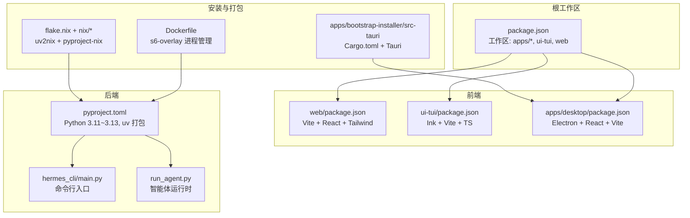
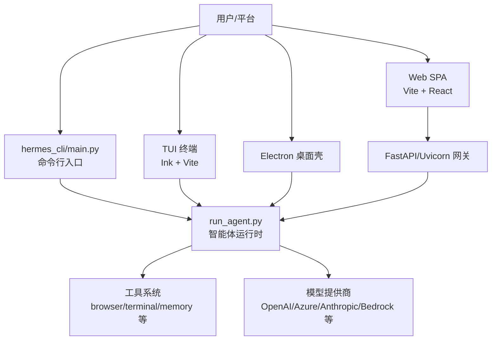
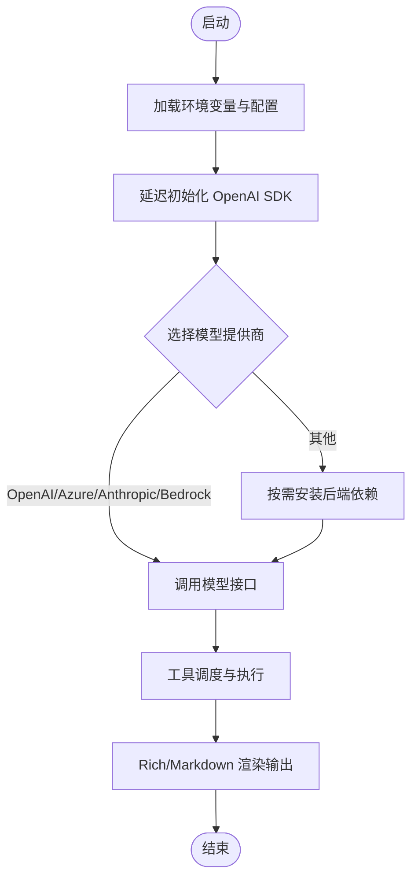
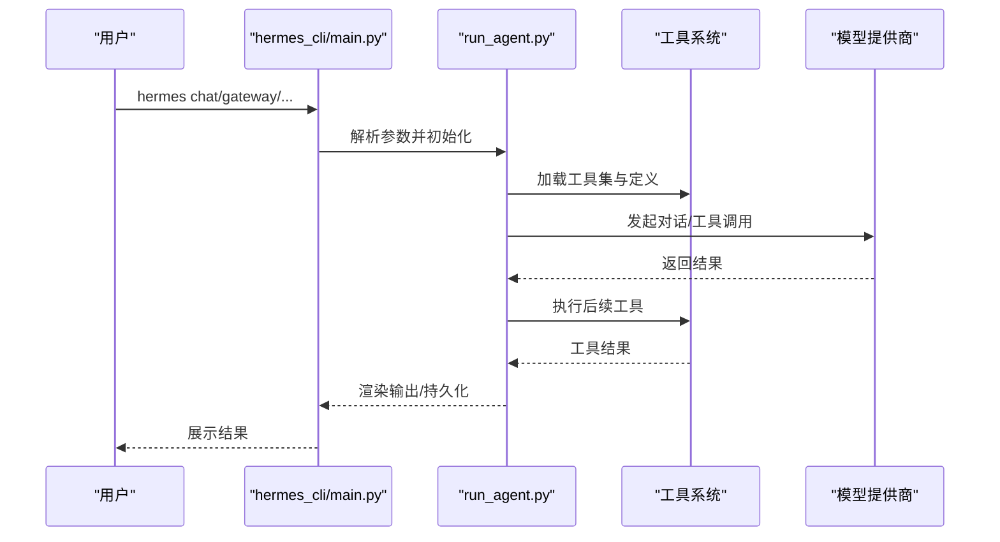
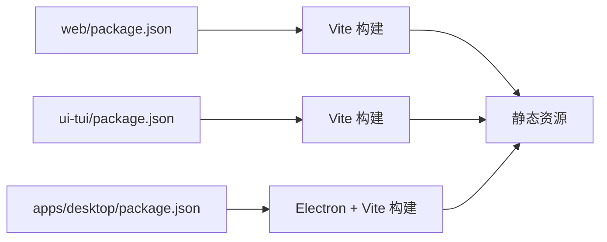
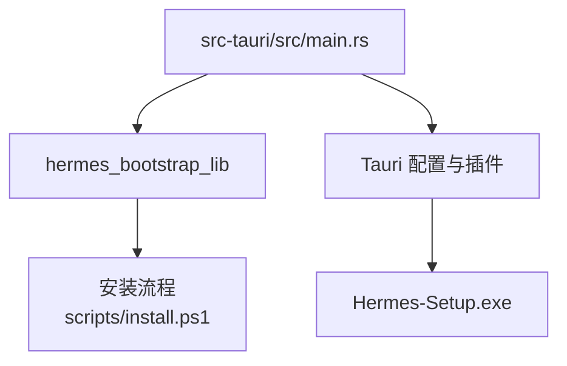
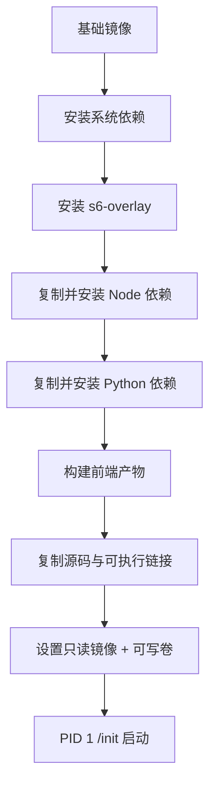
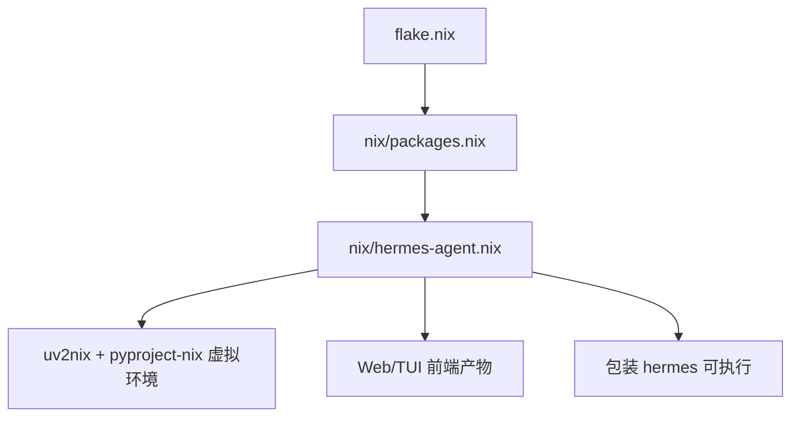
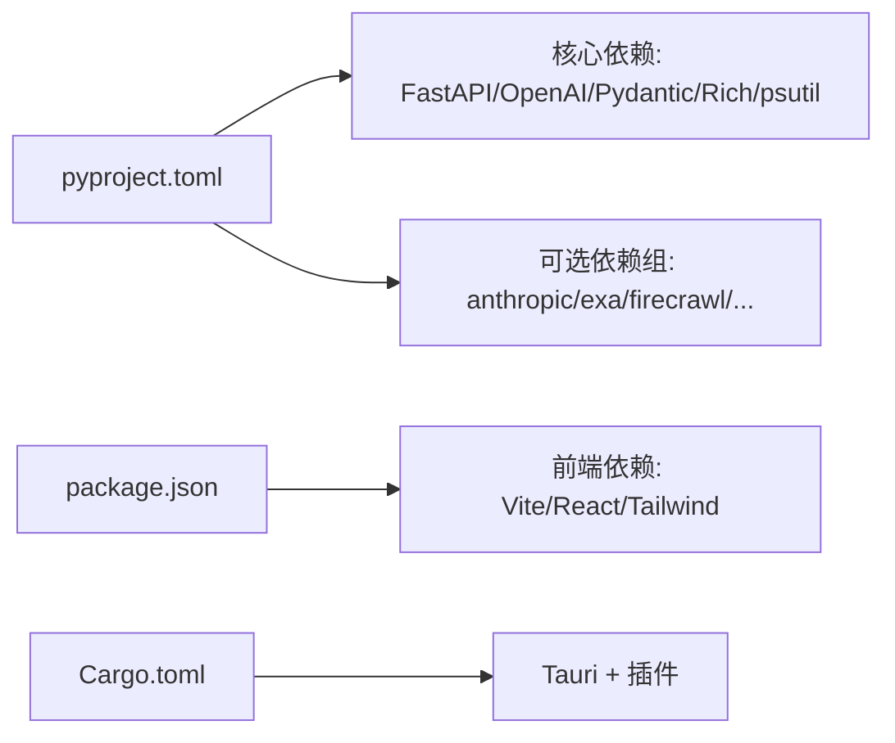

# 技术栈

<cite>
**本文引用的文件**
- [package.json](file://package.json)
- [pyproject.toml](file://pyproject.toml)
- [Dockerfile](file://Dockerfile)
- [flake.nix](file://flake.nix)
- [nix/packages.nix](file://nix/packages.nix)
- [nix/hermes-agent.nix](file://nix/hermes-agent.nix)
- [apps/desktop/package.json](file://apps/desktop/package.json)
- [web/package.json](file://web/package.json)
- [ui-tui/package.json](file://ui-tui/package.json)
- [hermes_cli/main.py](file://hermes_cli/main.py)
- [run_agent.py](file://run_agent.py)
- [apps/bootstrap-installer/src-tauri/Cargo.toml](file://apps/bootstrap-installer/src-tauri/Cargo.toml)
- [apps/bootstrap-installer/src-tauri/src/main.rs](file://apps/bootstrap-installer/src-tauri/src/main.rs)
</cite>

## 目录
1. [引言](#引言)
2. [项目结构](#项目结构)
3. [核心组件](#核心组件)
4. [架构总览](#架构总览)
5. [详细组件分析](#详细组件分析)
6. [依赖关系分析](#依赖关系分析)
7. [性能考量](#性能考量)
8. [故障排查指南](#故障排查指南)
9. [结论](#结论)
10. [附录](#附录)

## 引言
本文件系统性梳理 Hermes Agent 的技术栈与实现要点，覆盖后端（Python）、前端（TypeScript/React/Vue 生态）、桌面应用（Electron/Tauri）以及容器化与 Nix 包管理实践。重点解释核心依赖库与第三方服务（如 FastAPI、OpenAI SDK、Pydantic、Rich 等）的选择动机与优势，并给出开发环境搭建、运行与部署的实操建议。

## 项目结构
Hermes Agent 采用多语言混合架构：Python 后端负责智能体内核、工具系统与网关；TypeScript 前端提供 Web SPA、TUI 终端界面与 Electron 桌面壳；Rust 用于 Windows 安装器（Tauri）。工程通过 monorepo 管理，根级 package.json 声明工作区，分别构建 web、ui-tui 与 apps/* 子项目。

图表来源
- [package.json:6-11](file://package.json#L6-L11)
- [web/package.json:1-54](file://web/package.json#L1-L54)
- [ui-tui/package.json:1-47](file://ui-tui/package.json#L1-L47)
- [apps/desktop/package.json:1-253](file://apps/desktop/package.json#L1-L253)
- [pyproject.toml:1-379](file://pyproject.toml#L1-L379)
- [hermes_cli/main.py:1-200](file://hermes_cli/main.py#L1-L200)
- [run_agent.py:1-200](file://run_agent.py#L1-L200)
- [apps/bootstrap-installer/src-tauri/Cargo.toml:1-76](file://apps/bootstrap-installer/src-tauri/Cargo.toml#L1-L76)
- [Dockerfile:1-338](file://Dockerfile#L1-L338)
- [flake.nix:1-46](file://flake.nix#L1-L46)
- [nix/packages.nix:1-58](file://nix/packages.nix#L1-L58)
- [nix/hermes-agent.nix:1-251](file://nix/hermes-agent.nix#L1-L251)

章节来源
- [package.json:1-47](file://package.json#L1-L47)
- [pyproject.toml:1-379](file://pyproject.toml#L1-L379)
- [Dockerfile:1-338](file://Dockerfile#L1-L338)
- [flake.nix:1-46](file://flake.nix#L1-L46)
- [nix/packages.nix:1-58](file://nix/packages.nix#L1-L58)
- [nix/hermes-agent.nix:1-251](file://nix/hermes-agent.nix#L1-L251)
- [apps/desktop/package.json:1-253](file://apps/desktop/package.json#L1-L253)
- [web/package.json:1-54](file://web/package.json#L1-L54)
- [ui-tui/package.json:1-47](file://ui-tui/package.json#L1-L47)
- [hermes_cli/main.py:1-200](file://hermes_cli/main.py#L1-L200)
- [run_agent.py:1-200](file://run_agent.py#L1-L200)
- [apps/bootstrap-installer/src-tauri/Cargo.toml:1-76](file://apps/bootstrap-installer/src-tauri/Cargo.toml#L1-L76)
- [apps/bootstrap-installer/src-tauri/src/main.rs:1-20](file://apps/bootstrap-installer/src-tauri/src/main.rs#L1-L20)

## 核心组件
- Python 后端
  - 语言与包管理：Python 3.11~3.13，使用 uv 构建与锁定依赖，避免动态解析带来的不确定性。
  - 关键库：FastAPI/Uvicorn（API 与网关）、OpenAI SDK（模型调用）、Pydantic（数据校验与序列化）、Rich（终端渲染与日志）、httpx/requests（HTTP 客户端）、Jinja2/Markdown（消息渲染）、psutil（进程管理）、websockets/Pillow 等。
  - 可选依赖：按需分组（如 anthropic、exa、firecrawl、fal、edge-tts、matrix、messaging 等），通过 extras 控制懒加载或预置。
- TypeScript 前端
  - Web SPA：Vite + React + Tailwind，路由与状态管理，支持 Plot、Three.js 等可视化扩展。
  - TUI：基于 Ink 的终端 UI，构建产物在容器中直接复用，避免运行时 npm install。
  - 桌面壳：Electron + React + Vite，跨平台打包与签名，支持 DMG、MSI、AppImage、deb/rpm。
- Rust 组件
  - Windows 安装器（Tauri）：轻量、安全、无控制台窗口，驱动安装脚本与系统集成。
- 容器化与包管理
  - Docker：s6-overlay 进程监督、分层缓存优化、Playwright 浏览器预装、只读镜像 + 可写卷分离。
  - Nix：pyproject-nix/uv2nix 驱动，生成可重现的 Python 环境与二进制封装，支持额外依赖组叠加。

章节来源
- [pyproject.toml:20-133](file://pyproject.toml#L20-L133)
- [pyproject.toml:135-289](file://pyproject.toml#L135-L289)
- [web/package.json:1-54](file://web/package.json#L1-L54)
- [ui-tui/package.json:1-47](file://ui-tui/package.json#L1-L47)
- [apps/desktop/package.json:1-253](file://apps/desktop/package.json#L1-L253)
- [apps/bootstrap-installer/src-tauri/Cargo.toml:1-76](file://apps/bootstrap-installer/src-tauri/Cargo.toml#L1-L76)
- [Dockerfile:1-338](file://Dockerfile#L1-L338)
- [flake.nix:1-46](file://flake.nix#L1-L46)
- [nix/packages.nix:1-58](file://nix/packages.nix#L1-L58)
- [nix/hermes-agent.nix:1-251](file://nix/hermes-agent.nix#L1-L251)

## 架构总览
下图展示从用户交互到模型调用与工具执行的整体链路，涵盖 CLI/TUI/Web/Dashboard/Electron 多入口与后端 Python 智能体运行时。

图表来源
- [hermes_cli/main.py:1-200](file://hermes_cli/main.py#L1-L200)
- [run_agent.py:1-200](file://run_agent.py#L1-L200)
- [pyproject.toml:107-108](file://pyproject.toml#L107-L108)
- [web/package.json:1-54](file://web/package.json#L1-L54)
- [ui-tui/package.json:1-47](file://ui-tui/package.json#L1-L47)
- [apps/desktop/package.json:1-253](file://apps/desktop/package.json#L1-L253)

## 详细组件分析

### Python 后端：依赖与设计取舍
- 语言与版本：Python 3.11~3.13，上限限制避免 Rust 依赖在新解释器上缺轮子导致源码编译失败。
- 核心依赖
  - FastAPI/Uvicorn：高性能异步 Web 框架，满足网关与仪表盘 API 需求。
  - OpenAI SDK：统一模型调用接口，配合响应式资源适配器处理非主线程调用场景。
  - Pydantic：强类型与数据校验，保障输入输出一致性。
  - Rich：终端富文本输出与日志高亮。
  - httpx/requests：灵活的 HTTP 客户端，支持 SOCKS 代理与超时策略。
  - Jinja2/Markdown：消息渲染与格式转换。
  - psutil/websockets/Pillow：进程管理、WebSocket、图像处理。
- 可选依赖组：通过 extras 将 provider/search/TTS/IM 等后端延迟到首次使用，降低默认安装体积与供应链风险。
- 安全与稳定性：对 urllib3、starlette、pyjwt 等进行 CVE 修复与固定版本，确保容器与 Nix 环境一致。

图表来源
- [pyproject.toml:24-133](file://pyproject.toml#L24-L133)
- [pyproject.toml:135-289](file://pyproject.toml#L135-L289)
- [run_agent.py:49-61](file://run_agent.py#L49-L61)

章节来源
- [pyproject.toml:20-133](file://pyproject.toml#L20-L133)
- [pyproject.toml:135-289](file://pyproject.toml#L135-L289)
- [run_agent.py:49-61](file://run_agent.py#L49-L61)

### 命令行与运行时入口
- hermes_cli/main.py：设置进程标题、早期 TUI 决策、鼠标残留抑制、配置优先级与环境加载，作为所有子命令入口。
- run_agent.py：智能体运行时主模块，延迟导入 OpenAI SDK，集中管理工具定义、上下文压缩、重试与错误分类、轨迹保存等。

图表来源
- [hermes_cli/main.py:68-200](file://hermes_cli/main.py#L68-L200)
- [run_agent.py:122-200](file://run_agent.py#L122-L200)

章节来源
- [hermes_cli/main.py:68-200](file://hermes_cli/main.py#L68-L200)
- [run_agent.py:122-200](file://run_agent.py#L122-L200)

### TypeScript 前端生态
- Web SPA（web/package.json）
  - Vite + React + Tailwind，路由与状态管理，支持 Plot、Three.js 等可视化扩展。
- TUI（ui-tui/package.json）
  - Ink + Vite + TS，构建产物在容器中直接复用，避免运行时 npm install。
- 桌面壳（apps/desktop/package.json）
  - Electron + React + Vite，跨平台打包与签名，支持 DMG、MSI、AppImage、deb/rpm。

图表来源
- [web/package.json:1-54](file://web/package.json#L1-L54)
- [ui-tui/package.json:1-47](file://ui-tui/package.json#L1-L47)
- [apps/desktop/package.json:1-253](file://apps/desktop/package.json#L1-L253)

章节来源
- [web/package.json:1-54](file://web/package.json#L1-L54)
- [ui-tui/package.json:1-47](file://ui-tui/package.json#L1-L47)
- [apps/desktop/package.json:1-253](file://apps/desktop/package.json#L1-L253)

### Rust 安装器（Windows）
- Tauri 应用，Tokio 异步运行，reqwest 使用 rustls TLS，仅在 Windows 上启用 CREATE_NO_WINDOW。
- 二进制命名为 Hermes-Setup.exe，驱动安装脚本与系统集成，无控制台窗口。

图表来源
- [apps/bootstrap-installer/src-tauri/src/main.rs:1-20](file://apps/bootstrap-installer/src-tauri/src/main.rs#L1-L20)
- [apps/bootstrap-installer/src-tauri/Cargo.toml:1-76](file://apps/bootstrap-installer/src-tauri/Cargo.toml#L1-L76)

章节来源
- [apps/bootstrap-installer/src-tauri/src/main.rs:1-20](file://apps/bootstrap-installer/src-tauri/src/main.rs#L1-L20)
- [apps/bootstrap-installer/src-tauri/Cargo.toml:1-76](file://apps/bootstrap-installer/src-tauri/Cargo.toml#L1-L76)

### 容器化与进程监督
- Dockerfile
  - 分阶段构建：uv 源镜像、Node 22 LTS 来源、Debian 基础镜像。
  - s6-overlay 进程监督：PID 1 由 /init 提供，替代 tini，支持主进程、仪表盘与按配置文件动态注册的网关服务。
  - 分层缓存：先复制 package.json/lock 与 pyproject/uv.lock，再复制源码，显著缩短冷构建时间。
  - 只读镜像 + 可写卷：/opt/hermes 不可写，用户数据位于 /opt/data。
- docker-compose：Windows 版本文件存在，便于本地联调。

图表来源
- [Dockerfile:1-338](file://Dockerfile#L1-L338)

章节来源
- [Dockerfile:1-338](file://Dockerfile#L1-L338)
- [Dockerfile:234-240](file://Dockerfile#L234-L240)
- [Dockerfile:282-297](file://Dockerfile#L282-L297)

### Nix 包管理与可重现构建
- flake.nix：声明 nixpkgs、pyproject-nix、uv2nix 等输入，定义系统与导入模块。
- nix/packages.nix：提供默认包、messaging 全量包、full（含多后端）包、TUI/Web/Desktop 快捷包。
- nix/hermes-agent.nix：使用 uv2nix/pyproject-nix 生成 Python 虚拟环境，注入前端产物与运行时依赖，包装 hermes/hermes-agent/hermes-acp 可执行。

图表来源
- [flake.nix:1-46](file://flake.nix#L1-L46)
- [nix/packages.nix:1-58](file://nix/packages.nix#L1-L58)
- [nix/hermes-agent.nix:1-251](file://nix/hermes-agent.nix#L1-L251)

章节来源
- [flake.nix:1-46](file://flake.nix#L1-L46)
- [nix/packages.nix:1-58](file://nix/packages.nix#L1-L58)
- [nix/hermes-agent.nix:1-251](file://nix/hermes-agent.nix#L1-L251)

## 依赖关系分析
- Python 依赖通过 pyproject.toml 明确列出，核心库与可选 extras 分离，保证默认安装最小化与供应链安全。
- 前端依赖通过 package.json 管理，monorepo 工作区统一管理 web/ui-tui/apps/*。
- Rust 依赖集中在 Tauri 生态，Tokio、reqwest、serde 等，面向 Windows 安装器场景。

图表来源
- [pyproject.toml:24-133](file://pyproject.toml#L24-L133)
- [pyproject.toml:135-289](file://pyproject.toml#L135-L289)
- [package.json:1-47](file://package.json#L1-L47)
- [apps/bootstrap-installer/src-tauri/Cargo.toml:1-76](file://apps/bootstrap-installer/src-tauri/Cargo.toml#L1-L76)

章节来源
- [pyproject.toml:24-133](file://pyproject.toml#L24-L133)
- [pyproject.toml:135-289](file://pyproject.toml#L135-L289)
- [package.json:1-47](file://package.json#L1-L47)
- [apps/bootstrap-installer/src-tauri/Cargo.toml:1-76](file://apps/bootstrap-installer/src-tauri/Cargo.toml#L1-L76)

## 性能考量
- Python
  - uv 依赖锁定与分层缓存减少安装时间，避免动态解析导致的不可重现。
  - OpenAI SDK 延迟导入以缩短启动路径，测试兼容性通过 patch 方式保持。
  - Pillow 图像缩放与 websockets 优化浏览器相关能力。
- 前端
  - Vite 构建与按需依赖，TUI 构建产物直接复用，避免运行时 npm install。
- 容器
  - 分层缓存与 Playwright 预装，s6-overlay 非阻塞僵尸回收与服务监督。
- Nix
  - uv2nix/pyproject-nix 生成可重现虚拟环境，避免系统差异。

[本节为通用性能讨论，无需列出具体文件来源]

## 故障排查指南
- Windows 终端编码问题
  - hermes_bootstrap 在 Windows 上确保 UTF-8 stdio，若缺失可能导致非 ASCII 字符异常。
- 日志与权限
  - Windows 下日志轮转使用 concurrent-log-handler，避免文件句柄占用导致的轮转失败。
- 容器权限与特权
  - /opt/hermes 只读，/opt/data 可写；docker exec 默认 root，提供特权降级 shim。
- Nix 开发环境
  - devShellHook 自动创建/激活 .venv 并安装 [all]，检查插件与核心包冲突。

章节来源
- [hermes_cli/main.py:46-62](file://hermes_cli/main.py#L46-L62)
- [pyproject.toml:119-132](file://pyproject.toml#L119-L132)
- [Dockerfile:282-297](file://Dockerfile#L282-L297)
- [nix/hermes-agent.nix:225-240](file://nix/hermes-agent.nix#L225-L240)

## 结论
Hermes Agent 采用“Python 后端 + TypeScript 前端 + Rust 安装器”的多语言组合，结合 Docker 与 Nix 实现可重现、可移植与高可靠性的交付。核心依赖强调安全性（CVE 修复与固定版本）、可维护性（严格 extras 分层与延迟安装）与性能（uv 锁定、Vite 构建、s6-overlay 监督）。该技术栈适合需要跨平台、多入口与强工具集成的智能体系统。

[本节为总结性内容，无需列出具体文件来源]

## 附录

### 开发环境搭建建议
- Python
  - 使用 uv 管理虚拟环境与依赖锁定，安装 [all] 体验完整功能。
- Node.js
  - 根工作区使用 Node 22 LTS，各子项目遵循其 engines 约束。
- Rust（仅 Windows 安装器）
  - 安装 Rust 工具链与 Tauri 依赖，使用 cargo tauri dev 运行安装器。

章节来源
- [pyproject.toml:1-379](file://pyproject.toml#L1-L379)
- [package.json:43-46](file://package.json#L43-L46)
- [apps/desktop/package.json:10-12](file://apps/desktop/package.json#L10-L12)
- [apps/bootstrap-installer/src-tauri/Cargo.toml:7-7](file://apps/bootstrap-installer/src-tauri/Cargo.toml#L7-L7)

### 容器化部署要点
- 使用 Dockerfile 的分层缓存策略，先复制锁文件再复制源码。
- s6-overlay 作为 PID 1，注册 main-hermes 与 dashboard 服务，按配置文件动态注册网关。
- 只读镜像 + 可写卷分离，容器内特权降级 shim 保证安全。

章节来源
- [Dockerfile:110-198](file://Dockerfile#L110-L198)
- [Dockerfile:241-262](file://Dockerfile#L241-L262)
- [Dockerfile:282-297](file://Dockerfile#L282-L297)

### Nix 包管理使用
- 通过 flake.nix 导入 pyproject-nix/uv2nix，生成可重现 Python 环境。
- 使用 nix/packages.nix 中的快捷包（如 messaging/full/tui/web/desktop）快速安装。
- hermes-agent.nix 注入前端产物与运行时依赖，包装可执行。

章节来源
- [flake.nix:1-46](file://flake.nix#L1-L46)
- [nix/packages.nix:1-58](file://nix/packages.nix#L1-L58)
- [nix/hermes-agent.nix:1-251](file://nix/hermes-agent.nix#L1-L251)