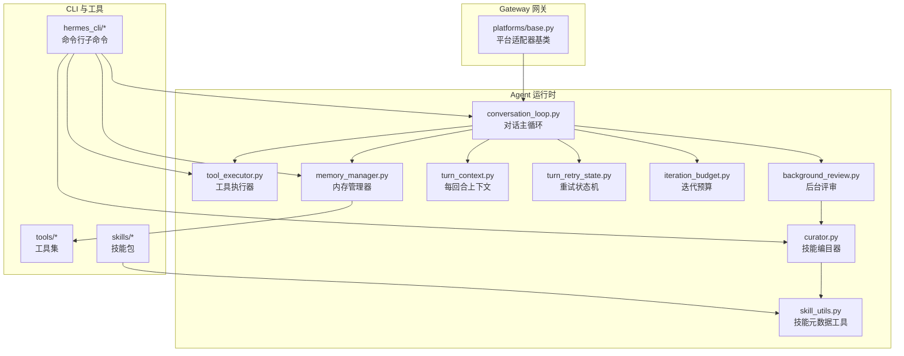
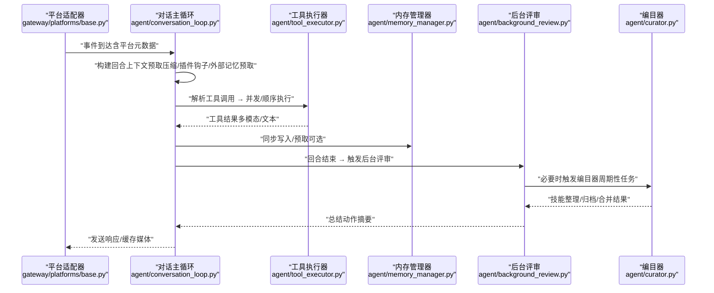
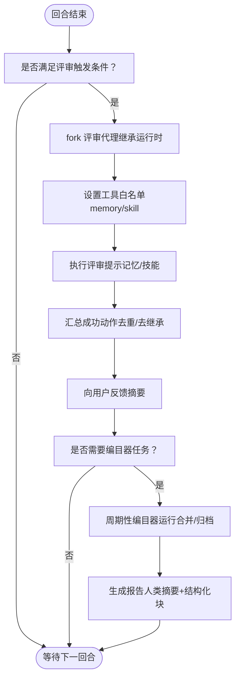
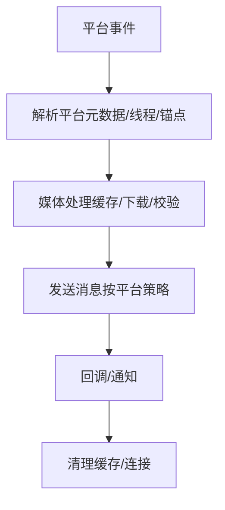
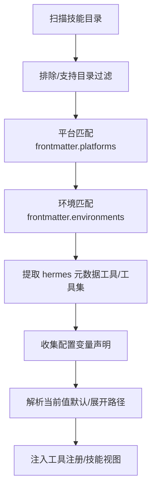
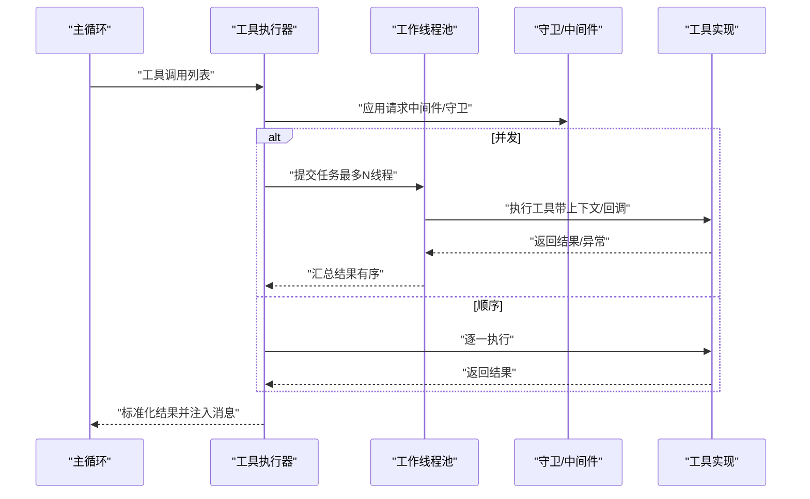
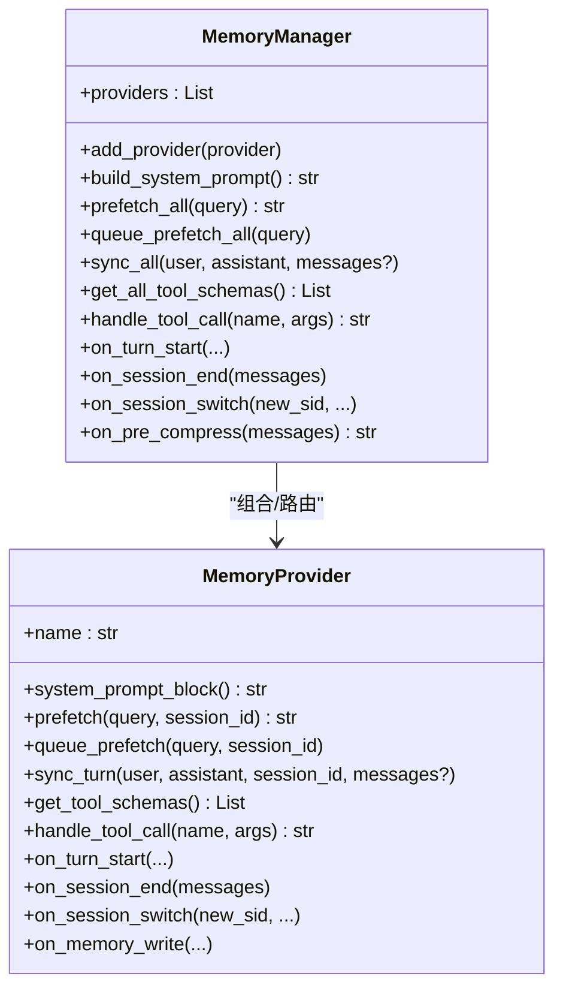
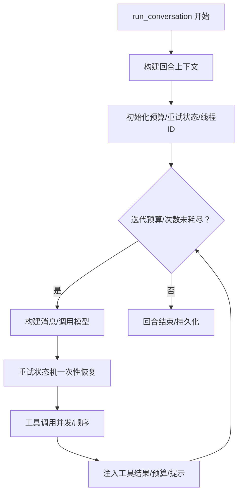
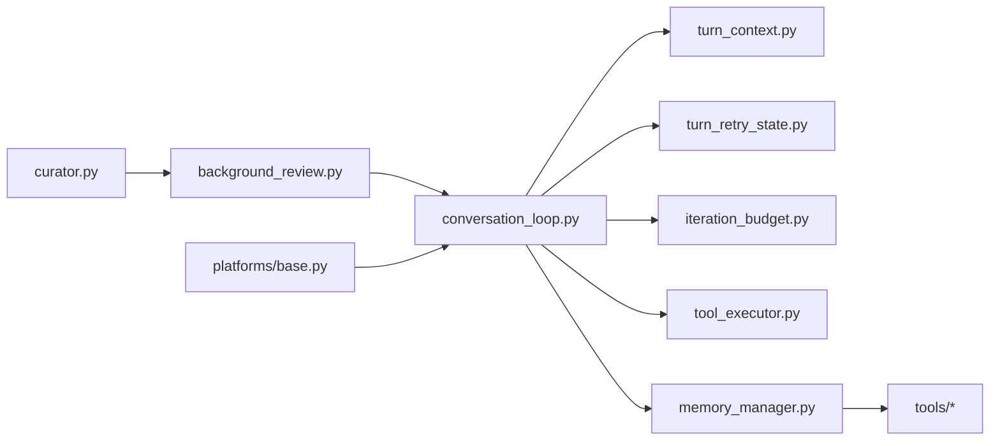

# 核心功能特性

<cite>
**本文档引用的文件**
- [conversation_loop.py](file://agent/conversation_loop.py)
- [memory_manager.py](file://agent/memory_manager.py)
- [tool_executor.py](file://agent/tool_executor.py)
- [base.py](file://gateway/platforms/base.py)
- [skill_utils.py](file://agent/skill_utils.py)
- [background_review.py](file://agent/background_review.py)
- [curator.py](file://agent/curator.py)
- [turn_context.py](file://agent/turn_context.py)
- [turn_retry_state.py](file://agent/turn_retry_state.py)
- [iteration_budget.py](file://agent/iteration_budget.py)
</cite>

## 目录
1. [简介](#简介)
2. [项目结构](#项目结构)
3. [核心组件](#核心组件)
4. [架构总览](#架构总览)
5. [详细组件分析](#详细组件分析)
6. [依赖分析](#依赖分析)
7. [性能考虑](#性能考虑)
8. [故障排除指南](#故障排除指南)
9. [结论](#结论)
10. [附录](#附录)

## 简介
本文件系统性梳理 Hermes Agent 的核心功能特性，围绕以下关键能力展开：  
- 自改进学习循环（基于后台评审与技能编目器的持续优化）  
- 多平台消息网关（统一适配与传输层抽象）  
- 技能管理系统（技能发现、条件匹配、配置注入与维护）  
- 工具调用系统（顺序/并发执行、中间件、守卫策略与结果处理）  
- 内存管理（内置与外部记忆提供者、上下文围栏与异步同步）  
- 调度系统（迭代预算、重试状态机、每回合上下文构建）

文档不仅解释各模块的技术实现要点，还提供使用场景、实际案例与最佳实践，帮助用户在不同环境中充分释放 Hermes Agent 的能力。

## 项目结构
Hermes Agent 将对话主循环、工具执行、记忆与技能管理、平台网关等能力分层组织，形成高内聚低耦合的模块化架构。核心目录与职责概览如下：
- agent：运行时核心逻辑（对话循环、工具执行、记忆、技能、平台适配）
- gateway：多平台接入与传输层（平台适配器、会话、镜像、流式分发）
- hermes_cli：命令行子命令与配置管理（工具、技能、内存、模型等）
- tools/plugins：工具集与插件生态（浏览器、图像生成、视频生成、Web 搜索等）
- skills：技能包集合（分类、描述、平台/环境过滤、配置变量声明）

**图表来源**
- [conversation_loop.py:469-800](file://agent/conversation_loop.py#L469-L800)
- [tool_executor.py:243-768](file://agent/tool_executor.py#L243-L768)
- [memory_manager.py:313-800](file://agent/memory_manager.py#L313-L800)
- [turn_context.py:64-391](file://agent/turn_context.py#L64-L391)
- [turn_retry_state.py:32-69](file://agent/turn_retry_state.py#L32-L69)
- [iteration_budget.py:17-62](file://agent/iteration_budget.py#L17-L62)
- [background_review.py:428-711](file://agent/background_review.py#L428-L711)
- [curator.py:1-200](file://agent/curator.py#L1-L200)
- [skill_utils.py:1-200](file://agent/skill_utils.py#L1-L200)
- [base.py:1-200](file://gateway/platforms/base.py#L1-L200)

**章节来源**
- [conversation_loop.py:1-200](file://agent/conversation_loop.py#L1-L200)
- [base.py:1-120](file://gateway/platforms/base.py#L1-L120)

## 核心组件
本节聚焦六大核心能力模块，概述其职责、交互与关键实现点。

- 自改进学习循环  
  - 后台评审：在每次对话结束后，派生一个“评审代理”复盘对话，自动更新记忆与技能，支持“仅记忆”“仅技能”或“合并”模式，并通过摘要向用户反馈。  
  - 编目器（Curator）：周期性地对技能库进行去重、归档、合并与伞形化整理，遵循严格不变量（仅处理代理创建的技能、不删除只归档、受钉住规则保护）。  
  - 关键路径：对话结束 → 构建评审提示 → fork 评审代理 → 执行工具调用 → 总结动作 → 用户可见反馈。

- 多平台消息网关  
  - 平台适配器基类定义统一接口与通用能力（线程元数据、回复锚点、媒体路由、UTF-16 长度限制、代理解析、图片/音频缓存等）。  
  - 支持 Telegram、Discord、WhatsApp、微信、飞书等多种平台，按平台差异定制发送策略与长度/格式限制。  
  - 关键路径：事件到达 → 解析平台元数据 → 构造消息 → 发送/缓存媒体 → 回调通知。

- 技能管理系统  
  - 技能发现与过滤：按平台/环境标签过滤；支持外部技能目录；收集技能配置变量声明并解析默认值。  
  - 技能条件与配置：提取 hermes 元数据中的工具/工具集依赖、回退策略；为技能视图与加载提供条件判断。  
  - 关键路径：扫描目录 → 解析 frontmatter → 条件匹配 → 注入配置 → 提供工具注册。

- 工具调用系统  
  - 并发/顺序执行：根据工具数量与类型选择并发线程池或顺序执行；支持中间件请求预处理与执行后回调；提供守卫策略与撤销机制。  
  - 结果处理：多模态内容标准化、子目录提示注入、工具结果持久化与预算控制。  
  - 关键路径：解析工具调用 → 中间件/守卫 → 分发执行 → 结果归一化 → 消息注入 → 预算与提示注入。

- 内存管理  
  - 统一入口：内置提供者优先，最多允许一个外部提供者；提供系统提示拼装、预取/同步、工具 Schema 注入、生命周期钩子。  
  - 上下文围栏：对来自外部提供者的上下文进行清洗与围栏，避免泄露内部标记；支持流式 Scrubber。  
  - 关键路径：注册提供者 → 构建系统提示 → 预取上下文 → 同步写入 → 工具路由。

- 调度系统  
  - 迭代预算：线程安全计数器，支持父/子代理独立预算与退款（如程序化工具调用）。  
  - 重试状态机：一次尝试内的一次性恢复分支（凭证刷新、格式修复、长上下文压缩、长度续传等），由状态对象集中管理。  
  - 每回合上下文：负责一次性初始化（stdio 保护、运行时主设置、日志上下文、系统提示恢复、预取压缩、插件钩子、外部记忆预取）。  
  - 关键路径：回合开始 → 初始化上下文 → 预取压缩 → 插件钩子 → 外部记忆预取 → 主循环。

**章节来源**
- [background_review.py:1-200](file://agent/background_review.py#L1-L200)
- [curator.py:1-120](file://agent/curator.py#L1-L120)
- [base.py:1-120](file://gateway/platforms/base.py#L1-L120)
- [skill_utils.py:1-120](file://agent/skill_utils.py#L1-L120)
- [tool_executor.py:243-450](file://agent/tool_executor.py#L243-L450)
- [memory_manager.py:313-500](file://agent/memory_manager.py#L313-L500)
- [iteration_budget.py:17-62](file://agent/iteration_budget.py#L17-L62)
- [turn_retry_state.py:32-69](file://agent/turn_retry_state.py#L32-L69)
- [turn_context.py:64-180](file://agent/turn_context.py#L64-L180)

## 架构总览
下图展示从平台事件到工具执行再到记忆/技能更新的端到端流程，体现各模块间的协作关系与数据流向。

**图表来源**
- [base.py:540-800](file://gateway/platforms/base.py#L540-L800)
- [conversation_loop.py:469-800](file://agent/conversation_loop.py#L469-L800)
- [tool_executor.py:243-768](file://agent/tool_executor.py#L243-L768)
- [memory_manager.py:515-776](file://agent/memory_manager.py#L515-L776)
- [background_review.py:428-711](file://agent/background_review.py#L428-L711)
- [curator.py:209-270](file://agent/curator.py#L209-L270)

## 详细组件分析

### 自改进学习循环
- 后台评审  
  - 触发条件：回合结束，按间隔与计数触发；支持“仅记忆”“仅技能”“合并”三种模式。  
  - 执行策略：fork 当前运行时（继承凭据与系统提示），仅允许 memory/skill 管理工具，避免副作用；完成后汇总成功动作并反馈给用户。  
  - 输出：简洁的动作摘要（新增/更新/修补/创建），支持静默/详细两种模式。  
  - 实现要点：继承父代理运行时以命中前缀缓存；白名单工具限制；抑制输出；清理内存提供者。  

- 编目器  
  - 周期性：基于空闲时间与配置间隔触发；首次安装延迟一轮以避免更新后立即运行。  
  - 自动状态迁移：根据最后活动时间标记“陈旧/归档/激活”，受“钉住”与“内置修剪”策略影响。  
  - 合并策略：识别前缀集群，将窄技能合并为伞形技能或降级为 references/templates/scripts；严格禁止删除，仅归档。  
  - 报告：生成人类可读摘要与结构化 YAML，便于下游审批与自动化。  

**图表来源**
- [background_review.py:675-711](file://agent/background_review.py#L675-L711)
- [curator.py:209-332](file://agent/curator.py#L209-L332)

**章节来源**
- [background_review.py:1-200](file://agent/background_review.py#L1-L200)
- [curator.py:1-200](file://agent/curator.py#L1-L200)

### 多平台消息网关
- 平台适配器基类提供统一抽象：  
  - 线程元数据与回复锚点：支持 Telegram 私聊主题、飞书话题等差异化路由。  
  - 媒体处理：图片/音频缓存、SSRF 防护、重试与超时控制、平台特定附件格式映射。  
  - 文本长度：UTF-16 单元计数与截断，确保平台限制合规。  
  - 代理与网络：系统代理检测、NO_PROXY 匹配、连接可达性检查。  
- 关键路径：事件解析 → 元数据构建 → 媒体缓存/下载 → 发送/回调 → 清理缓存。

**图表来源**
- [base.py:540-800](file://gateway/platforms/base.py#L540-L800)

**章节来源**
- [base.py:1-200](file://gateway/platforms/base.py#L1-L200)

### 技能管理系统
- 技能发现与过滤  
  - 排除目录与支持目录：统一排除 VCS/虚拟环境/缓存等；支持 references/templates/assets 等渐进披露目录。  
  - 平台/环境匹配：按 frontmatter 的 platforms/environments 列表过滤；Termux 特例兼容。  
  - 外部目录：支持配置多个外部技能目录，去重与绝对路径解析。  
- 技能条件与配置  
  - hermes 元数据：提取 requires/fallback_for 工具/工具集；为技能视图与加载提供条件判断。  
  - 配置变量：收集技能声明的配置项（key/description/default/prompt），解析当前值并展开路径。  
- 关键路径：扫描目录 → 解析 frontmatter → 条件匹配 → 注入配置 → 工具注册。

**图表来源**
- [skill_utils.py:53-120](file://agent/skill_utils.py#L53-L120)
- [skill_utils.py:268-305](file://agent/skill_utils.py#L268-L305)
- [skill_utils.py:592-629](file://agent/skill_utils.py#L592-L629)

**章节来源**
- [skill_utils.py:1-200](file://agent/skill_utils.py#L1-L200)

### 工具调用系统
- 并发/顺序执行  
  - 并发：线程池最大工作线程数限制；每个槽位记录函数名/参数/结果/耗时/错误标志；支持中断取消与心跳。  
  - 顺序：逐个执行，适合交互/单次工具；中断即跳过剩余调用。  
- 中间件与守卫  
  - 请求中间件：在执行前对参数进行转换并记录追踪；执行后回调用于终端上报。  
  - 守卫策略：在执行前评估是否允许，支持插件阻断与策略阻断；失败时记录观察结果。  
- 结果处理  
  - 多模态标准化：将字典结果转为 OpenAI 兼容内容列表；文本安全回退；子目录提示注入；工具结果持久化与回合预算控制。  
- 关键路径：解析调用 → 中间件/守卫 → 分发执行 → 结果归一化 → 消息注入 → 预算与提示注入。

**图表来源**
- [tool_executor.py:243-768](file://agent/tool_executor.py#L243-L768)

**章节来源**
- [tool_executor.py:1-200](file://agent/tool_executor.py#L1-L200)

### 内存管理
- 提供者注册与路由  
  - 内置提供者优先，最多一个外部提供者；冲突工具名拒绝注册；保留核心工具名优先级。  
  - 工具 Schema 注入：聚合所有提供者的工具定义，去重与过滤核心工具名。  
- 上下文围栏与清洗  
  - 对外部提供者返回的上下文进行清洗与围栏包装，避免泄露内部标记；流式 Scrubber 支持跨块边界的安全输出。  
- 生命周期钩子  
  - on_turn_start/on_session_end/on_session_switch/on_pre_compress 等钩子贯穿回合与会话生命周期，支持外部提供者状态同步。  
- 关键路径：注册提供者 → 构建系统提示 → 预取上下文 → 同步写入 → 工具路由。

**图表来源**
- [memory_manager.py:313-800](file://agent/memory_manager.py#L313-L800)

**章节来源**
- [memory_manager.py:1-200](file://agent/memory_manager.py#L1-L200)

### 调度系统
- 迭代预算  
  - 线程安全计数器，支持父/子代理独立预算；程序化工具调用可退款，避免消耗主预算。  
- 重试状态机  
  - 一次尝试内的一次性恢复分支：OAuth 刷新、格式修复、长上下文压缩、长度续传、传输/限流恢复等。  
- 每回合上下文  
  - 一次性初始化：stdio 保护、运行时主设置、日志上下文、系统提示恢复、预取压缩、插件钩子、外部记忆预取。  
- 关键路径：回合开始 → 初始化上下文 → 预取压缩 → 插件钩子 → 外部记忆预取 → 主循环。

**图表来源**
- [turn_context.py:64-391](file://agent/turn_context.py#L64-L391)
- [turn_retry_state.py:32-69](file://agent/turn_retry_state.py#L32-L69)
- [iteration_budget.py:17-62](file://agent/iteration_budget.py#L17-L62)

**章节来源**
- [turn_context.py:1-120](file://agent/turn_context.py#L1-L120)
- [turn_retry_state.py:1-40](file://agent/turn_retry_state.py#L1-L40)
- [iteration_budget.py:1-40](file://agent/iteration_budget.py#L1-L40)

## 依赖分析
- 模块耦合与内聚  
  - conversation_loop 作为中枢，依赖 turn_context/turn_retry_state/iteration_budget 提供稳定的基础设施；对外部依赖（memory_manager、tool_executor）采用组合而非继承，降低耦合。  
  - memory_manager 与 tools/registry 解耦，通过工具 Schema 注入与路由表实现松耦合扩展。  
  - background_review/curator 通过 fork 与白名单工具限制，避免对主会话与前缀缓存产生副作用。  
- 外部依赖与集成点  
  - 平台适配器依赖 httpx/aiohttp 及第三方 SDK；工具执行器依赖线程池与中间件；技能系统依赖 hermes_cli 配置与工具注册。  
- 循环依赖防护  
  - 使用延迟导入（如 run_agent）与模块级常量，避免启动时的循环导入问题。

**图表来源**
- [conversation_loop.py:469-563](file://agent/conversation_loop.py#L469-L563)
- [tool_executor.py:243-260](file://agent/tool_executor.py#L243-L260)
- [memory_manager.py:334-398](file://agent/memory_manager.py#L334-L398)
- [base.py:1-120](file://gateway/platforms/base.py#L1-L120)

**章节来源**
- [conversation_loop.py:1-120](file://agent/conversation_loop.py#L1-L120)
- [tool_executor.py:1-60](file://agent/tool_executor.py#L1-L60)
- [memory_manager.py:1-60](file://agent/memory_manager.py#L1-L60)
- [base.py:1-60](file://gateway/platforms/base.py#L1-L60)

## 性能考虑
- 前缀缓存与系统提示复用  
  - 会话级缓存系统提示，避免重复构建；fork 评审代理继承缓存键，显著降低成本。  
- 异步与批处理  
  - 外部记忆提供者预取/同步通过单工作线程串行化，避免竞态与过载；工具执行并发上限可控。  
- 压缩与预算  
  - 预飞行压缩与令牌估算减少请求开销；迭代预算与回合预算控制资源消耗。  
- 最佳实践  
  - 合理配置 _memory_nudge_interval 与 _skill_nudge_interval，平衡学习频率与性能。  
  - 在高并发工具场景中，优先使用并发执行并配合守卫策略与结果持久化，避免资源泄漏。  
  - 平台侧启用媒体缓存与代理直连，减少网络抖动与重试成本。

[本节为通用指导，无需具体文件引用]

## 故障排除指南
- 工具执行失败  
  - 检查守卫策略与中间件返回；查看工具结果是否为错误字符串；确认多模态内容已标准化。  
  - 若出现线程缺失/中断，检查并发执行的线程回收与中断信号传播。  
- 认证与配额问题  
  - 后台评审与编目器运行时继承父代理凭据，若 OAuth 失效，先在主会话刷新再重试。  
  - 遇到 429/配额耗尽，参考 billing 或 entitlement 指引切换提供商或补充额度。  
- 平台发送异常  
  - 检查代理配置与 NO_PROXY；确认媒体缓存目录权限；关注 UTF-16 长度限制导致的截断。  
- 记忆/技能更新无效  
  - 确认评审代理工具白名单；检查“受保护/钉住”的技能是否被跳过；核对摘要中“Nothing to save.”的触发条件。

**章节来源**
- [tool_executor.py:520-720](file://agent/tool_executor.py#L520-L720)
- [background_review.py:428-520](file://agent/background_review.py#L428-L520)
- [base.py:326-380](file://gateway/platforms/base.py#L326-L380)

## 结论
Hermes Agent 的核心能力以“对话主循环”为中心，通过“工具执行器”“内存管理器”“技能工具集”“平台适配器”“后台评审/编目器”“调度系统”六大模块协同，实现了从多平台接入、智能工具调用、上下文压缩与前缀缓存优化，到自改进学习与技能治理的完整闭环。  
- 选型建议：  
  - 需要强学习与自我优化：启用后台评审与编目器，合理设置间隔与白名单。  
  - 高并发工具场景：优先并发执行并开启守卫与中间件；注意线程池上限与结果持久化。  
  - 多平台接入：统一使用平台适配器基类，关注媒体缓存与代理配置。  
  - 记忆与技能：结合内置与外部提供者，建立清晰的工具命名与生命周期钩子规范。

[本节为总结性内容，无需具体文件引用]

## 附录
- 使用场景与案例  
  - 自改进学习：在客服/研发/写作等场景中，通过后台评审自动沉淀用户偏好与工作流，编目器定期合并相似技能，提升知识库质量。  
  - 多平台协作：在企业 IM 中统一接入，按平台差异路由消息与媒体，保障合规与性能。  
  - 工具编排：在开发/运维/研究场景中，通过并发工具执行与中间件链路，快速完成检索、生成、验证与落地。  
  - 记忆增强：在长期对话中，通过外部记忆提供者与内置存储，持续积累用户画像与领域知识，减少重复输入。  
- 最佳实践清单  
  - 明确工具白名单与守卫策略，避免危险操作。  
  - 合理设置迭代预算与回合预算，防止资源滥用。  
  - 使用媒体缓存与代理直连，降低网络波动影响。  
  - 定期运行编目器，保持技能库整洁与可用性。  
  - 在 fork 评审与编目器运行时，避免对主会话与前缀缓存产生副作用。

[本节为概念性内容，无需具体文件引用]