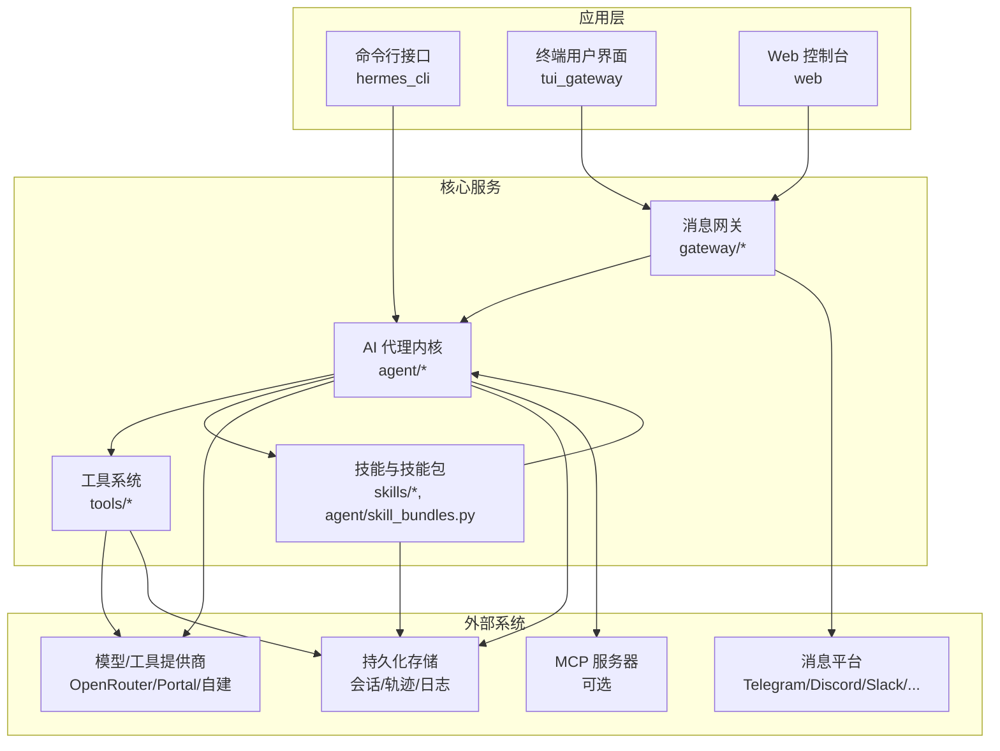
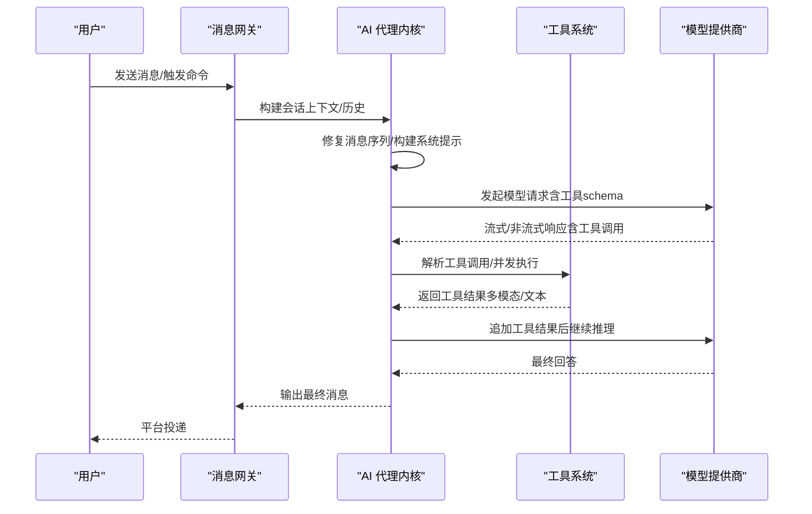
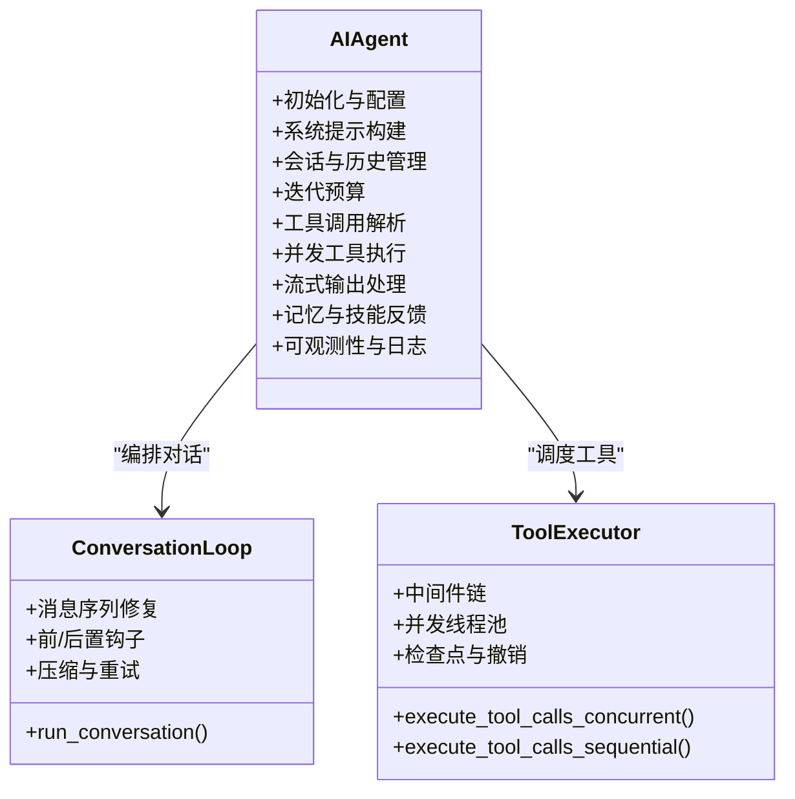
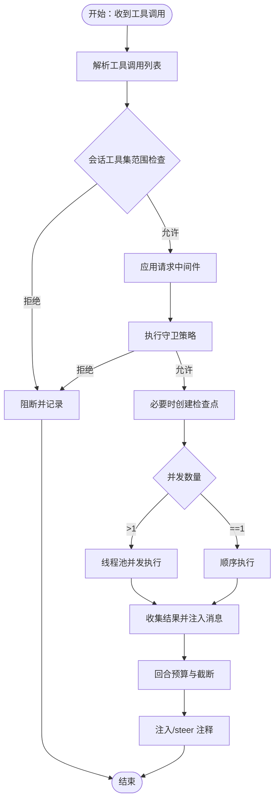
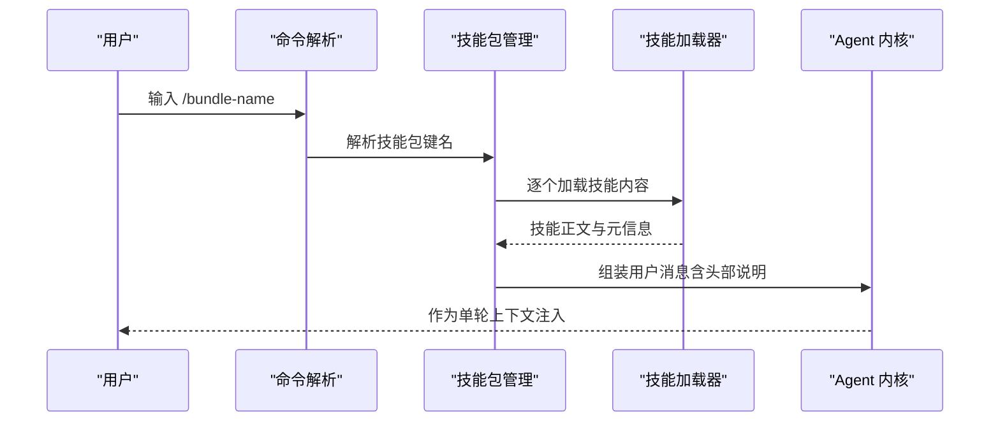
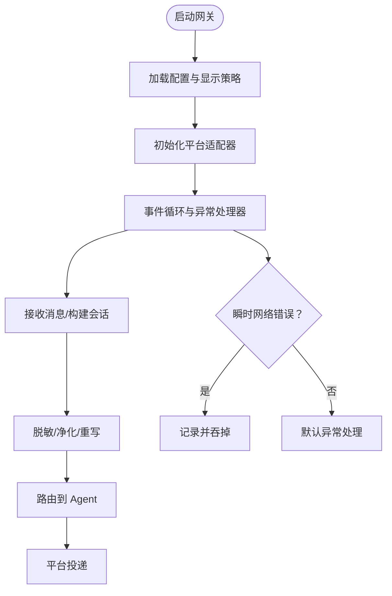

# 系统架构

<cite>
**本文引用的文件**
- [README.md](file://README.md)
- [agent/__init__.py](file://agent/__init__.py)
- [gateway/__init__.py](file://gateway/__init__.py)
- [tools/__init__.py](file://tools/__init__.py)
- [agent/agent_init.py](file://agent/agent_init.py)
- [agent/conversation_loop.py](file://agent/conversation_loop.py)
- [agent/tool_executor.py](file://agent/tool_executor.py)
- [agent/skill_bundles.py](file://agent/skill_bundles.py)
- [gateway/run.py](file://gateway/run.py)
</cite>

## 目录
1. [引言](#引言)
2. [项目结构](#项目结构)
3. [核心组件](#核心组件)
4. [架构总览](#架构总览)
5. [详细组件分析](#详细组件分析)
6. [依赖分析](#依赖分析)
7. [性能考量](#性能考量)
8. [故障排查指南](#故障排查指南)
9. [结论](#结论)
10. [附录](#附录)

## 引言
本文件面向开发者与架构师，系统化梳理 Hermes Agent 的整体架构与关键设计。重点覆盖以下方面：
- 高层架构：AI 代理核心、消息网关、工具系统、技能管理等主要组件及其交互关系
- 架构模式与设计原则：模块化、插件化、事件驱动、并发执行、可观测性与安全隔离
- 数据流与控制流：从用户输入到模型推理、工具调用、结果回传与记忆/技能反馈的闭环
- 技术决策与权衡：性能、可扩展性、安全性、跨平台一致性
- 基础设施与部署拓扑：容器化、进程/线程模型、会话缓存与超时策略
- 第三方依赖与集成点：模型提供商、消息平台、MCP、浏览器云、图像/语音/视频生成等

## 项目结构
Hermes Agent 采用分层与功能域结合的组织方式：
- agent：AI 代理内核（初始化、对话循环、工具执行、技能与记忆）
- gateway：多平台消息网关（会话、路由、交付、平台适配器）
- tools：工具注册与执行（文件、终端、网络、多媒体、外部服务）
- plugins：插件生态（仪表盘、可观测性、平台、模型供应商等）
- skills：技能与技能包（可组合的指令模板与上下文）
- hermes_cli：命令行入口与子命令（配置、安装、迁移、调试等）

图表来源
- [agent/agent_init.py:154-800](file://agent/agent_init.py#L154-L800)
- [agent/conversation_loop.py:469-800](file://agent/conversation_loop.py#L469-L800)
- [agent/tool_executor.py:243-800](file://agent/tool_executor.py#L243-L800)
- [agent/skill_bundles.py:1-411](file://agent/skill_bundles.py#L1-L411)
- [gateway/run.py:1-800](file://gateway/run.py#L1-L800)

章节来源
- [README.md:1-224](file://README.md#L1-L224)
- [agent/__init__.py:1-9](file://agent/__init__.py#L1-L9)
- [gateway/__init__.py:1-36](file://gateway/__init__.py#L1-L36)
- [tools/__init__.py:1-26](file://tools/__init__.py#L1-L26)

## 核心组件
- AI 代理内核（Agent Core）
  - 负责模型客户端初始化、系统提示构建、会话状态管理、迭代预算、错误分类与重试、流式输出处理、工具调用与并发执行、记忆与技能反馈、可观测性与日志
  - 关键实现参考：[agent/agent_init.py:154-800](file://agent/agent_init.py#L154-L800)、[agent/conversation_loop.py:469-800](file://agent/conversation_loop.py#L469-L800)、[agent/tool_executor.py:243-800](file://agent/tool_executor.py#L243-L800)

- 消息网关（Gateway）
  - 提供统一入口，连接多平台（Telegram、Discord、Slack、WhatsApp、Signal、Email 等），负责会话管理、动态上下文注入、投递路由、平台特定工具集、异常与敏感信息脱敏
  - 关键实现参考：[gateway/run.py:1-800](file://gateway/run.py#L1-L800)

- 工具系统（Tools）
  - 统一的工具注册、参数中间件、请求/执行中间件、并发执行、结果持久化与预算控制、权限与破坏性命令保护
  - 关键实现参考：[tools/__init__.py:1-26](file://tools/__init__.py#L1-L26)、[agent/tool_executor.py:243-800](file://agent/tool_executor.py#L243-L800)

- 技能与技能包（Skills & Skill Bundles）
  - 技能是可复用的上下文与指令模板；技能包允许一次加载多个技能形成“指令集合”
  - 关键实现参考：[agent/skill_bundles.py:1-411](file://agent/skill_bundles.py#L1-L411)

章节来源
- [agent/agent_init.py:154-800](file://agent/agent_init.py#L154-L800)
- [agent/conversation_loop.py:469-800](file://agent/conversation_loop.py#L469-L800)
- [agent/tool_executor.py:243-800](file://agent/tool_executor.py#L243-L800)
- [agent/skill_bundles.py:1-411](file://agent/skill_bundles.py#L1-L411)
- [gateway/run.py:1-800](file://gateway/run.py#L1-L800)

## 架构总览
Hermes Agent 采用“事件驱动 + 并发执行”的核心模式：
- 用户通过 CLI 或网关进入会话，网关解析平台消息并构建会话上下文
- Agent 内核在每轮对话中完成：系统提示构建、消息序列修复、工具调用参数清洗、模型请求构造、流式响应处理、工具并发执行、结果注入与后处理
- 工具执行支持中间件链路（请求/执行）、并发线程池、中断传播与检查点保护
- 记忆与技能通过后台审查与 nudges 参与自我改进，轨迹可选持久化用于训练

图表来源
- [gateway/run.py:715-796](file://gateway/run.py#L715-L796)
- [agent/conversation_loop.py:675-800](file://agent/conversation_loop.py#L675-L800)
- [agent/tool_executor.py:243-800](file://agent/tool_executor.py#L243-L800)

## 详细组件分析

### AI 代理内核（AIAgent）类图

图表来源
- [agent/agent_init.py:154-800](file://agent/agent_init.py#L154-L800)
- [agent/conversation_loop.py:469-800](file://agent/conversation_loop.py#L469-L800)
- [agent/tool_executor.py:243-800](file://agent/tool_executor.py#L243-L800)

章节来源
- [agent/agent_init.py:154-800](file://agent/agent_init.py#L154-L800)
- [agent/conversation_loop.py:469-800](file://agent/conversation_loop.py#L469-L800)
- [agent/tool_executor.py:243-800](file://agent/tool_executor.py#L243-L800)

### 工具执行并发流程

图表来源
- [agent/tool_executor.py:243-800](file://agent/tool_executor.py#L243-L800)

章节来源
- [agent/tool_executor.py:243-800](file://agent/tool_executor.py#L243-L800)

### 技能包加载与消息构建

图表来源
- [agent/skill_bundles.py:253-341](file://agent/skill_bundles.py#L253-L341)

章节来源
- [agent/skill_bundles.py:1-411](file://agent/skill_bundles.py#L1-L411)

### 网关生命周期与异常防护

图表来源
- [gateway/run.py:242-375](file://gateway/run.py#L242-L375)

章节来源
- [gateway/run.py:1-800](file://gateway/run.py#L1-L800)

## 依赖分析
- 组件耦合与内聚
  - Agent 内核对工具系统与技能系统采用“定义清晰的桥接接口”，通过工具注册表与模型工具桥接解耦具体实现
  - 网关对平台适配器采用“统一接口 + 可插拔实现”，通过会话上下文与投递路由解耦平台差异
- 外部依赖与集成点
  - 模型提供商：OpenRouter、Portal、Anthropic、OpenAI、Bedrock、自建兼容端点
  - 工具提供商：搜索、图像生成、TTS、视频生成、浏览器云、Google Workspace、GitHub 等
  - 平台适配器：Telegram、Discord、Slack、WhatsApp、Signal、Email、Matrix 等
  - MCP：可选的外部能力扩展（如计算机控制、工作流）
- 循环依赖与风险
  - 工具系统避免在包级导入完整工具栈，通过延迟导入与按需装配降低启动成本与循环依赖风险
  - Agent 对工具执行采用中间件与守卫策略，避免工具调用引发的不可控副作用

章节来源
- [tools/__init__.py:1-26](file://tools/__init__.py#L1-L26)
- [agent/tool_executor.py:184-241](file://agent/tool_executor.py#L184-L241)
- [gateway/run.py:1-800](file://gateway/run.py#L1-L800)

## 性能考量
- 并发与资源
  - 工具并发执行使用固定上限的线程池，避免过度并发导致资源争用
  - Agent 缓存与会话缓存（LRU + 空闲 TTL）限制长连接下的内存增长
- 推理与上下文
  - Prompt 缓存（Anthropic 协议）显著降低多轮输入开销
  - 上下文压缩与预压缩在网关与 Agent 层协同，减少令牌占用
- I/O 与网络
  - 瞬时网络错误在网关层吞掉并记录，避免进程崩溃影响整体可用性
  - 提供者错误映射与脱敏输出，降低噪声与敏感信息泄露
- 可观测性
  - 详细的活动追踪、速率限制状态、用量与配额统计，便于诊断与容量规划

## 故障排查指南
- 常见问题定位
  - Provider 错误：认证失败、配额/限流、策略拦截；网关层会进行短语识别与简化回复
  - 工具执行失败：查看工具进度回调与错误摘要；确认守卫策略与中间件链是否阻断
  - 会话中断与恢复：检查自动续跑新鲜度窗口与最后活动时间戳
- 安全与合规
  - 网关对敏感信息进行正则脱敏，避免凭证外泄
  - 守卫策略与中间件可阻止高风险工具调用（如破坏性命令）
- 日志与诊断
  - Agent 内核与网关均提供详细日志与状态回调，建议开启详细日志以辅助定位

章节来源
- [gateway/run.py:277-375](file://gateway/run.py#L277-L375)
- [agent/tool_executor.py:324-391](file://agent/tool_executor.py#L324-L391)
- [agent/conversation_loop.py:193-237](file://agent/conversation_loop.py#L193-L237)

## 结论
Hermes Agent 通过模块化与插件化的架构，实现了跨平台、可扩展、可观测且安全的智能体系统。其核心在于：
- 以 Agent 内核为中心的事件驱动对话循环
- 以工具系统为核心的并发执行与中间件链
- 以技能包为载体的可组合上下文与指令
- 以网关为入口的多平台适配与安全隔离

该架构在性能、可扩展性与安全性之间取得平衡，并为第三方集成（MCP、平台、工具）提供了清晰的契约与扩展点。

## 附录
- 基础设施与部署
  - 支持本地、Docker、SSH、Singularity、Modal、Daytona 等多种运行后端
  - 容器化与进程/线程模型结合，满足从轻量终端到 GPU 集群的部署需求
- 第三方依赖与集成
  - 模型与工具：OpenRouter、Portal、Anthropic、OpenAI、Bedrock、Hugging Face、GitHub Copilot 等
  - 平台：Telegram、Discord、Slack、WhatsApp、Signal、Email、Matrix、Weixin 等
  - MCP：可选的外部能力扩展（如计算机控制、工作流）

章节来源
- [README.md:1-224](file://README.md#L1-L224)
- [gateway/run.py:1-800](file://gateway/run.py#L1-L800)