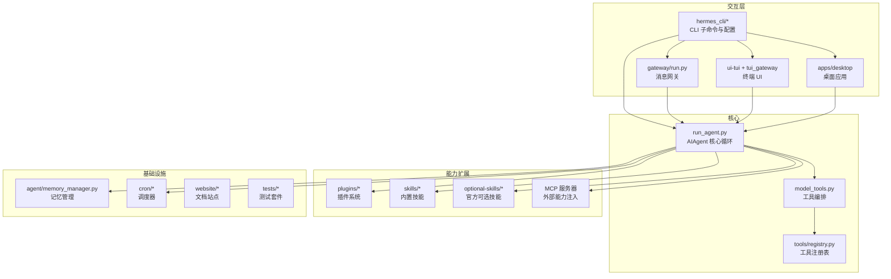
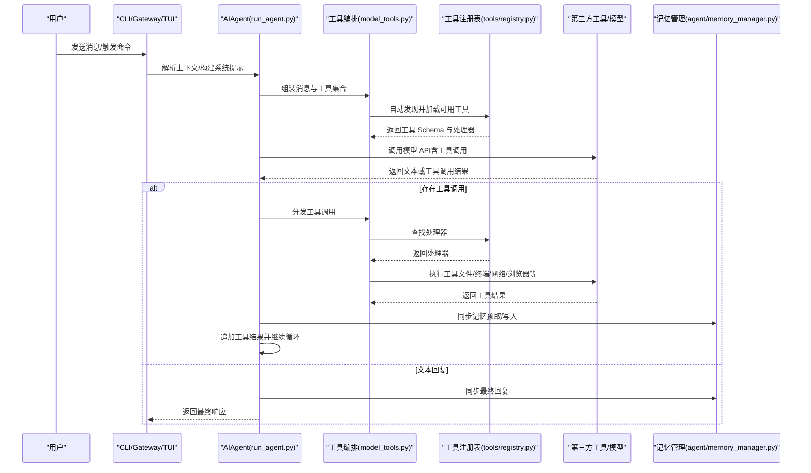
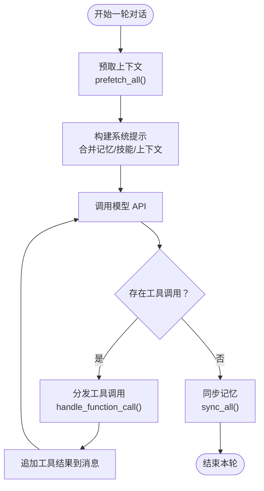
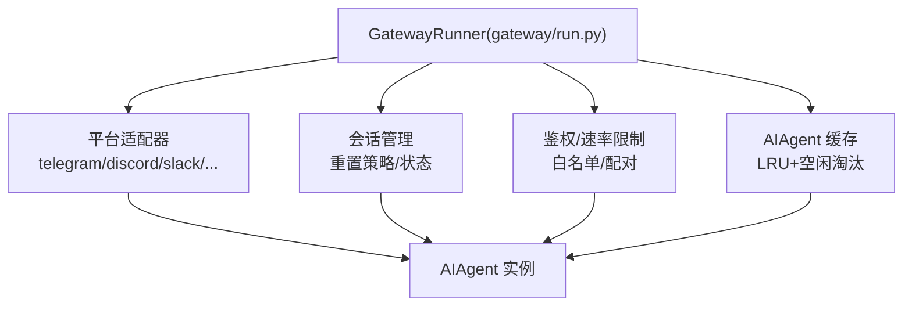
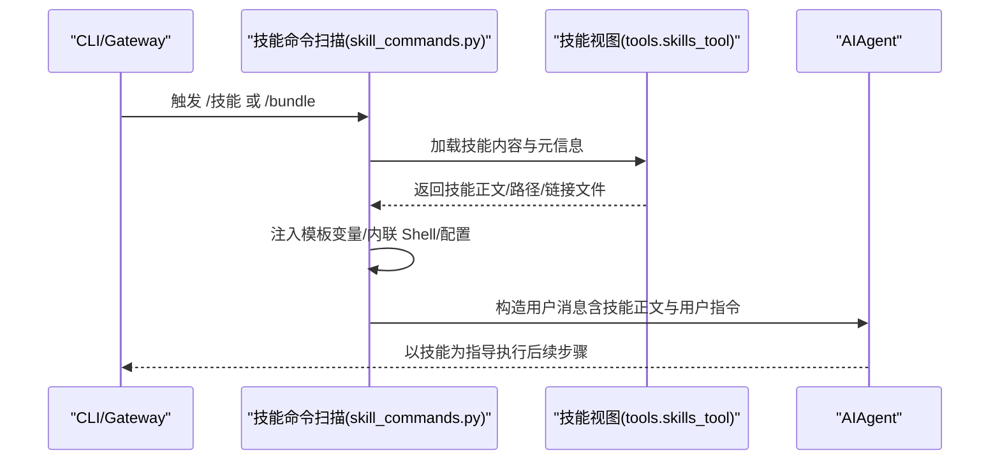
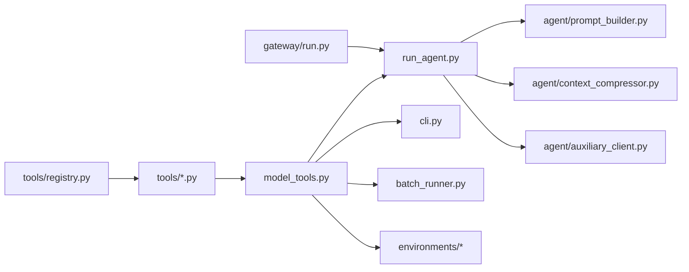

# 项目介绍

<cite>
**本文引用的文件**
- [README.md](file://README.md)
- [AGENTS.md](file://AGENTS.md)
- [CONTRIBUTING.md](file://CONTRIBUTING.md)
- [run_agent.py](file://run_agent.py)
- [gateway/run.py](file://gateway/run.py)
- [agent/skill_commands.py](file://agent/skill_commands.py)
- [agent/memory_manager.py](file://agent/memory_manager.py)
- [website/docs/developer-guide/architecture.md](file://website/docs/developer-guide/architecture.md)
- [website/docs/developer-guide/agent-loop.md](file://website/docs/developer-guide/agent-loop.md)
- [website/docs/user-guide/messaging/index.md](file://website/docs/user-guide/messaging/index.md)
</cite>

## 目录
1. [引言](#引言)
2. [项目结构](#项目结构)
3. [核心组件](#核心组件)
4. [架构总览](#架构总览)
5. [详细组件分析](#详细组件分析)
6. [依赖关系分析](#依赖关系分析)
7. [性能考量](#性能考量)
8. [故障排查指南](#故障排查指南)
9. [结论](#结论)
10. [附录](#附录)

## 引言
Hermes Agent 是由 Nous Research 打造的“自改进型”AI 代理系统，其核心价值主张在于：
- 内置学习循环：通过经验生成技能、在使用中自我改进、主动沉淀知识、跨会话检索历史对话，形成对用户的深层理解模型。
- 多平台消息网关：统一接入 Telegram、Discord、Slack、WhatsApp、Signal、邮件、短信等平台，提供跨平台会话连续性与语音转录能力。
- 技能管理系统：以“技能”为基本可组合单元，支持按需加载、条件激活、模板变量与内联 Shell 扩展，实现“指令即工具”的可扩展范式。
- 超强可移植性：可在 $5/VPS、GPU 集群或类服务器无服务器形态运行；终端后端覆盖本地、Docker、SSH、Singularity、Modal、Daytona，支持“空闲休眠、按需唤醒”的低成本运行。

设计理念与目标用户：
- 设计理念：以“窄核心、广边缘”为原则，核心仅承载最必要的模型工具与协议，能力主要通过插件、技能与 MCP 服务扩展，确保每次调用的最小开销与最佳成本控制。
- 目标用户：追求高生产力与可定制性的个人用户、需要跨平台自动化的企业团队、以及希望进行研究与训练数据生成的研究者。

解决传统 AI 助手的局限：
- 传统助手通常缺乏跨会话记忆与持续改进能力；Hermes 提供“代理式记忆”与“技能自举”，使智能随使用加深而增强。
- 传统助手常被限制在单一入口（桌面/网页）；Hermes 通过消息网关实现“多平台即入口”，打破设备边界。
- 传统助手工具链割裂、配置复杂；Hermes 采用“工具即插件”的统一注册与发现机制，降低集成门槛。

主要应用场景：
- 个人助理：日程、任务、知识检索、跨平台消息与语音备忘。
- 企业自动化：跨平台通知、定时审计、每日/每周报告、工单处理与协作。
- 研究工具：轨迹生成、上下文压缩、模型微调数据准备、并行实验与批处理。

发展历程与生态：
- 项目遵循严格的贡献规范与设计意图，强调“最小核心、最大扩展”；通过插件与技能生态持续演进。
- 社区活跃，提供 Discord、Skills Hub、WeChat 桥接等扩展生态；支持从 OpenClaw 平滑迁移。

## 项目结构
Hermes 采用模块化与分层架构，核心目录职责如下：
- agent/：代理内核（提示构造、上下文压缩、辅助客户端、轨迹保存等）
- hermes_cli/：命令行子系统（主入口、配置管理、设置向导、皮肤引擎等）
- tools/：工具实现（终端、文件操作、网络搜索、浏览器、视觉分析、委托、代码执行、会话检索、计划任务、技能工具等），自注册到注册表
- gateway/：消息网关（平台适配器、会话管理、钩子、认证授权、传输层等）
- plugins/：插件体系（内存提供者、模型提供者、可观测性、图像生成、平台桥接等）
- skills/：内置技能（研究、生产力、开发运维、创意、健康、安全等分类）
- optional-skills/：官方可选技能（非默认启用，可通过 hub 安装）
- cron/：调度器（作业定义、调度器、建议目录）
- ui-tui/：终端 UI（Ink + JSON-RPC 后端）
- tui_gateway/：TUI 的 Python JSON-RPC 后端
- acp_adapter/：ACP（IDE/编辑器）集成适配
- apps/desktop/：Electron 桌面聊天应用
- docker/、scripts/、website/、tests/：容器化、安装脚本、文档站点与测试套件

图示来源
- [AGENTS.md:213-259](file://AGENTS.md#L213-L259)
- [run_agent.py:1-120](file://run_agent.py#L1-L120)
- [gateway/run.py:1-120](file://gateway/run.py#L1-L120)

章节来源
- [AGENTS.md:213-259](file://AGENTS.md#L213-L259)

## 核心组件
- AIAgent（run_agent.py）：同步编排引擎，负责模型选择、提示构建、工具执行、重试回退、回调、压缩与持久化，支持多种 API 模式。
- 工具系统（model_tools.py + tools/registry.py）：自注册工具发现与分发，按工具集启用/禁用，零核心侵入式扩展。
- 技能系统（agent/skill_commands.py + skills/*）：以“指令即技能”的方式动态加载技能，支持模板变量、内联 Shell、前置条件与平台过滤。
- 记忆管理（agent/memory_manager.py）：统一编排内置与外部记忆提供者，支持预取、同步、流式清洗与工具路由。
- 消息网关（gateway/run.py）：统一平台生命周期、消息路由、会话状态、安全白名单与速率限制。
- 插件系统（plugins/*）：内存提供者、模型提供者、可观测性、图像生成、平台桥接等，遵循统一接口与发现机制。
- 调度器（cron/*）：基于自然语言的计划任务，支持跨平台投递。

章节来源
- [run_agent.py:1-120](file://run_agent.py#L1-L120)
- [agent/skill_commands.py:1-120](file://agent/skill_commands.py#L1-L120)
- [agent/memory_manager.py:1-120](file://agent/memory_manager.py#L1-L120)
- [gateway/run.py:1-120](file://gateway/run.py#L1-L120)
- [AGENTS.md:303-361](file://AGENTS.md#L303-L361)

## 架构总览
Hermes 的整体架构围绕“代理循环 + 工具编排 + 可插拔能力 + 统一入口”展开。核心循环在 run_agent.py 中实现，结合 model_tools 的工具调度、agent 子模块的提示与压缩、以及 tools 的自注册能力，形成“模型 + 工具 + 记忆 + 技能”的闭环。

图示来源
- [website/docs/developer-guide/architecture.md:188-204](file://website/docs/developer-guide/architecture.md#L188-L204)
- [website/docs/developer-guide/agent-loop.md:221-239](file://website/docs/developer-guide/agent-loop.md#L221-L239)
- [run_agent.py:1-120](file://run_agent.py#L1-L120)
- [agent/memory_manager.py:313-420](file://agent/memory_manager.py#L313-L420)

## 详细组件分析

### 自学习循环与记忆管理
- 记忆管理器（MemoryManager）统一编排内置与外部记忆提供者，支持：
  - 预取（prefetch）：在每轮开始前从各提供者召回上下文
  - 同步（sync）：回合结束后异步写入用户输入与模型输出
  - 工具路由：将工具调用路由至对应提供者，避免与核心工具冲突
  - 流式清洗：对流式输出中的“记忆围栏”进行状态机清洗，防止泄露
- 技能加载与指令注入：通过 skill_commands 将技能内容作为用户消息注入，同时保留用户原始指令以便记忆系统正确归档。

图示来源
- [agent/memory_manager.py:452-572](file://agent/memory_manager.py#L452-L572)
- [agent/skill_commands.py:517-562](file://agent/skill_commands.py#L517-L562)
- [run_agent.py:1-120](file://run_agent.py#L1-L120)

章节来源
- [agent/memory_manager.py:313-572](file://agent/memory_manager.py#L313-L572)
- [agent/skill_commands.py:348-431](file://agent/skill_commands.py#L348-L431)

### 多平台消息网关
- 网关统一管理平台生命周期、连接超时、鉴权与速率限制，支持：
  - 平台适配器：Telegram、Discord、Slack、WhatsApp、Signal、邮件、短信、飞书、企业微信、钉钉、Matrix、Webhook 等
  - 会话管理：按平台策略重置（每日/空闲）、跨会话状态保持
  - 安全策略：默认仅允许白名单用户或通过 DM 配对；支持环境变量配置
- 网关进程内维护 AIAgent 缓存上限与空闲 TTL，避免长期运行导致资源膨胀。

图示来源
- [gateway/run.py:60-120](file://gateway/run.py#L60-L120)
- [website/docs/user-guide/messaging/index.md:190-235](file://website/docs/user-guide/messaging/index.md#L190-L235)

章节来源
- [gateway/run.py:1-120](file://gateway/run.py#L1-L120)
- [website/docs/user-guide/messaging/index.md:190-235](file://website/docs/user-guide/messaging/index.md#L190-L235)

### 技能管理系统
- 技能以 Markdown（SKILL.md）描述，支持：
  - 条件激活：基于工具集/工具可用性或平台过滤
  - 模板变量与内联 Shell：在加载时替换变量与执行脚本
  - 支持文件：references/templates/scripts/assets 自动列出与引用
  - 用户指令注入：/skill 命令将用户指令与技能正文合并，仅记忆用户指令
- 技能扫描与命令映射：自动扫描 ~/.hermes/skills 与外部目录，生成 /slash 命令映射，支持热重载而不破坏前缀缓存。

图示来源
- [agent/skill_commands.py:245-346](file://agent/skill_commands.py#L245-L346)
- [agent/skill_commands.py:517-562](file://agent/skill_commands.py#L517-L562)

章节来源
- [agent/skill_commands.py:348-496](file://agent/skill_commands.py#L348-L496)

### 工具系统与插件生态
- 工具自注册：每个工具文件在导入时调用 registry.register，自动被 discover_builtin_tools 发现并加入工具集
- 工具集分组：按 web、terminal、file、browser、memory 等分组启用/禁用，影响平台默认可用性
- 插件体系：内存提供者、模型提供者、可观测性、图像生成、平台桥接等，均通过统一接口与发现机制接入
- MCP 集成：通过内置 MCP 客户端连接外部 MCP 服务器，实现跨宿主复用的能力。

章节来源
- [AGENTS.md:498-546](file://AGENTS.md#L498-L546)
- [CONTRIBUTING.md:724-800](file://CONTRIBUTING.md#L724-L800)

## 依赖关系分析
- 文件级依赖链：tools/registry.py（无依赖）→ tools/*.py（注册工具）→ model_tools.py（触发发现）→ run_agent.py/cli.py/batch_runner.py/environments/
- 关键耦合点：
  - run_agent.py 与 model_tools.py：前者负责循环与状态，后者负责工具 Schema 收集与分发
  - agent/* 子模块：提示构建、上下文压缩、辅助客户端、轨迹保存等模块化拆分
  - gateway/run.py 与 agent：网关侧持有 AIAgent 缓存并进行平台生命周期管理

图示来源
- [AGENTS.md:289-300](file://AGENTS.md#L289-L300)
- [run_agent.py:122-132](file://run_agent.py#L122-L132)
- [gateway/run.py:1-120](file://gateway/run.py#L1-L120)

章节来源
- [AGENTS.md:289-300](file://AGENTS.md#L289-L300)

## 性能考量
- 前缀缓存与提示稳定性：严格维持系统提示字节稳定与消息角色交替，避免缓存失效导致的重复成本
- 工具调用最小化：核心工具仅在必要时引入，优先通过 CLI 命令 + 技能或服务门控工具实现
- 上下文压缩：接近阈值时进行摘要压缩，减少 token 使用
- 网关资源控制：AIAgent 缓存上限与空闲 TTL，防止长期运行导致内存与句柄泄漏
- 并行与异步：记忆同步与预取在后台线程执行，不阻塞主线程

## 故障排查指南
常见问题与定位要点：
- 网关启动失败或平台不可达：检查平台适配器配置、环境变量与网络连通性；关注速率限制与鉴权错误模式
- 工具未生效：确认工具是否在当前平台工具集中启用；检查工具注册与 check_fn 条件
- 记忆未更新：确认 sync_all 是否在后台线程执行；检查提供者签名与参数兼容性
- 技能未显示：检查平台过滤、工具集条件与禁用列表；使用 /reload-skills 重新扫描
- 日志与诊断：使用 hermes logs、hermes doctor 与网关日志定位问题

章节来源
- [gateway/run.py:90-137](file://gateway/run.py#L90-L137)
- [agent/memory_manager.py:575-642](file://agent/memory_manager.py#L575-L642)
- [agent/skill_commands.py:433-496](file://agent/skill_commands.py#L433-L496)

## 结论
Hermes Agent 通过“自学习循环 + 多平台网关 + 技能系统 + 插件生态”的组合，实现了从个人助理到企业自动化再到研究工具的广泛适用。其“窄核心、广边缘”的设计确保了在保证成本与性能的同时，最大化扩展性与可定制性。对于希望获得“会说话的智能体”的用户与团队，Hermes 提供了稳定、可演进且易于参与贡献的开放平台。

## 附录
- 快速安装与入门：参见 README 的快速安装与入门指南
- 文档与参考：开发者指南、用户手册与 CLI 参考位于网站 docs
- 贡献与治理：遵循贡献指南与设计意图，通过 PR 与测试保障质量

章节来源
- [README.md:34-123](file://README.md#L34-L123)
- [CONTRIBUTING.md:1-100](file://CONTRIBUTING.md#L1-L100)
- [website/docs/developer-guide/architecture.md:173-204](file://website/docs/developer-guide/architecture.md#L173-L204)