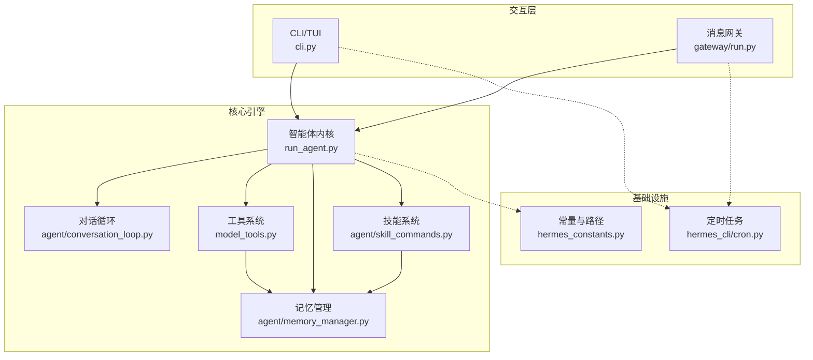
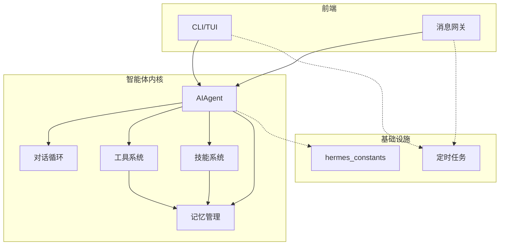
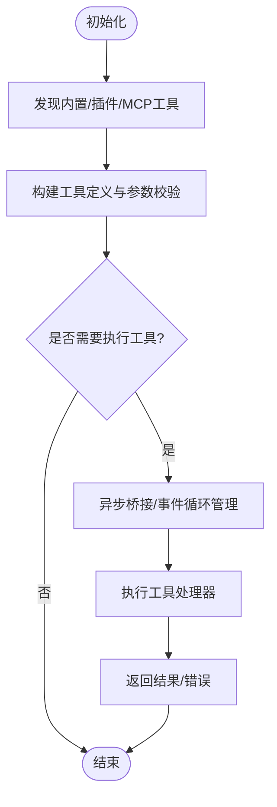
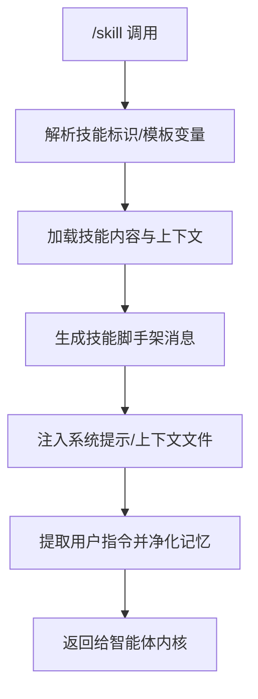
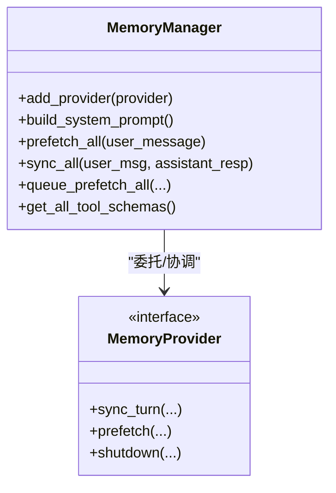
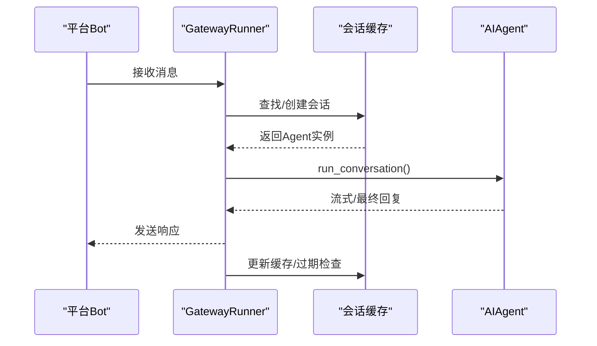
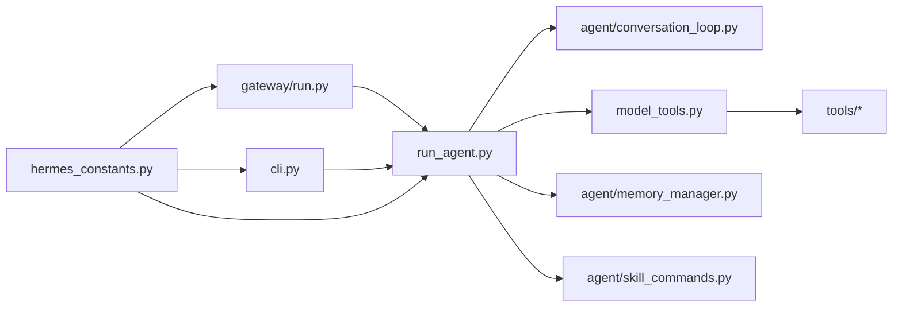

# 项目概述

<cite>
**本文档引用的文件**
- [README.md](file://README.md)
- [hermes_constants.py](file://hermes_constants.py)
- [cli.py](file://cli.py)
- [run_agent.py](file://run_agent.py)
- [agent/conversation_loop.py](file://agent/conversation_loop.py)
- [gateway/run.py](file://gateway/run.py)
- [agent/skill_commands.py](file://agent/skill_commands.py)
- [agent/memory_manager.py](file://agent/memory_manager.py)
- [model_tools.py](file://model_tools.py)
- [CONTRIBUTING.md](file://CONTRIBUTING.md)
- [website/docs/developer-guide/architecture.md](file://website/docs/developer-guide/architecture.md)
- [website/docs/developer-guide/agent-loop.md](file://website/docs/developer-guide/agent-loop.md)
- [website/docs/developer-guide/cron-internals.md](file://website/docs/developer-guide/cron-internals.md)
- [website/i18n/zh-Hans/docusaurus-plugin-content-docs/current/developer-guide/architecture.md](file://website/i18n/zh-Hans/docusaurus-plugin-content-docs/current/developer-guide/architecture.md)
- [website/i18n/zh-Hans/docusaurus-plugin-content-docs/current/guides/work-with-skills.md](file://website/i18n/zh-Hans/docusaurus-plugin-content-docs/current/guides/work-with-skills.md)
- [hermes_cli/cron.py](file://hermes_cli/cron.py)
- [tools/memory_tool.py](file://tools/memory_tool.py)
</cite>

## 目录
1. [简介](#简介)
2. [项目结构](#项目结构)
3. [核心组件](#核心组件)
4. [架构总览](#架构总览)
5. [详细组件分析](#详细组件分析)
6. [依赖关系分析](#依赖关系分析)
7. [性能考量](#性能考量)
8. [故障排查指南](#故障排查指南)
9. [结论](#结论)
10. [附录](#附录)

## 简介
Hermes Agent 是一个“自改进”的AI智能体平台，具备内置学习循环与多平台消息网关，可跨终端、桌面、云端与服务器无差别运行。其核心价值主张包括：
- 自主学习与记忆：通过对话与工具使用不断沉淀技能，改善自身能力，并在会话间持续积累用户画像与知识。
- 多入口统一体验：既可直接在本地TUI交互，也可通过Telegram、Discord、Slack、WhatsApp、Signal等平台接入，实现跨平台连续对话。
- 开放生态：支持技能（Skills）与工具（Tools）体系，提供插件与MCP扩展能力，便于社区共建共享。

项目定位为开源、可移植、可扩展的AI智能体基础设施，适合个人开发者、研究团队与企业运维场景使用。

**章节来源**
- [README.md:18-30](file://README.md#L18-L30)
- [README.md:106-122](file://README.md#L106-L122)

## 项目结构
项目采用模块化与分层设计，围绕“智能体内核 + 工具系统 + 平台网关 + 技能与记忆”四大支柱组织代码：
- 核心运行时：run_agent.py 提供 AIAgent 主循环，负责模型调用、工具调度、上下文压缩与会话持久化。
- 交互界面：cli.py 提供全功能TUI与命令行入口，支持多平台快捷命令与会话管理。
- 平台网关：gateway/run.py 提供消息平台适配与长连接服务，支持多平台并发与任务调度。
- 技能与记忆：agent/skill_commands.py、agent/memory_manager.py 管理技能加载与记忆提供者集成。
- 工具系统：model_tools.py 统一发现、注册与调度工具，支持异步桥接与并行执行。
- 配置与常量：hermes_constants.py 提供跨模块的路径、环境与网络偏好等基础能力。



**图表来源**
- [cli.py:1-120](file://cli.py#L1-L120)
- [run_agent.py:320-490](file://run_agent.py#L320-L490)
- [agent/conversation_loop.py:1-120](file://agent/conversation_loop.py#L1-L120)
- [gateway/run.py:1-120](file://gateway/run.py#L1-L120)
- [model_tools.py:1-120](file://model_tools.py#L1-L120)
- [agent/skill_commands.py:1-120](file://agent/skill_commands.py#L1-L120)
- [agent/memory_manager.py:1-120](file://agent/memory_manager.py#L1-L120)
- [hermes_constants.py:1-120](file://hermes_constants.py#L1-L120)
- [hermes_cli/cron.py:320-360](file://hermes_cli/cron.py#L320-L360)

**章节来源**
- [CONTRIBUTING.md:172-200](file://CONTRIBUTING.md#L172-L200)
- [website/docs/developer-guide/architecture.md:173-204](file://website/docs/developer-guide/architecture.md#L173-L204)

## 核心组件
- 智能体内核（AIAgent）
  - 负责模型选择、系统提示词构建、工具调用循环、上下文压缩、错误重试与回退、会话持久化与成本估算。
  - 支持多种API模式与Provider后端，具备最小化SDK导入延迟的懒加载策略。
- 工具系统（model_tools.py）
  - 统一发现与注册工具，提供同步/异步桥接，避免“事件循环已关闭”问题；支持并行执行与超时控制。
- 技能系统（agent/skill_commands.py）
  - 将技能脚本转化为可注入的系统提示内容，支持单技能与技能包两种调用形态，并对记忆存储进行净化。
- 记忆管理（agent/memory_manager.py）
  - 统一接入外部记忆提供者，屏蔽多后端差异；提供上下文清洗与流式过滤，确保隐私与一致性。
- 平台网关（gateway/run.py）
  - 提供多平台适配、长连接心跳、会话缓存与资源回收、错误分类与脱敏输出。
- CLI/TUI（cli.py）
  - 提供丰富的显示样式、工具预览、配置桥接与皮肤引擎；支持多后端终端与容器环境。
- 常量与路径（hermes_constants.py）
  - 提供跨模块的Herme家目录解析、环境变量覆盖、容器/WSL/Android识别与网络偏好设置。

**章节来源**
- [run_agent.py:320-490](file://run_agent.py#L320-L490)
- [model_tools.py:47-120](file://model_tools.py#L47-L120)
- [agent/skill_commands.py:58-120](file://agent/skill_commands.py#L58-L120)
- [agent/memory_manager.py:1-120](file://agent/memory_manager.py#L1-L120)
- [gateway/run.py:60-120](file://gateway/run.py#L60-L120)
- [cli.py:356-420](file://cli.py#L356-L420)
- [hermes_constants.py:520-595](file://hermes_constants.py#L520-L595)

## 架构总览
Hermes采用“前端交互 + 智能体内核 + 工具/记忆/技能 + 平台网关”的分层架构：
- 交互层：CLI与网关分别面向终端用户与消息平台，统一进入智能体内核。
- 智能体内核：封装对话循环、工具调度、上下文压缩与会话数据库。
- 基础设施：常量与路径、网络偏好、环境变量桥接。
- 生态扩展：工具系统、技能系统、记忆提供者、MCP与插件。



**图表来源**
- [run_agent.py:320-490](file://run_agent.py#L320-L490)
- [agent/conversation_loop.py:1-120](file://agent/conversation_loop.py#L1-L120)
- [model_tools.py:1-120](file://model_tools.py#L1-L120)
- [agent/skill_commands.py:1-120](file://agent/skill_commands.py#L1-L120)
- [agent/memory_manager.py:1-120](file://agent/memory_manager.py#L1-L120)
- [hermes_constants.py:1-120](file://hermes_constants.py#L1-L120)
- [hermes_cli/cron.py:320-360](file://hermes_cli/cron.py#L320-L360)

## 详细组件分析

### 智能体内核（AIAgent）与对话循环
- 职责边界：AIAgent封装完整的对话循环，包括系统提示构建、工具调用、上下文压缩、错误分类与回退、会话状态管理与轨迹保存。
- 关键流程：run_conversation主循环抽取为独立模块，便于测试与演进；支持迭代预算、中断处理与静默工具进度输出。
- 性能优化：延迟导入OpenAI SDK、预热元数据、LM Studio模型预加载、流式输出与错误恢复。

```mermaid
sequenceDiagram
participant User as "用户/平台"
participant GW as "网关/CLI"
participant Agent as "AIAgent"
participant Loop as "对话循环"
participant Tools as "工具系统"
participant Mem as "记忆管理"
User->>GW : 发送消息
GW->>Agent : 初始化会话/参数
Agent->>Loop : run_conversation()
Loop->>Agent : 构建系统提示
Agent->>Tools : 解析并调度工具
Tools-->>Agent : 工具结果/错误
Agent->>Mem : 同步/预取记忆
Agent-->>GW : 流式/最终回复
GW-->>User : 展示结果
```

**图表来源**
- [run_agent.py:320-490](file://run_agent.py#L320-L490)
- [agent/conversation_loop.py:1-120](file://agent/conversation_loop.py#L1-L120)
- [model_tools.py:1-120](file://model_tools.py#L1-L120)
- [agent/memory_manager.py:1-120](file://agent/memory_manager.py#L1-L120)

**章节来源**
- [website/docs/developer-guide/agent-loop.md:221-240](file://website/docs/developer-guide/agent-loop.md#L221-L240)
- [agent/conversation_loop.py:1-120](file://agent/conversation_loop.py#L1-L120)

### 工具系统（model_tools.py）
- 设计要点：薄层编排，统一发现与注册；异步桥接避免事件循环生命周期问题；支持并行执行与超时取消。
- 扩展路径：MCP工具发现移至调用方启动阶段，降低网关冷启动阻塞风险。



**图表来源**
- [model_tools.py:1-120](file://model_tools.py#L1-L120)
- [model_tools.py:180-200](file://model_tools.py#L180-L200)

**章节来源**
- [model_tools.py:47-120](file://model_tools.py#L47-L120)
- [model_tools.py:180-200](file://model_tools.py#L180-L200)

### 技能系统（agent/skill_commands.py）
- 功能：将技能脚本嵌入系统提示，支持单技能与技能包调用；对记忆存储进行净化，避免技能骨架污染。
- 交互：CLI与网关共享同一套slash命令解析与技能展开逻辑，保证一致性。



**图表来源**
- [agent/skill_commands.py:58-120](file://agent/skill_commands.py#L58-L120)
- [agent/skill_commands.py:138-200](file://agent/skill_commands.py#L138-L200)

**章节来源**
- [agent/skill_commands.py:58-120](file://agent/skill_commands.py#L58-L120)
- [website/i18n/zh-Hans/docusaurus-plugin-content-docs/current/guides/work-with-skills.md:246-282](file://website/i18n/zh-Hans/docusaurus-plugin-content-docs/current/guides/work-with-skills.md#L246-L282)

### 记忆管理（agent/memory_manager.py）
- 能力：统一接入外部记忆提供者，屏蔽多后端差异；提供上下文清洗与流式过滤，确保隐私与一致性。
- 工具注入：根据启用的工具集动态注入外部记忆工具Schema，避免冲突与冗余。



**图表来源**
- [agent/memory_manager.py:1-120](file://agent/memory_manager.py#L1-L120)

**章节来源**
- [agent/memory_manager.py:1-120](file://agent/memory_manager.py#L1-L120)
- [tools/memory_tool.py:756-783](file://tools/memory_tool.py#L756-L783)

### 平台网关（gateway/run.py）
- 能力：多平台适配、长连接心跳、会话缓存与资源回收、错误分类与脱敏输出、定时任务集成。
- 优化：会话缓存上限与空闲TTL，防止长期运行时资源泄露；平台错误正则过滤，减少噪声。



**图表来源**
- [gateway/run.py:60-120](file://gateway/run.py#L60-L120)
- [gateway/run.py:576-612](file://gateway/run.py#L576-L612)

**章节来源**
- [gateway/run.py:60-120](file://gateway/run.py#L60-L120)
- [website/docs/developer-guide/cron-internals.md:34-125](file://website/docs/developer-guide/cron-internals.md#L34-L125)

### CLI/TUI（cli.py）
- 特性：丰富的显示样式、工具预览、配置桥接与皮肤引擎；支持多后端终端与容器环境；安全的UTF-8标准IO处理。
- 配置：优先用户配置，其次项目配置，支持环境变量覆盖；终端后端、浏览器、压缩、代理等配置桥接。

**章节来源**
- [cli.py:356-420](file://cli.py#L356-L420)
- [cli.py:506-704](file://cli.py#L506-L704)

### 常量与路径（hermes_constants.py）
- 能力：跨模块的Home目录解析、环境变量覆盖、容器/WSL/Android识别、网络偏好设置（如强制IPv4）。
- 安全：对父目录权限进行安全修正，避免误改根目录；提供显示友好路径字符串。

**章节来源**
- [hermes_constants.py:520-595](file://hermes_constants.py#L520-L595)

## 依赖关系分析
- 模块耦合
  - run_agent.py 与 agent/* 子模块强耦合，但通过导出接口与懒加载降低启动成本。
  - model_tools.py 与 tools/* 解耦良好，通过注册表实现发现与调度。
  - gateway/run.py 与 run_agent.py 通过会话缓存弱耦合，避免直接依赖。
- 外部依赖
  - OpenAI SDK 仅在需要时导入，避免CLI冷启动开销。
  - 第三方平台SDK按需加载，网关模式下通过线程池与超时控制保障稳定性。



**图表来源**
- [run_agent.py:320-490](file://run_agent.py#L320-L490)
- [model_tools.py:1-120](file://model_tools.py#L1-L120)
- [agent/conversation_loop.py:1-120](file://agent/conversation_loop.py#L1-L120)
- [agent/memory_manager.py:1-120](file://agent/memory_manager.py#L1-L120)
- [agent/skill_commands.py:1-120](file://agent/skill_commands.py#L1-L120)
- [gateway/run.py:1-120](file://gateway/run.py#L1-L120)
- [cli.py:1-120](file://cli.py#L1-L120)
- [hermes_constants.py:1-120](file://hermes_constants.py#L1-L120)

**章节来源**
- [website/docs/developer-guide/architecture.md:173-204](file://website/docs/developer-guide/architecture.md#L173-L204)

## 性能考量
- 启动与导入优化
  - OpenAI SDK延迟导入，避免CLI冷启动时的额外开销。
  - 智能体内核与工具系统均采用懒加载与事件循环复用，减少“事件循环已关闭”问题。
- 并发与资源
  - 工具执行使用持久化事件循环与线程池，避免频繁创建销毁带来的GC压力。
  - 网关侧会话缓存上限与空闲TTL，防止长期运行导致的内存膨胀。
- 网络与容器
  - 强制IPv4选项用于解决部分服务器IPv6不可达导致的超时问题。
  - 容器/WSL/Android环境识别与HOME目录策略，确保在不同宿主上的稳定运行。

[本节为通用指导，无需列出具体文件来源]

## 故障排查指南
- 常见问题定位
  - 网络错误：检查强制IPv4开关与DNS解析行为；确认平台错误正则是否命中。
  - 速率限制：查看错误分类与回退策略，必要时切换凭证池或降级模型。
  - 工具执行失败：检查异步桥接与超时设置；确认工具Schema与参数校验。
- 日志与诊断
  - CLI/TUI与网关均提供详细日志输出；使用 hermes doctor 进行健康检查。
  - 定时任务模式下，任务状态与下次运行时间可辅助定位执行异常。

**章节来源**
- [gateway/run.py:80-137](file://gateway/run.py#L80-L137)
- [model_tools.py:84-174](file://model_tools.py#L84-L174)
- [CONTRIBUTING.md:159-168](file://CONTRIBUTING.md#L159-L168)

## 结论
Hermes Agent 通过“自改进学习循环 + 多平台消息网关 + 技能与工具生态”的组合，提供了从个人助理到企业自动化的一体化解决方案。其模块化架构、异步桥接与容器适配能力，使其在复杂环境中仍能保持高性能与高可用。建议新用户从CLI/TUI入手，逐步探索网关与技能系统，结合定时任务与MCP扩展，构建符合自身需求的智能体工作流。

[本节为总结性内容，无需列出具体文件来源]

## 附录
- 快速开始与安装
  - 支持Linux/macOS/WSL2/Termux/Windows（原生与WSL2），一键安装脚本自动处理依赖。
- 社区与生态
  - Discord社区、Skills Hub、第三方桥接与插件生态持续扩展。
- 定时任务（Cron）
  - 支持在网关与CLI模式下运行，任务以全新会话执行，具备状态管理与交付能力。

**章节来源**
- [README.md:34-81](file://README.md#L34-L81)
- [README.md:209-216](file://README.md#L209-L216)
- [website/docs/developer-guide/cron-internals.md:34-125](file://website/docs/developer-guide/cron-internals.md#L34-L125)
- [hermes_cli/cron.py:320-360](file://hermes_cli/cron.py#L320-L360)